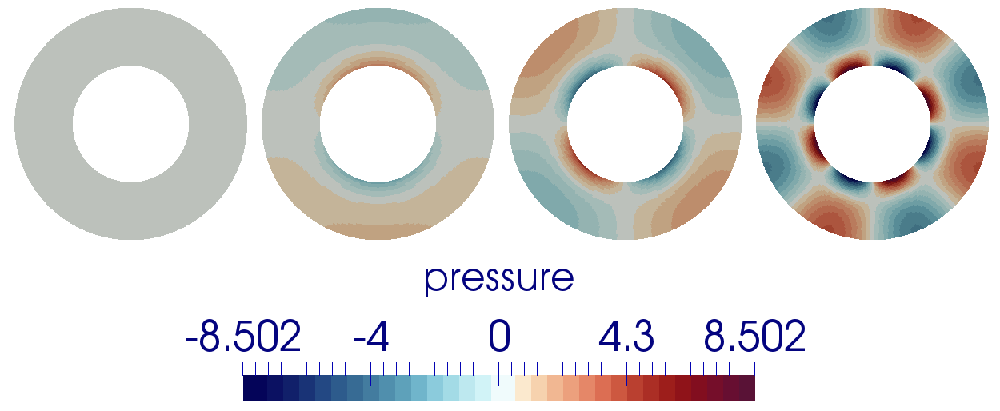
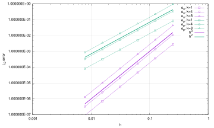

# The 2D annulus benchmark

*This section was contributed by C. Thieulot, E. G. Puckett, and R. Gassmoeller.*

This benchmark is based on a manufactured solution in which an analytical
solution to the isoviscous incompressible Stokes equations is derived in an
annulus geometry. The velocity and pressure fields are as follows:
```{math}
v_r(r,\theta)     &=  g(r) k \sin(k\theta), \\
v_\theta(r,\theta)&=  f(r) \cos(k \theta), \\
p(r,\theta)       &=  k h(r) \sin(k \theta) + \rho_0 (R2-r), \\
\rho (r,\theta)   &=  m(r) k \sin (k \theta) + \rho_0,
```
with
```{math}
f(r)&=Ar+B/r, \\
g(r) &= \frac{A}{2}r  +  \frac{B}{r} \ln r + \frac{C}{r}, \\
h(r)&= \frac{2g(r)-f(r)}{r},  \\
m(r) &= g'' - \frac{g'}{r}  - \frac{g}{r^2} (k^2 - 1)  + \frac{f}{r^2}   + \frac{f'}{r}, \\
A &= -C\frac{2(\ln R_1 - \ln R_2)} { R_2^2 \ln R_1  - R_1^2 \ln R_2}, \\
B &= -C \frac{R_2^2-R_1^2}{R_2^2 \ln R_1 - R_1^2 \ln R_2}.
```
The parameters $A$ and $B$ are chosen so that $v_r(R_1)=v_r(R_2)=0$, i.e. the
velocity is tangential to both inner and outer surfaces. The gravity vector is
radial inward and of unit length.

The parameter $k$ controls the number of convection cells present in the
domain, as shown in {numref}`fig:annulus-vp1` through {numref}`fig:annulus-vp3`.


```{figure-md} fig:annulus-vp1


 Pressure fields for k=0,1,2,4 for the 2D annulus benchmark.
```

```{figure-md} fig:annulus-vp2


Density fields for k=0,1,2,4 for the 2D annulus benchmark.
```

```{figure-md} fig:annulus-vp3


Velocity fields for k=0,1,2,4 for the 2D annulus benchmark.
```

In the present case, we set $R_1=1$, $R_2=2$ and $C=-1$. {numref}`fig:annulus-errors` shows
the velocity and pressure errors in the $L_2$-norm as a function of the mesh
size $h$ (taken in this case as the radial extent of the elements). As
expected we recover a third-order convergence rate for the velocity and a
second-order convergence rate for the pressure.

```{figure-md} fig:annulus-errors


Velocity and pressure errors in the <span class="math inline"><em>L</em><sub>2</sub></span>-norm as a function of the mesh size for the 2D annulus benchmark.
```

Additionally, the subdirectory
[benchmarks/annulus/transient](https://github.com/geodynamics/aspect/tree/main/benchmarks/annulus/transient)
contains an extension of the benchmark
to time-dependent flow. The benchmark and its results are described in
{cite:t}`gassmoeller:etal:2023`, "Benchmarking the accuracy of higher
order particle methods in geodynamic models of transient flow" see there
for a detailed description.
