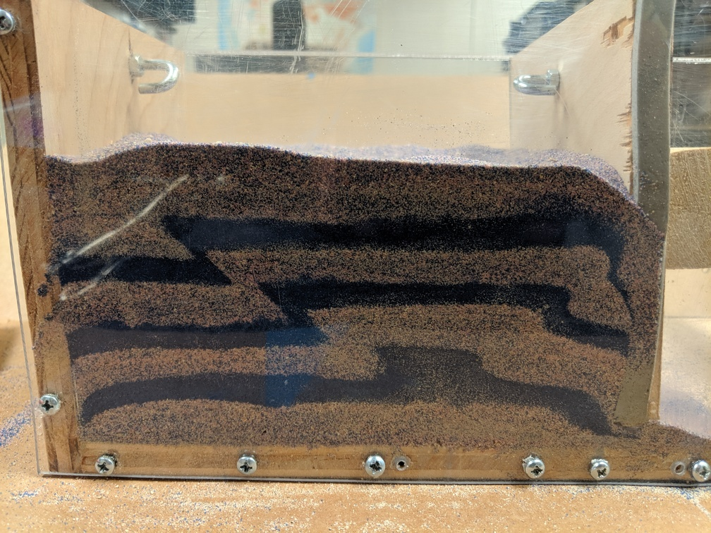

# Brittle thrust wedges benchmark

*This section was contributed by Sibiao Liu, Stephanie Sparks, John Naliboff,
Cedric Thieulot, and Wolfgang Bangerth.*

Thrusting of brittle crust by applying compressive forces can lead to large
deformations. The process is complicated to model because the rheology of
cold, brittle crust is substantially more complicated than that of the hot,
ductile rocks in the mantle. At the same time, the processes that act in such
situations are surprisingly easy to replicate and visualize using simple
"sand box" experiments in which one fills a volume with layers of
differently-colored sand and compresses or stretches the volume. Examples of
the patterns one can then observe in these do-it-yourself models are shown in
{numref}`fig:sandbox-images1` and {numref}`fig:sandbox-images2`.


```{figure-md} fig:sandbox-images1


 Examples of deformation patterns of sand box experiments in which alternating layers of differently-colored sand undergo deformation. Pictures courtesy of the lab of Dennis Harry at Colorado State University.
```

```{figure-md} fig:sandbox-images2


 Examples of deformation patterns of sand box experiments in which alternating layers of differently-colored sand undergo deformation. Pictures courtesy of the lab of Dennis Harry at Colorado State University.
```

{cite}`buiter:etal:2016` organized new comparison experiments
between these kinds of analogue and numerical models to investigate this kind
of brittle thrust wedge behavior. The benchmark here aims to verify that the
wedge models using follows other numerical results and the analytical wedge
theory shown in this paper. In particular, input files
([benchmarks/buiter_et_al_2016_jsg](https://www.github.com/geodynamics/aspect/blob/main/benchmarks/buiter_et_al_2016_jsg)) are provided for reproducing the
numerical simulations of stable wedge experiment 1 and unstable wedge
experiment 2 with the same model setups.

A number of model sets of prescribed material behavior are required to
simulate the brittle thrust formation. For example, although the material in
the numerical model has a visco-plastic rheology, it performs plastic yielding
at the beginning of shortening due to the non-viscous sand. We prescribe
plastic strain-weakening behavior, with the internal angle of friction
diminishing between total finite strain invariant values of 0.5 and 1.0, to
mimic the softening from peak to dynamic stable strength which correlates with
sand dilation.

In sandbox-type models, an important role is played by the boundaries and the
frictional sliding of sand against these boundaries. For the top boundary
condition, zero traction ("open") and a sticky air layer is used
to approximate a free surface. Additional testing revealed that using a true
free surface leads to significant mesh distortion and associated numerical
instabilities. We also apply a rigid block that approximates a mobile wall
with a constant velocity of 2.5 cm/hour on the right-hand side boundary to
drive the deformation in the sand layers. The following listing shows key
portions of the parameter file that describes this kind of setup:

```{literalinclude} velocity_bc.part.prm
```

Accurate solver convergence is always challenging to achieve in numerical
thrust wedge models with a high spatial resolution (ca. 1 mm node spacing) and
a large viscosity contrast. Here, we suggest that several parameters should be
considered carefully. First, the nonlinear and linear solver tolerances should
be sufficiently strict to avoid numerical instabilities. Second, we use the
discontinuous Galerkin method
(`set Use discontinuous composition discretization = true`) to ensure that the
discontinuous composition bound preserving limiter produces sharp interfaces
between compositional layers. Lastly, we use the harmonic averaging scheme for
material and viscosity is required to achieve reasonable convergence behavior.
The relevant parameters are shown here:

```{literalinclude} convergence.part.prm
```

*Experiment 1* tests whether model wedges in the stable domain of critical
taper theory remain stable when translated horizontally. A quartz sand wedge
with a horizontal base and a surface slope of 20 degrees is pushed 4 cm
horizontally by inward movement of a mobile wall at the right boundary with a
velocity of 2.5 cm/hour ({numref}`fig:btwexp1`). The basal angle is zero
(horizontal), a thin layer separates the sand and boundary to ensure minimum
coupling between the wedge and bounding box during translation, and a sticky
air layer is used above the wedge. Further, the purely plastic material should
not undergo any deformation during translation.

```{figure-md} fig:btwexp1


 Numerical model of a stable sand wedge. a) Initial model setup. b) Material field after 4 cm of translation. c) Strain rate field and d) pressure field.
```

*Experiment 2* tests how an unstable subcritical wedge deforms to reach the
critical taper solution. In this experiment, horizontal layers of sand undergo
10 cm shortening by inward movement of a mobile wall with a velocity of 2.5
cm/hour ({numref}`fig:btwexp2`). Model results show thrust wedge generation near
the mobile wall through a combination of mainly in-sequence forward and
backward thrusting. The strain field highlights several incipient shear zones
that do not always accumulate enough offset to become visible in the material
field. The pressure field of the model remains more or less lithostatic, with
lower pressure values in (incipient) shear zones.

```{figure-md} fig:btwexp2


 Numerical model of an unstable subcritical wedge. a) Initial model setup. b) Material field of sands after 10 cm shortening. c) Strain field and d) pressure field.
```
