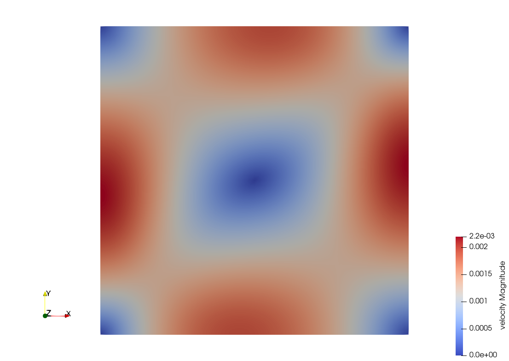
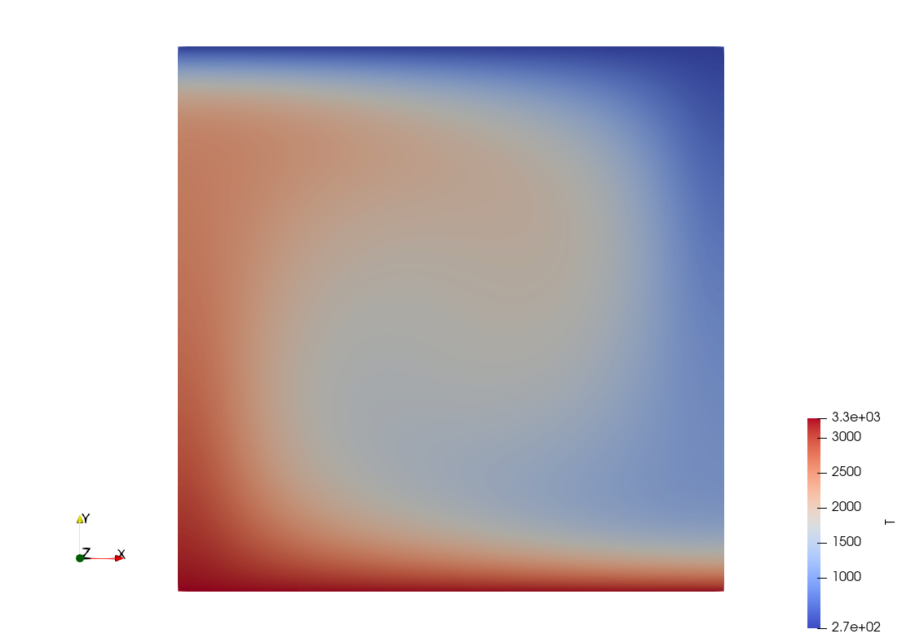
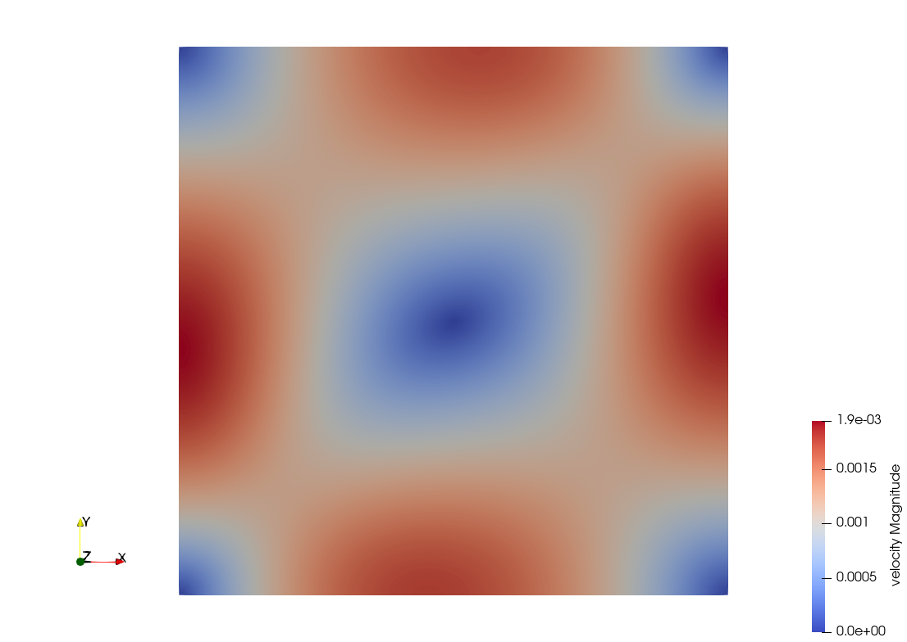
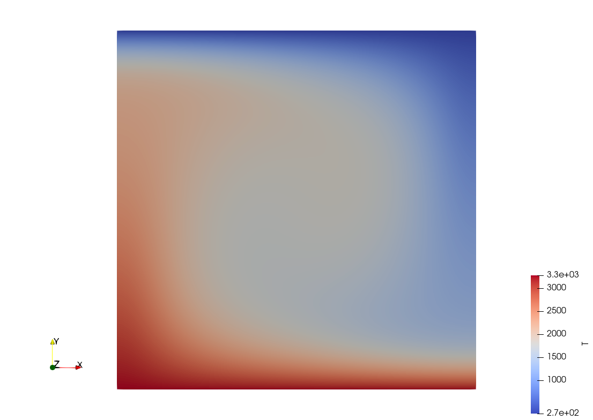
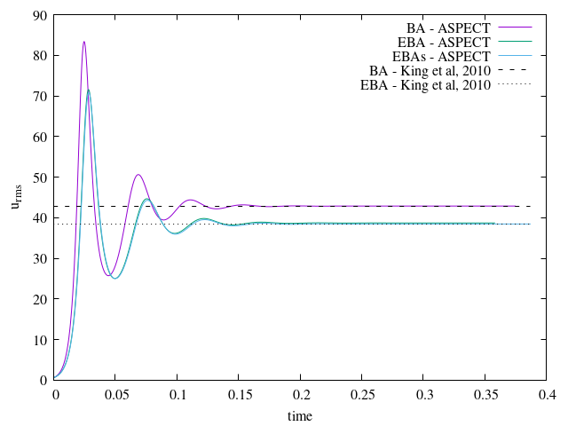
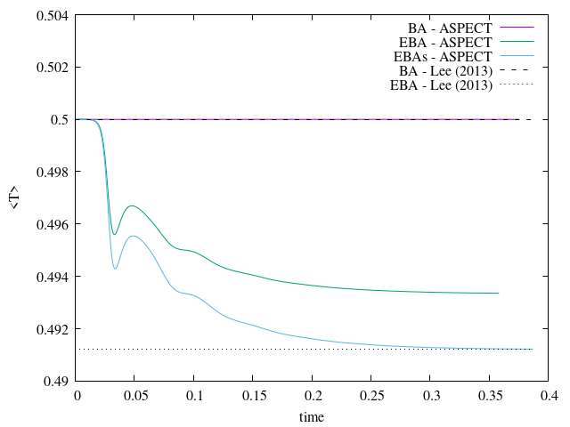
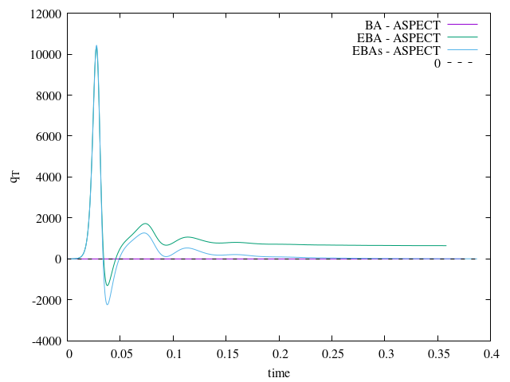
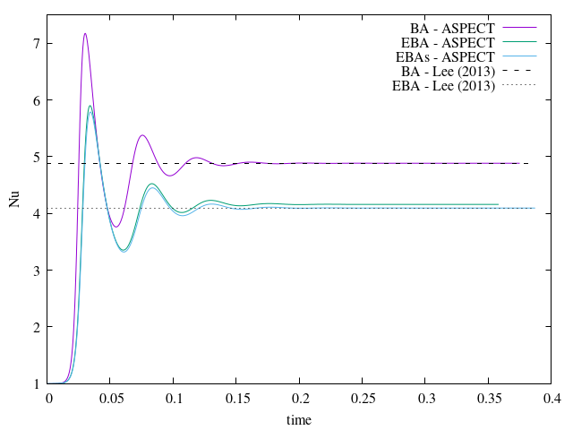
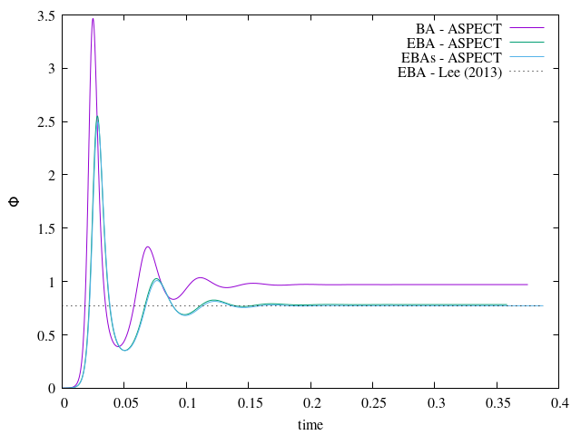

```{tags}
category:benchmark
feature:2d
feature:cartesian
```

(sec:benchmarks:convection_box_2d_lee_2013)=
# Convection in a 2d box based on Lee (2013)

The setup for this benchmark is based on {cite:t}`lee:2013` (note that the publication is in
Korean with the exception of equations, tables and figure captions):

Lee (2013): "A Benchmark for 2-Dimensional Incompressible and Compressible Convection Using COMSOL Multiphysics",
J. Geol. Soc. Korea 54(6), 683-694.

It is in fact very similar to the {cite:t}`king:etal:2010` benchmark albeit with one major difference:
mantle-like dimensions and properties are used and it does not require any plugin.
This makes this specific approach rather interesting for teaching purposes, and it also lends itself very well
to the use/testing of many post-processors (e.g. dynamic topography, melt production).

The domain is a square of size $L=1000$ km, the gravity is set to $g=10$ m/s$^2$,
the reference density is $\rho_0=4000$ kg/m$^3$ at reference temperature $T_0=273$ K,
and the thermal expansivity is $\alpha=3.125\times 10^{-5}$ K$^{-1}$.

Boundary conditions are free slip on all sides, $T_{top}=273$ K at the surface and $T_{bottom}=3273$ K at the bottom.

The Rayleigh number $Ra$ of the system is varied by changing the viscosity:
$\eta=3.750\times 10^{23}$ Pa.s corresponds to $Ra=10^4$,
$\eta=3.750\times 10^{22}$ Pa.s corresponds to $Ra=10^5$,
and $\eta=3.750\times 10^{21}$ Pa.s corresponds to $Ra=10^6$.
Likewise the dissipation number $Di$ is varied by changing the value of the heat capacity:
$C_p=1250$ J/kg/K corresponds to $Di=0.25$,
$C_p=625$ J/kg/K corresponds to $Di=0.5$ and
$C_p=312.5$ J/kg/K corresponds to $Di=1$.
Note however that these last two values are not realistic for the mantle.
Also, since the heat diffusivity is set to $\kappa=10^{-6}$ m/s$^2$,
the value of the heat conductivity $k$ is therefore affected by these choices since $\kappa=k/\rho_0 C_p$.

Although the author of the paper does present results for all (BA, EBA, TALA, ALA) cases
as in {cite:t}`king:etal:2010`, we here only focus on the BA and EBA cases
which we can setup by making use of the Formulation and Heating models flexibility (see below).

The carried out measurements are: the root mean square velocity $u_{rms}$,
the Nusselt number $Nu$, the average temperature over the domain $\langle T \rangle$,
the total viscous dissipation $\Phi$ and the total heat flux across all boundaries $q_T$
(the latter is expected to be zero since there is no heat source in the experiments).

In order to compare these values with {cite:t}`BBC89` or {cite:t}`gassmoller:etal:2020` we will
need to nondimensionalize them using the following reference quantities provided in
{cite:t}`king:etal:2010`:

```{math}
\begin{equation}
t_{ref}=\frac{\rho_0 C_p L^2}{k},
\quad
u_{ref}=\frac{L}{t_{ref}},
\quad
p_{ref}=\frac{\eta_0 k }{ \rho_0 C_p L^2},
\quad
T_{ref}=T_{bottom}-T_{top}
\end{equation}
```
which gives (for $Ra=10^4$): $t_{ref}=10^{18}$ s, $u_{ref}=10^{-12}$ m/s, $p_{ref}=3.75\times 10^5$ Pa.

Simulations are run until steady state is reached. We here require that the relative deviation of the
root mean square velocity and the total heat flux on the top boundary is smaller than $10^{-6}$ over at least 500 Myr:


```{literalinclude} lee_1.prm
```

Note that {cite:t}`lee:2013` unfortunately does not report on the
root mean square velocity so we will use values from {cite:t}`king:etal:2010` instead.

## Boussinesq Approximation (BA) results

The Boussinesq Approximation is available in ASPECT by means of the following choice of
parameters:

```{literalinclude} lee_2.prm
```

The velocity and temperature fields at steady state for $Ra=10^4$ are shown in
{numref}`fig:convection-box-lee-BA1` and {numref}`fig:convection-box-lee-BA2`

```{figure-md} fig:convection-box-lee-BA1


Convection in 2D box (Boussinesq Approximation): Velocity field at steady state.
```

```{figure-md} fig:convection-box-lee-BA2


Convection in 2D box (Boussinesq Approximation): Temperature field at steady state.
```

## Extended Boussinesq Approximation (EBA) results

The Extended Boussinesq Approximation is available in ASPECT by means of the following choice of
parameters:

```{literalinclude} lee_3.prm
```

As explained in the manual the adiabatic heating term can be computed in full
$\alpha T \left( \mathbf u \cdot \nabla \mathbf p \right)$,
or using a simplified approach $-\alpha \rho T \mathbf u \cdot \mathbf g$,
the second approach being commonly used in the literature.
We choose to run both cases and we will later discuss the obtained results.

The velocity and temperature fields at steady state for $Ra=10^4$ are shown in
{numref}`fig:convection-box-lee-EBA1`  and
{numref}`fig:convection-box-lee-EBA2`

```{figure-md} fig:convection-box-lee-EBA1


Convection in 2D box (Extended Boussinesq Approximation): Velocity field at steady state.
```

```{figure-md} fig:convection-box-lee-EBA2


Convection in 2D box (Extended Boussinesq Approximation): Temperature fields at steady state.
```

## A comparison of BA and EBA results

Steady state measurements are shown in {numref}`tab:convection-box-lee1` and
and their nondimensionalised values in {numref}`tab:convection-box-lee2`.
We show in
{numref}`fig:convection-box-lee-EBA-all1`,
{numref}`fig:convection-box-lee-EBA-all2`,
{numref}`fig:convection-box-lee-EBA-all3`,
{numref}`fig:convection-box-lee-EBA-all4`, and
{numref}`fig:convection-box-lee-EBA-all5`
the time evolution of the (dimensionless) global quantities for $Ra=10^4$ and
for all three formulations (BA, EBA, EBA-simplified or EBAs)
We find that the measurements agree with the literature,
but in the case of EBA *only* the simplified approach guarantees a good match.
Please also bear in mind that the thermal boundary layers get thinner and thinner
with increasing $Ra$ numbers so that models with $Ra=10^6$ should ultimately
be run with (much) higher resolution for best accuracy.


:::{table} Convection in 2D box: Global measurements (resolution $32\times 32$). 'tba' entries mark indicate models that remain to be run.
:name: tab:convection-box-lee1

| Formulation | $Ra$        | $u_{rms}$  | $\langle T\rangle$ | $q_T$ | $\Phi$ | $Nu$   |
| :---        | :--------:  | ---------: | -----------------: | ----: | -----: | ---:   |
|  BA         | $10^4$      | 0.00135    | 1773               | 0     | 7283   | 4.884  |
|  EBA        | $10^4$      | 0.00122    | 1752               | 647   | 5878   | 4.159  |
|  EBAs       | $10^4$      | 0.00121    | 1746               | 8.4   | 5999   | 4.095  |
|  BA         | $10^5$      | 0.00610    | 1773               | 0     | 17877  | 10.534 |
|  EBA        | $10^5$      | 0.00122    | 1795               | 1626  | 14526  | 8.805  |
|  EBAs       | $10^5$      | 0.00121    | 1787               | -3    | 14341  | 8.653  |
|  BA         | $10^6$      | 0.02630    | 1773               | 0     | 39274  | 21.858 |
|  EBA        | $10^6$      | 0.00122    | tba                | tba   | tba    | tba    |
|  EBAs       | $10^6$      | 0.00121    | tba                | tba   | tba    | tba    |
:::

:::{table} Convection in 2D box: Global dimensionless measurements (resolution $32\times 32$). Values inside parentheses are those found in Lee (2013). A cross indicates that no value is given in Lee (2013). Root mean square velocities are taken from King et al (2010).
:name: tab:convection-box-lee2

| Formulation | $Ra$       | $u_{rms}$        | $\langle T\rangle$ |  $\Phi$        | $Nu$            |
| :---        | :--------: | :--------------- | :----------------- |  :-----        | :---            |
|  BA         | $10^4$     | 42.864 (42.865)  |  (0.500)           |  0.971 (X)     | 4.884 (4.884)   |
|  EBA        | $10^4$     | 38.702 (38.4)    |  (0.491)           |  0.784 (0.773) | 4.159 (4.092)   |
|  EBAs       | $10^4$     | 38.453 (38.4)    |  (0.491)           |  0.773 (0.773) | 4.095 (4.092)   |
|  BA         | $10^5$     | 193.21 (193.215) |  (0.500)           |  2.384 (X)     | 10.534 (10.529) |
|  EBA        | $10^5$     | 174.953 (174.1)  |  (0.505)           |  1.937 (1.911) | 8.805 (8.644)   |
|  EBAs       | $10^5$     | 173.4 (174.1)    |  (0.505)           |  1.912 (1.911) | 8.653 (8.644)   |
|  BA         | $10^6$     | 833.30 (833.990) |  (0.502)           |  5.236 (X)     | 21.858 (21.900) |
|  EBA        | $10^6$     | tba (586)        |  (0.519)           |  tba (3.650)   | tba (15.563)    |
|  EBAs       | $10^6$     | tba (586)        |  (0.519)           |  tba (3.650)   | tba (15.563)    |
:::


```{figure-md} fig:convection-box-lee-EBA-all1


Convection in 2D box: time evolution of the root mean square velocity.
```

```{figure-md} fig:convection-box-lee-EBA-all2


Convection in 2D box: time evolution of the average temperature.
```

```{figure-md} fig:convection-box-lee-EBA-all3


Convection in 2D box: time evolution of the total heat flux.
```

```{figure-md} fig:convection-box-lee-EBA-all4


Convection in 2D box: time evolution of the Nusselt number.
```

```{figure-md} fig:convection-box-lee-EBA-all5


Convection in 2D box: time evolution of the viscous dissipation.
```
