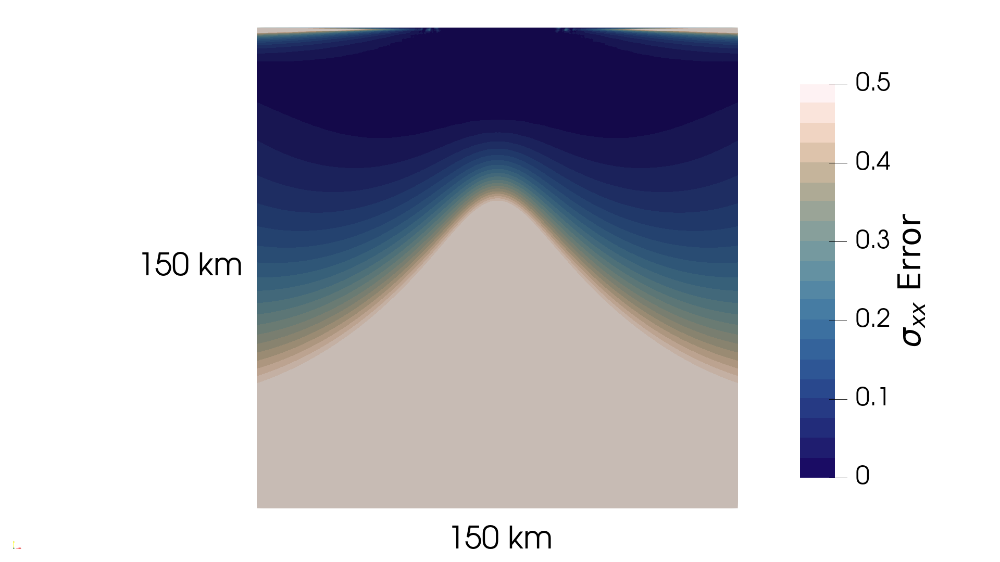
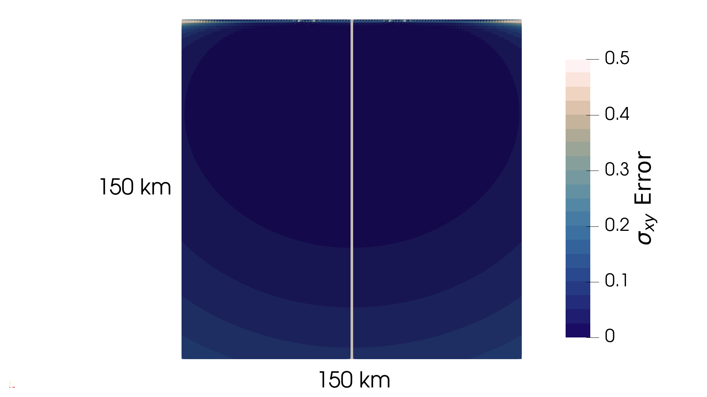
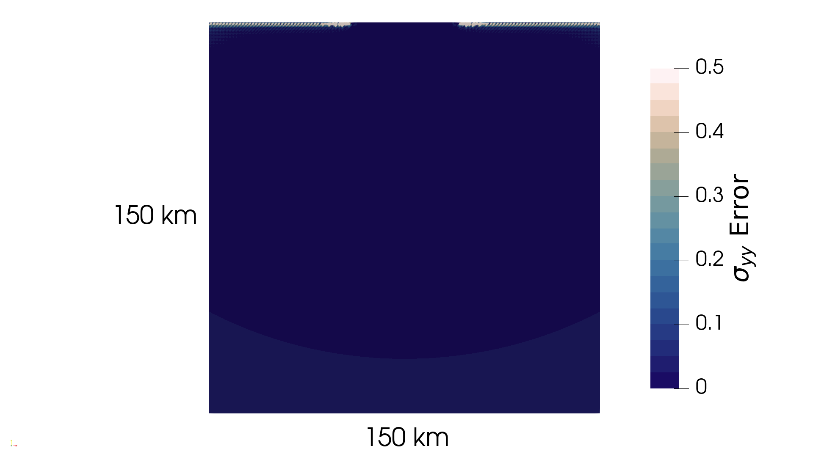
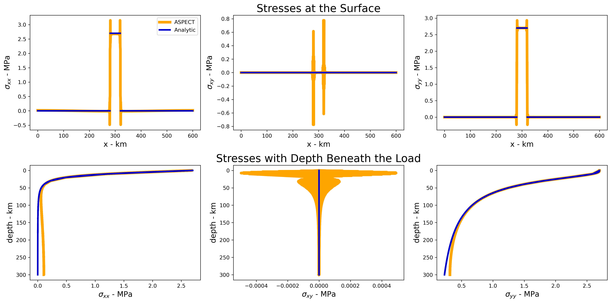

```{tags}
category:benchmark
feature:2d
feature:cartesian
feature:analytical-solution
feature:mesh-deformation
feature:visco-elastic-plastic
```

(sec:benchmarks:elastic-line-load)=
# 2D Elastic Line Loading Problem

*This section was contributed by Daniel Douglas, Cedric Thieulot, Prajakta Mohite and John Naliboff*

This example uses ASPECT to reproduce the modeling setup of {cite:t}`dase96`, which prescribes
a line "load" on the top of an elastic half-space. The analytic solution for $\sigma_{xx}$, $\sigma_{xy}$
and $\sigma_{yy}$ comes from Albert Flamant. The model setup, and the determination of the analytic
solution is outlined below.

The analytic solution which describes the stresses within the domain are outlined by Davis and Selvadurai
1996 in Section 4.6, but the expressions for each of the 3 unique components is:

```{math}
\sigma_{xx} = \frac{p_0}{\pi} \left[\theta_2 - \theta_1 - \frac{1}{2} \cdot (\text{sin}(2 \theta_2) - \text{sin}(2 \theta_1) ) \right]
```

```{math}
\sigma_{xy} = \frac{p_0}{\pi} \left[(\text{sin}^2(\theta_2) - \text{sin}^2(\theta_1) ) \right]
```

```{math}
\sigma_{yy} = \frac{p_0}{\pi} \left[\theta_2 - \theta_1 + \frac{1}{2} \cdot (\text{sin}(2 \theta_2) - \text{sin}(2 \theta_1) ) \right]
```

where $\theta_1$ is the angle from the right edge of the line load to the current point, and $\theta_2$ is the angle from the
left edge of the line load to the current point, and $p_0$ is the magnitude of the traction introduced by the load, in Pa. Within this
benchmark, the plugin `flamant_solution.cc` creates a postprocessor that visualizes the analytical solution onto the ASPECT grid for
direct comparison to the ASPECT stresses. In the three figures below, we compare the stresses output by ASPECT with the analytic
solution within a 150 \si \km $\times$ 150 \si \km subset of the domain, centered on the load. To quantify how well ASPECT reproduces the analytic
solution, we calculate a relative error with:

```{math}
\chi = \text{abs}\left( \frac{\sigma_i^{analytic} - sigma_i^{ASPECT}}{\sigma_i^{analytic}} \right)
```

where $i$ = $xx$, $xy$, or $yy$ is a given stress component.

```{figure-md} fig:sigma-xx-error


The relative error for $\sigma_{xx}$.
```

```{figure-md} fig:sigma-xy-error


The relative error for $\sigma_{xy}$.
```

```{figure-md} fig:sigma-yy-error


The relative error for $\sigma_{yy}$.
```

ASPECT most accurately reproduces $\sigma_{yy}$, which is clearly visible in {numref}`fig:sigma-yy-error`.
Similarly, ASPECT accurately reproduces $\sigma_{xy}$ as well, the vertical line directly in the center of
{numref}`fig:sigma-xy-error` is a numerical artifact since the stress is 0 here, meaning that in our relative
error calculation we are dividing by 0. The highest deviation occurs for $\sigma_{xx}$, where the misfit increases
with depth, and is higher directly beneath the load ({numref}`fig:sigma-xx-error`). We can also visualize the stress
along the surface of the ASPECT model, as well as with depth directly beneath the center of the load ({numref}`fig:surface-depth-stresses`).
Along the surface, with the exception of the points at the left and right edges of the line load, there is good agreement
with the predicted stresses in ASPECT and with the analytic solution. The oscillations in the stresses at the edges of the
load are numerical artifacts introduced by the discontinuity in the traction at this point, from 0 to $p_0$. ASPECT also
predicts non-zero $\sigma_{xx}$ towards the edges of the model domain (top row of {numref}`fig:surface-depth-stresses`).
With depth beneath the middle of the load, ASPECT accurately reproduces all of the stress components at depths $\leq$40 \si \km.
At depths greater than 40 km, $\sigma_{xx}$ begins to noticeably deviate from the analytic solution, which is likely due to the
increasing proximity to the boundary conditions. The analytic solution assumes an infinite elastic half-space, but in this
example we place a physical boundary at 300 \si \km depth.

```{figure-md} fig:surface-depth-stresses


Plotting stresses along the surface and beneath the center of the load. Note the very small magnitudes of stress in the
bottom middle panel.
```

Output from ASPECT's topography postprocessor compared to the analytic solution
is shown in {numref}`fig:flexure-comparison`. Both the flexural amplitude and the
flexural wavelength are accurately recovered.
