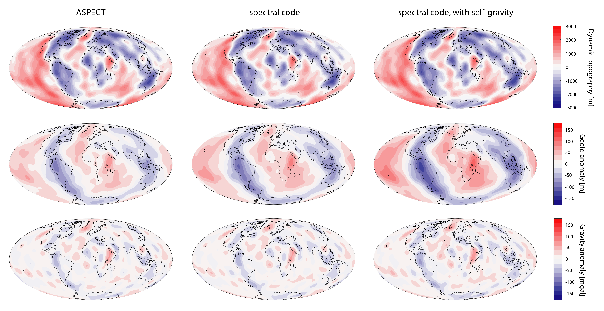

(sec:benchmarks:geoid-spectral-comparison)=
Geoid Spectral Comparison
=========================

[This folder](https://github.com/geodynamics/aspect/tree/main/benchmarks/geoid-spectral-comparison)
contains a comparison between results from ASPECT and a spectral code. The latter is an
instantaneous flow code (formulation from Corrieu et al., 1995; code by Sia
Ghelichkhan at LMU Munich; calculations done by Mark Hoggard at Harvard
University). This comparison was done in 2018. The setup for the run is:

1. Generate density field using S20RTS Vs % variations, scaled to density %
variations using constant factor of 0.15, and converted into absolute density
variations using constant 3300 kg/m3.

2. Run instantaneous flow with compressibility turned off, the value of g is
set to constant 10.0 m/s2, background density = 3300 kg/m3, core density =
9900 kg/m3, surface fluid density = 0 kg/m3.

3. Runs are done without self-gravitation, i.e. the delta g x rho term in the
momentum equation is omitted (e.g. see eqn. 25 of Forte, 2007 and shown in
terms (6,3) and (5,4) in propagator matrix A of Corrieu et al, 1995).

```{figure-md} fig:benchmark-geoid-spectral-comparison


Dynamic topography (top), geoid (middle), and gravity (bottom) anomalies
computed with ASPECT (left), spectral code (middle), spectral code with self-gravity (right).
```

See [spectral-comparison.prm](https://github.com/geodynamics/aspect/blob/main/benchmarks/geoid-spectral-comparison/spectral-comparison.prm)
for the ASPECT input file. The resulting dynamic
topography, geoid, and gravity anomalies show good agreement (see
{numref}`fig:benchmark-geoid-spectral-comparison`).
Spectral runs with self-gravitation are also shown (this is not yet
an option in ASPECT).
