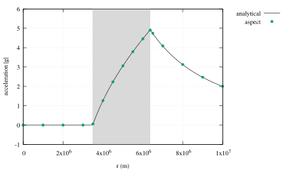
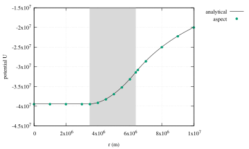

# Thick shell gravity benchmark

*This section was contributed by Cedric Thieulot.*

This benchmark tests the accuracy of the gravity field and gravitational
potential computed by the gravity postprocessor inside and outside an
Earth-sized planet (without its core) of constant density. The domain is a
spherical shell with inner radius $R\_{inner}=3840~\si{\km}$ and
outer radius $R\_{outer}=6371~\si{\km}$. The density is constant
in the domain and set to $\rho_0=3300~\si{\kg\per\cubic\metre}$.

First, let us calculate the exact profile which we expect the benchmark to
reproduce. The gravitational potential $U$ of a spherically symmetric object
satisfies the Poisson equation $\Delta U = 4\pi G \rho(\mathbf r)$. For a
constant density shell, this equation can be solved analytically for the
gravitational acceleration and potential inside and outside the planet. Inside
($r<R\_{inner}$) and outside ($r>R\_{outer}$) the
spherical shell (i.e. where $\rho=0$) the Poisson equation simplifies to the
Laplace equation $\Delta U=0$:
$$\frac{1}{r^2} \frac{\partial }{\partial r} \left(r^2 \frac{\partial U}{\partial r} \right) = 0.$$
The solution to this expression is:
$$g=\frac{\partial U}{\partial r} = \frac{C}{r^2} \label{eq:app1},$$ where $C$
is a constant of integration. In order to avoid an infinite gravity field at
$r=0$ (where the density is also zero in this particular setup of a shell), we
need to impose $C=0$, i.e. the gravity is zero for
$r\leq R\_{inner}$. Another way of arriving at the same conclusion
is to realize that $g$ is zero at the center of the body because the material
around it exerts an equal force in every direction. Inside the shell,
$\rho=\rho_0$, yielding
$$g=\frac{\partial U}{\partial r} = \frac{4 \pi}{3} G \rho_0 r + \frac{A}{r^2},$$
where $A$ is another integration constant. At the inner boundary,
$r=R\_{inner}$ and $g=0$, allowing $A$ to be computed.
Substituting in the value of $A$,
$$g=\frac{\partial U}{\partial r} = \frac{4 \pi}{3} G \rho_0
\left(r - \frac{R\_{inner}^3}{r^2} \right). \label{eqgin}$$ When
$r\geq R\_{outer}$, the gravitational potential is given by Eq.
([\[eq:app1\]][1]). Requiring the gravity field to be continuous at
$r=R\_{outer}$: $$g(r) = \frac{G M}{r^2} \label{eq:gout},$$ where
$M=\frac{4 \pi}{3} \rho_0(R\_{outer}^3-R\_{inner}^3)$
is the mass contained in the shell. For $r\ge R\_{outer}$, the
potential is obtained by integrating Eq.([\[eq:gout\]][2]):
$$U(r)=-\frac{GM}{r} +D,$$ where $D$ is an integration constant which has to
be zero since we require the potential to vanish for $r\rightarrow \infty$.
The potential within the shell,
$R\_{inner}\leq r \leq R\_{outer}$, is found by
integrating Eq.&nbsp;[\[eqgin\]][3]:
$$U(r)= \frac{4 \pi}{3} G \rho_0 \left(\frac{r^2}{2} + \frac{R\_{inner}^3}{r} \right)  + E,$$
where $E$ is a constant. Continuity of the potential at
$r=R\_{outer}$ requires that
$E=-2\pi\rho_0 G R\_{outer}^2$. Gravitational acceleration is zero
for $r\leq R\_{inner}$, so the potential there is constant and a
continuity requirement yields
$$U(r)=2\pi G \rho_0 (R\_{inner}^2-R\_{outer}^2).$$

The gravity postprocessor in can be used to calculate the radial components of
gravity ($g_r$ and $U$) at arbitrary points using the sampling scheme
'*list of points*.' For this benchmark we calculate points along a
line from the center of the planet to a distant point, $r=0$ to
$r=10,000~\si{\km}$ (Figure [2]). Arbitrarily, the latitude and longitude
are both set to $13\si{\degree}$ so as to avoid potential measurement
artifacts due to symmetry. The list of radii is defined as follows:

``` prmfile
```

The resulting measurements obtained for a mesh composed of 12 caps of $32^3$
cells (i.e., 393,216 total mesh cells) are shown in Fig.&nbsp;([2]) and are
in good agreement with the analytical profiles.


```{figure-md} fig:grav-thick-shell

```

```{figure-md} fig:grav-thick-shell

```

  [1]: #eq:app1
  [2]: #eq:gout
  [3]: #eqgin
  [2]: #fig:grav-thick-shell
