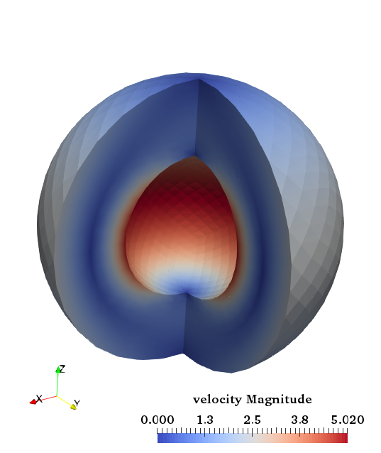
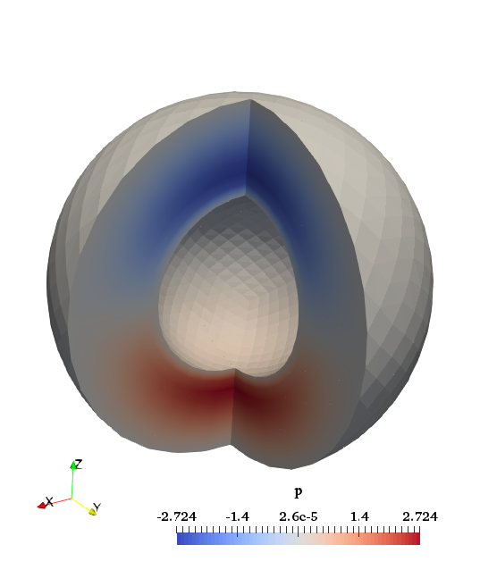

#### The hollow sphere benchmark

This benchmark is based on Thieulot (Thieulot 2017) in which an analytical
solution to the isoviscous incompressible Stokes equations is derived in a
spherical shell geometry. The velocity and pressure fields are as follows:

$$\begin{aligned}
v_r(r,\theta)      &=& g(r) \cos \theta, \\
v_\theta(r,\theta) &=& f(r) \sin \theta, \\
v_\phi(r,\theta)   &=& f(r) \sin \theta, \\
p(r,\theta)        &=& h(r) \cos \theta ,\end{aligned}$$ where
$$\begin{aligned}
f(r) &=& \frac{\alpha}{r^2} + \beta r, \\
g(r) &=& -\frac{2}{r^2} \left(  \alpha \ln r + \frac{\beta}{3}  r^3  + \gamma \right),   \\
h(r) &=& \frac{2\mu_0}{r} g(r),\end{aligned}$$ with $$\begin{aligned}
\alpha&=&-\gamma \frac{R_2^3-R_1^3}{R_2^3 \ln R_1 - R_1^3 \ln R_2}, \\
\beta &=& -3\gamma \frac{\ln R_2 - \ln R_1  }{R_1^3 \ln R_2 - R_2^3 \ln R_1}.\end{aligned}$$
These two parameters are chosen so that $v_r(R_1)=v_r(R_2)=0$, i.e. the
velocity is tangential to both inner and outer surfaces. The gravity vector is
radial and of unit length, while the density is given by:
$$\rho(r,\theta)=  \left(   \frac{\alpha}{r^4}  (8 \ln r -6) +  \frac{8\beta}{3r}  +8 \frac{\gamma}{r^4}  \right) \cos\theta.$$
We set $R_1=0.5$, $R_2=1$ and $\gamma=-1$. The pressure is zero on both
surfaces so that the surface pressure normalization is used. The boundary
conditions that are used are simply the analytical velocity prescribed on both
boundaries. The velocity and pressure fields are shown in Fig.&nbsp;[3][].

Fig.&nbsp;[4][] shows the velocity and pressure errors in the $L_2$-norm as a
function of the mesh size $h$ (taken in this case as the radial extent of the
elements). As expected we recover a third-order convergence rate for the
velocity and a second-order convergence rate for the pressure.





```{figure-md}
<embed src="cookbooks/benchmarks/hollow_sphere/doc/errors_hollowsphere.pdf" id="fig:hollow-sphere-errors" />

<figcaption aria-hidden="true"><em>Velocity and pressure errors in the <span class="math inline"><em>L</em><sub>2</sub></span>-norm as a function of the mesh size.</em></figcaption>
```

<div id="refs" class="references csl-bib-body hanging-indent">

<div id="ref-THIE17" class="csl-entry">

Thieulot, C. 2017. &ldquo;Analytical Solution for Viscous Incompressible
Stokes Flow in a Spherical Shell.&rdquo; *Solid Earth* 8 (6): 1181&ndash;91.
<https://doi.org/10.5194/se-8-1181-2017>.

</div>

</div>

  [3]: #fig:hollow-sphere-vp
  [4]: #fig:hollow-sphere-errors
