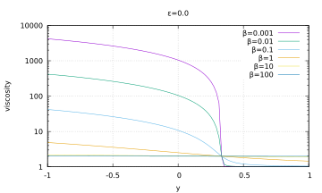
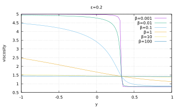

#### Layered flow with viscosity contrast

*This section was contributed by Cedric Thieulot.*

The idea behind this benchmark is to construct an analytical solution to the
incompressible Stokes equation in the case where the viscosity field showcases
a viscosity contrast at location $y=y_0$ whose amplitude and width can be
controlled. The viscosity is defined as
$$\eta(y)=\frac{1}{\frac{1}{\pi} \tan^{-1} (\frac{y-y_0}{\beta} ) + 1/2 + \epsilon}$$
where $\beta$ and $\epsilon$ are chosen by the user. Viscosity profiles for
different values of $\beta$ and $\epsilon$ are shown in Fig.&nbsp;[2][]. The
set up of this benchmark allows testing how discretizations deal with abrupt
changes in the viscosity (if $\beta$ is small) as well as large changes in the
viscosity (if $\epsilon$ is small).

The flow is assumed to take place in an infinitely long domain (in the
horizontal direction) and bounded by $y=-1$ and $y+1$. At the bottom we impose
$v_x(y=-1)=0$, while we impose $v_x(y=+1)=1$ at the top. The density is set to
1 while the gravity is set to zero. Under these assumptions, the flow velocity
and pressure fields are given by: $$\begin{aligned}
v_x(x,y)&=&\frac{1}{2\pi} \left(  -\beta C_1 \log [\beta^2 + (z-z_0)^2]  + 2 (z-z_0)  C_1 \tan^{-1} \frac{z-z_0}{\beta} + \pi (1+2\epsilon) z C_1  + C_2 \right), \nonumber\\
v_y(x,y) &=& 0, \nonumber\\
p(x,y) &=& 0,\end{aligned}$$ where $C_1$ and $C_2$ are integration constants:
$$\begin{aligned}
C_1 &=& 2\pi \Bigl[
 \beta  \log [\beta^2 + (1+z_0)^2]  -  2(1+z_0) \tan^{-1}
 \frac{1+z_0}{\beta}
 \\
 &&\qquad\qquad
-\beta  \log [\beta^2 + (1-z_0)^2]  +  2(1-z_0) \tan^{-1} \frac{1-z_0}{\beta} + 2\pi (1+2\epsilon)   \Bigr]^{-1},\\
C_2 &=& \left[ \beta  \log [\beta^2 + (1+z_0)^2]  -  2(1+z_0) \tan^{-1} \frac{1+z_0}{\beta} + \pi(1+2\epsilon) \right]C_1.\end{aligned}$$
The viscosity and velocity fields are shown in Fig.&nbsp;[4][] for
$\beta=0.01$ and $\epsilon=0.05$.

  [2]: #fig:layeredflow1
  [4]: #fig:layeredflow2
