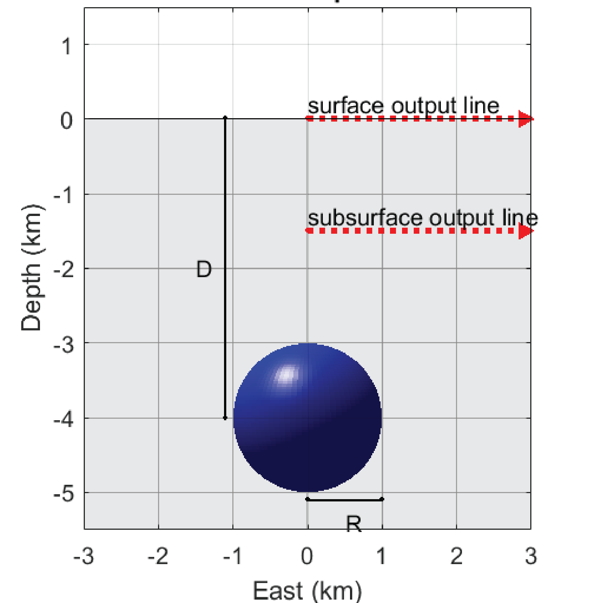
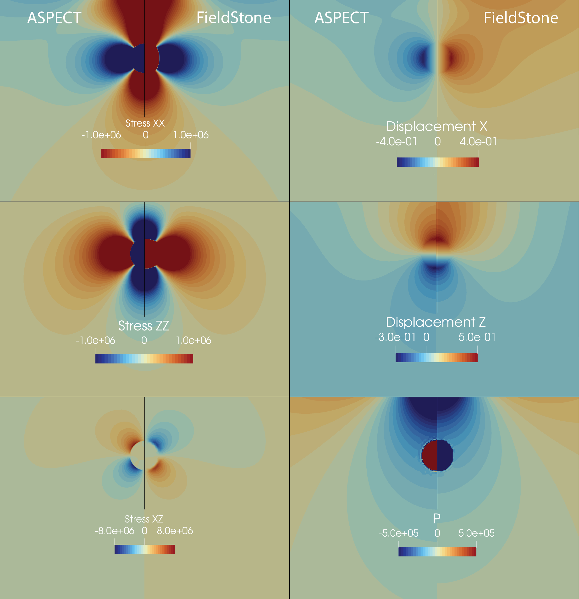
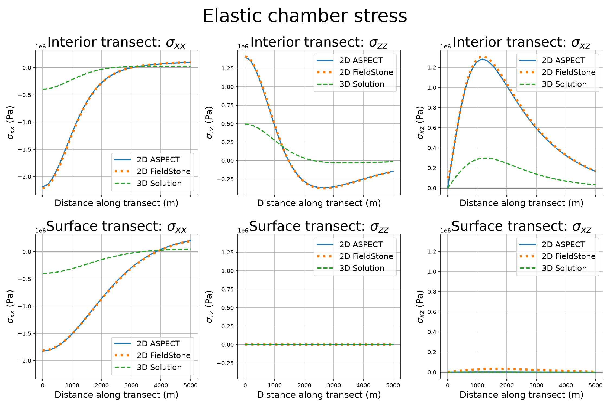
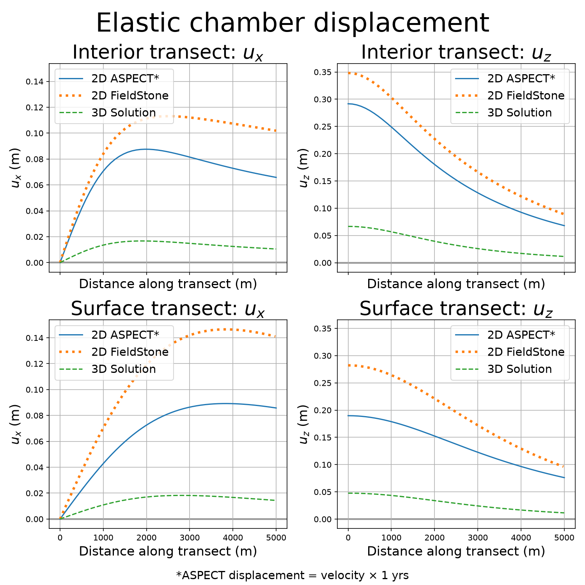

```{tags}
category:benchmark
feature:2d
feature:cartesian
feature:nonlinear-solver
feature:compositional-fields
feature:community-benchmark
```

(sec:benchmarks:magma_chamber)=
# Pressurized magma chamber in a compressible material

*This section was contributed by Annie Thompson and Cedric Thieulot.*

This is a 2D model of a pressurized magma chamber using a compressible equation of state and viscoelastic rheology. We create a pressurized chamber by including a non-zero thermal expansivity and adding heat to the chamber, causing the chamber to dilate.

This is based on a commonly used 3D benchmark in the volcanology community for a pressurized magma chamber in elastic half-space, shown in {numref}`fig:chamber`. Examples can be found [here](http://www.driversofvolcanodeformation.org/) and in {cite:t}`crozier:etal:2023` under exercise 1.3.

```{figure-md} fig:chamber


View of chamber and output transect locations from {cite}`crozier:etal:2023`. In ASPECT, we implement this chamber setup in the center of a 50x25km box. Subsurface output lines are used for {numref}`fig:stress` and {numref}`fig:displacement`.
```

This implementation simulates a half-space using a 50x25 km domain that is significantly larger than the 1 km spherical magma chamber. The model has free-slip boundary conditions on the left, right, and bottom boundaries, and a free surface on the top boundary. It is calibrated to have a constant 10 MPa pressure in the chamber by adjusting the heating rate and thermal expansivity of the material. To create elastic behavior, we set viscosity to 10<sup>20</sup> Pa s in the viscoelastic material model to make viscous behavior negligible. The material has a Poisson ratio of 0.25, following the analytical solution.

As this is a 2D benchmark, it is not expected to match the 3D analytical solution from {cite:t}`zhong:dabrowski:jamtveit:2019` (below). Instead, we compare our results against the output of a purely elastic finite element model, FieldStone from {cite:t}`fieldstone`. FieldStone has been tested in 3D and matches the original 3D analytical solution. Below are comparisons between this benchmark's implementation, FieldStone, and the analytical solution of {cite:t}`zhong:dabrowski:jamtveit:2019` ({numref}`fig:6-panel`, {numref}`fig:stress`, {numref}`fig:displacement`).


```{figure-md} fig:6-panel


Comparison of stress, displacement, and pressure fields around the chamber. Each inset is a combined plot of Fieldstone (left half of chamber) and ASPECT (right half of chamber) to help visualize the differences between model outputs.
```

```{figure-md} fig:stress


Plots of stress along the transects shown in {numref}`fig:chamber` for this ASPECT benchmark, the 2D Fieldstone implementation, and the 3D analytical solution. The interior transect is 2km above the chamber and the surface transect is 4km above.
```

```{figure-md} fig:displacement


Plots of displacement along the transects shown in {numref}`fig:chamber` for this ASPECT benchmark, the 2D Fieldstone implementation, and the 3D analytical solution. The interior transect is 2km above the chamber and the surface transect is 4km above. Displacement from ASPECT was calculated by multiplying velocity at 1 elastic timestep by the elastic timestep.
```
We have found that ASPECT produces a good match for stress, and a reasonable, but not exact match for displacement. This may be due to the compressible formulation, which is insensitive to changes in Poisson ratios ranging from 0.25 to 0.45. With future development and implementation of compressible elasticity, this benchmark can serve as a test for compressibility performance.

This benchmark is useful for simulating the surface inflation created above magma chambers before volcanic eruptions. This phenomenon can affect surface processes and produces measurable field data that can be used to understand subsurface dynamics.
