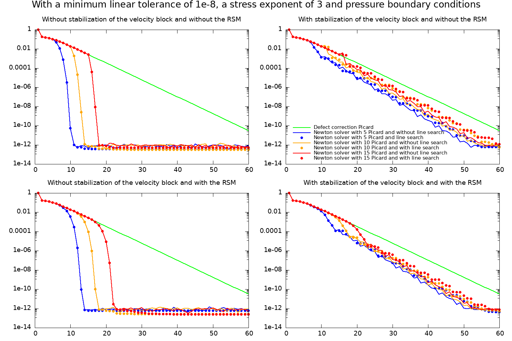
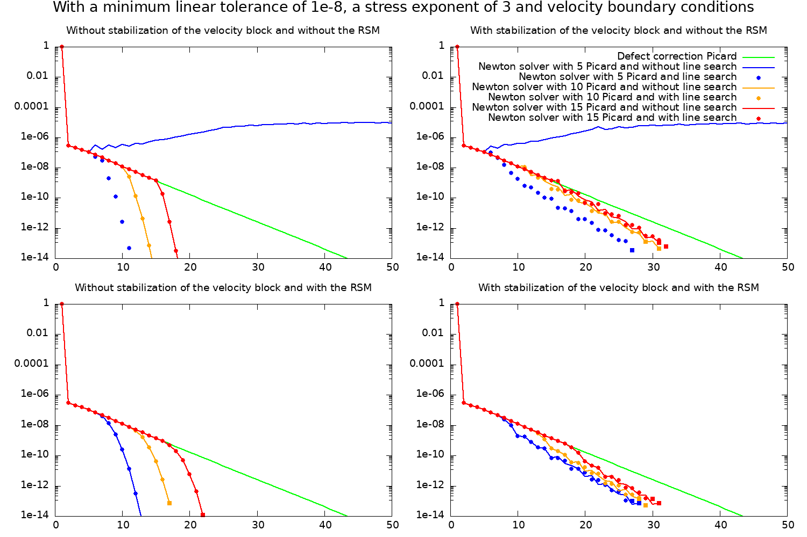
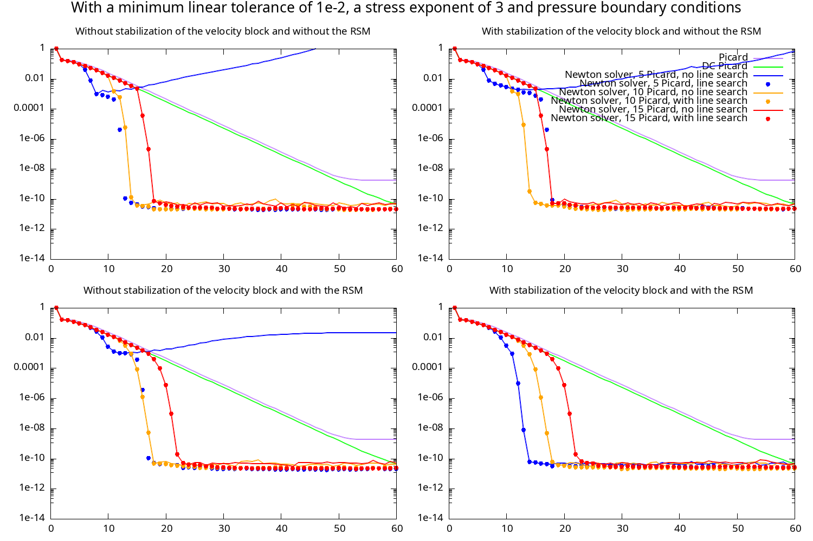
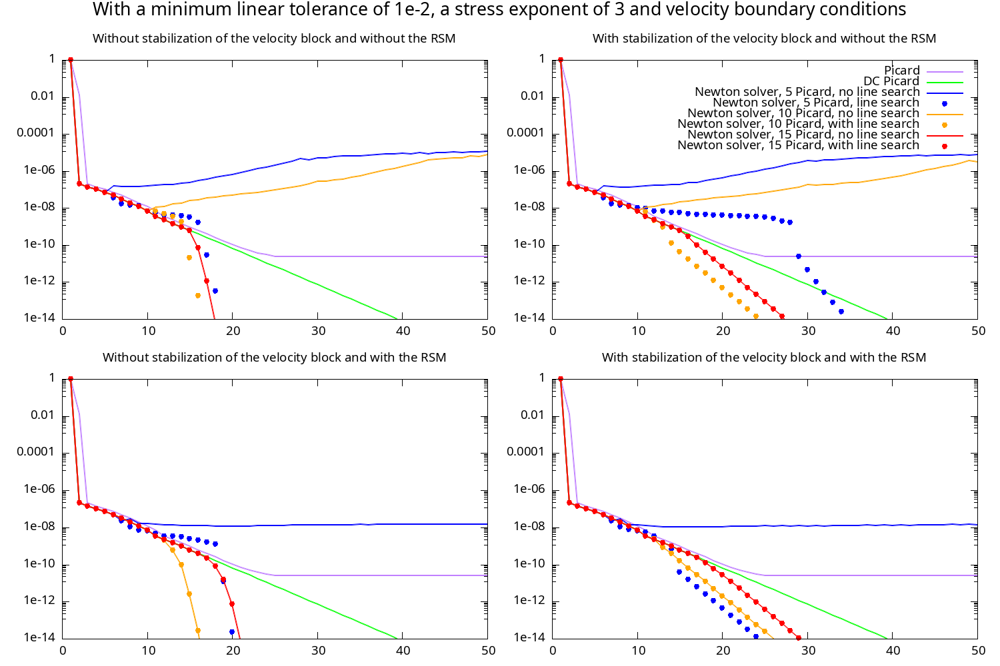

# Newton Solver Benchmark Set - Nonlinear Channel Flow

The files in [this directory](https://github.com/geodynamics/aspect/tree/main/benchmarks/newton_solver_benchmark_set/nonlinear_channel_flow)
can be used to recreate the nonlinear channel flow figures from
{cite:t}`fraters:etal:2019`.
Start by compiling the `simple_nonlinear` plugin in this directory as described (at the example of another benchmark)
in {ref}`sec:benchmark-run` .
After compiling the plugin you can run (or adjust) the script `run.sh`, which will run all the models necessary
to recreate Fig. 1 and Fig. 2 of {cite:t}`fraters:etal:2019` and the other figures on this page
(by default the script will assume your processor has 4 compute cores, but you can adjust the number in the script).
After running the model series you can use the gnuplot files `plot_v.gnuplot` and `plot_t.gnuplot` to recreate the following figures.

```{figure-md} fig:benchmark-newton-nonlinear-channel-flow-tractions


Convergence history for several methods for a rheology with n = 3 where in- and outflow are described by prescribing the traction. Top row: Computations in which we switch abruptly from Picard iterations to Newton iterations. Bottom row: Same as top, but using the residual scaling method in which we gradually introduce the Newton method. Left-hand column: Unmodified Newton iterations. Right-hand column: Results where we applied the SPD stabilizations to the Newton matrix. Horizontal axes: number of the non-linear (outer) iteration. Vertical axes: non-linear residual.
```

```{figure-md} fig:benchmark-newton-nonlinear-channel-flow-velocities


Convergence history for several methods for a rheology with n = 3 where in- and outflow are described by prescribing the velocity. Top row: Computations in which we switch abruptly from Picard iterations to Newton iterations. Bottom row: Same as top, but using the residual scaling method in which we gradually introduce the Newton method. Left-hand column: Unmodified Newton iterations. Right-hand column: Results where we applied the SPD stabilizations to the Newton matrix. Horizontal axes: number of the non-linear (outer) iteration. Vertical axes: non-linear residual.
```

The nonlinear convergence behavior is shown in {numref}`fig:benchmark-newton-nonlinear-channel-flow-tractions` and {numref}`fig:benchmark-newton-nonlinear-channel-flow-velocities`.

Note, that the linear residual is stalling in some cases. This is related to the choice of boundary velocity (in {numref}`fig:benchmark-newton-nonlinear-channel-flow-velocities`)
and boundary traction (in {numref}`fig:benchmark-newton-nonlinear-channel-flow-tractions`). You can adjust the base input files `input_t.prm` and `input_v.prm` to
test what happens when varying the boundary tractions or velocities.

Also note that compared to the original paper we have added a new model series to the figure that uses the default Picard solver `single Advection, iterated Stokes` (purple lines). You can see that this solver converges at about the same rate as the defect correction Picard solver, however its residual eventually stagnates at a fixed value. This is the expected behavior of a solver that computes the actual solution vector instead of an update to the solution vector. The accuracy of the linear solver in these cases limits the accuracy that the nonlinear solver can reach and changing the linear solver tolerance controls the exact residual at which the nonlinear solver stagnates. At the same time this illustrates the advantage of defect-correction solvers (using either Picard or Newton iterations). Even with a coarse linear solver tolerance these nonlinear solvers continue to converge to the actual solution.

Since the publication of {cite:t}`fraters:etal:2019` we have continued to work on improving and optimizing the Newton solver implementation and parameters. The result of this work are default parameters that can solve many models faster than using the parameters originally used. In particular two choices influence the solver convergence and are discussed here:

- We can make use of a coarser maximum linear solver tolerance than the one used for the publications (here `1e-20`). See the parameter [](parameters:Solver_20parameters/Newton_20solver_20parameters/Maximum_20linear_20Stokes_20solver_20tolerance). For the example with velocity boundary conditions this change cuts the cost for the linear Stokes solver in half, while not affecting the number of nonlinear iterations significantly.

- Choosing less (but not 0) line search iterations actually benefits the stability of the Newton solver. This is because too many line search iterations will prevent the Newton solver from modifying the solution to a value that has a higher residual. In other words if the solver gets stuck in a local minimum there is no way for it to leave this minimum behind. Therefore by default we now limit the number of line-search iterations. See the parameter [](parameters:Solver_20parameters/Newton_20solver_20parameters/Max_20Newton_20line_20search_20iterations) for more details.

Applying these modifications here is a version of the figures above that was run with the current (as of version 3.0) default parameters of ASPECT:

```{figure-md} fig:benchmark-newton-nonlinear-channel-flow-tractions-default-parameters


As above for the model with pressure boundary conditions, but using the updated default solver parameters.
```

```{figure-md} fig:benchmark-newton-nonlinear-channel-flow-velocities-default-parameters


As above for the model with velocity boundary conditions, but using the updated default solver parameters.
```

You can easily recreate these figures by replacing `mLT_1e-8` with `mLT_1e-2`, and by replacing `LS_100` with `LS_5` in the plotting scripts.
