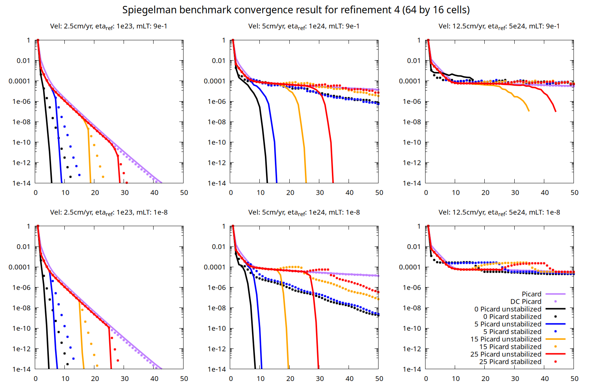

# Newton Solver Benchmark Set - Spiegelman et at. (2016)

The files in [this directory](https://github.com/geodynamics/aspect/tree/main/benchmarks/newton_solver_benchmark_set/spiegelman_et_al_2016)
can be used to recreate the figures from
{cite:t}`fraters:etal:2019` reproducing the {cite:t}`spiegelman:etal:2016` benchmark.
`input.prm` is the setup of one of the benchmark
models and `run.sh` will execute a series of model runs. Before you can execute
the benchmark you will have to compile the plugin `drucker_prager_compositions.cc` in
the same directory, the process of compiling plugins is described in [](sec:benchmark-run).
After you have executed `run.sh`, you can use the gnuplot plotting script
`plot.gnuplot` to recreate Fig. 4 of {cite:t}`fraters:etal:2019`.

```{figure-md} fig:benchmark-newton-spiegelman-2016


Convergence history of several models of the Spiegelman et al. benchmark: a reproduction of three of the nine pressure dependent Drucker–Prager cases with a resolution of 64 × 16 cells. Top: results for computations where linear systems are solved with a maximum relative tolerance of 0.9. Bottom: The same models solved with a tolerance of $10^{-8}$. The initial Picard iteration is always solved to a linear tolerance of $10^{-14}$. Left to right: different prescribed velocities of u0 = 2.5, 5, and 12.5 cm\yr, and different background reference viscosities of respectively $\eta_{ref}$ = $10^{23}$, $10^{24}$ and $10^{25}$ Pa s. Horizontal axis: number of the non-linear (outer) iteration; and vertical axis: non-linear residual. "DC Picard" refers to a defect correction Picard iteration, see the paper describing this solver.
```

The nonlinear convergence behavior of ASPECT's different nonlinear solvers is shown in {numref}`fig:benchmark-newton-spiegelman-2016`.
