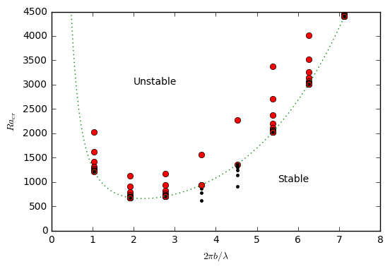
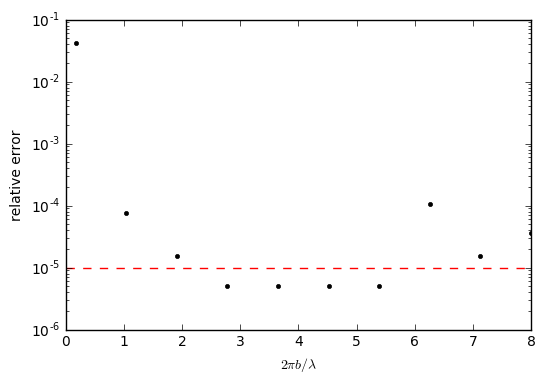

(sec:benchmarks:onset_of_convection)=
# Onset of convection benchmark

*This section was contributed by Max Rudolph, based on a course assignment for
"Geodynamic Modeling" at Portland State University.*

Here we use ASPECT to numerically reproduce the results of a linear stability
analysis for the onset of convection in a fluid layer heated from below. This
exercise was assigned to students at Portland State University as a first step
towards setting up a nominally Earth-like mantle convection model. Hence,
representative length scales and transport properties for Earth are used. This
cookbook consists of a jupyter notebook
(`benchmarks/onset-of-convection/onset-of-convection.ipynb`) that is used to
run ASPECT and analyze the results of several calculations. To use this code, you
must compile ASPECT and give the path to the executable in the notebook as
`aspect_bin`.

The linear stability analysis for the onset of convection appears in {cite:t}`turcotte:schubert:2014` (section 6.19). The linear stability
analysis assumes the Boussinesq approximation and makes predictions for the
growth rate (vertical velocity) of instabilities and the critical Rayleigh
number $Ra_c$ above which convection will occur. $Ra_c$ depends only on the
dimensionless wavelength of the perturbation, which is assumed to be equal to
the width of the domain. The domain has height $b$ and width $\lambda$ and the
perturbation is described by
```{math}
T'(x,y) = T_0'\cos\left(\frac{2\pi x}{\lambda}\right)\sin\left(\frac{\pi y}{b} \right),
```
where $T_0'$ is the amplitude of the perturbation. Note that because we place
the bottom boundary of the domain at $y=0$ and the top at $y=b$, the
perturbation vanishes at the top and bottom boundaries. This departs slightly
from the setup in {cite:t}`turcotte:schubert:2014`, where the top and bottom
boundaries of the domain are at $y=\pm b/2$. The analytic expression for the
critical Rayleigh number, $Ra_c$ is given in {cite:t}`turcotte:schubert:2014` equation (6.319):
```{math}
Ra_c=\frac{\left(\pi^2+\frac{4\pi^2 b^2}{\lambda^2}\right)^3}{\frac{4\pi^2 b^2}{\lambda^2}}.
```
The linear stability analysis also makes a prediction for the dimensionless
growth rate of the instability $\alpha'$ ({cite:t}`turcotte:schubert:2014`, equation (6.315)). The maximum vertical velocity is given by
```{math}
v_{y,\text{max}} = \frac{2\pi}{\lambda}\phi_0' e^{\alpha' t},
```
where
```{math}
\phi_0' = -\frac{2\pi}{\lambda}\frac{\rho_0 g \alpha T_0'}{\mu}\left(\frac{4\pi^2}{\lambda^2}+\frac{\pi^2}{b^2} \right)^{-2},
```
and
```{math}
\alpha'=\frac{\kappa}{b^2}\left[\frac{\rho_0 g \alpha b^3 \Delta T}{\mu \kappa}\left(\frac{\frac{4\pi^2 b^2}{\lambda^2}}{\left(\frac{4\pi^2 b^2}{\lambda^2}+\pi^2\right)^2}\right) -\left(\pi^2+\frac{4\pi^2b^2}{\lambda^2}\right)\right].
```

We use bisection to determine $Ra_c$ for specific choices of the domain
geometry, keeping the depth $b$ constant and varying the domain width
$\lambda$. If the vertical velocity increases from the first to the second
timestep, the system is unstable to convection. Otherwise, it is stable and
convection will not occur. Each calculation is terminated after the second
timestep. {numref}`fig:onset-1` shows the numerically-determined threshold for the
onset of convection, which can be compared directly with the theoretical
prediction (green curve) and Fig.&nbsp;6.39 of {cite:t}`turcotte:schubert:2014`.
The relative error between the numerically-determined value of $Ra_c$ and the
analytic solution are shown in {numref}`fig:onset-2`.


```{figure-md} fig:onset-1


Comparison of numerically-determined and theoretical values for $Ra_c$. Red circles indicate numerical simulations unstable to convection, black circles indicate simulations that are stable. The green dashed curve indicates the theoretical prediction.
```

```{figure-md} fig:onset-2


Relative error in determination of $Ra_c$. The dashed red line indicates the error tolerance used in bisection procedure.
```
