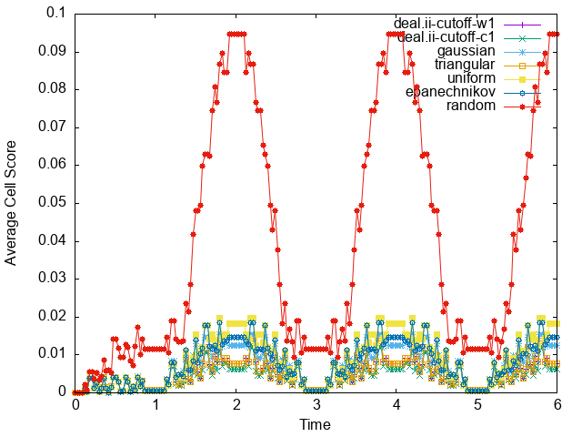

```{tags}
category:benchmark
feature:2d
feature:cartesian
feature:particles
```

(sec:benchmarks:particle_distribution)=
# Particle distribution benchmark
*This section was contributed by Jarett Baker-Dunn and Rene Gassmöller*

This benchmark is designed to compare different particle removal algorithms. In particular, it is designed to test the use of a point density function (PDF) of particle positions to remove particles from the part of the cell which has the highest density of particles. The benchmark measures how well using a PDF to remove particles functions compared to randomly selecting particles to remove. This comparison matters because randomly deleting particles was the only method available in ASPECT before version 3.1.0, and randomly selecting particles to delete could cause uneven particle distributions to develop in some models where particles were advected across cell refinement boundaries.

The PDF is generated using kernel density estimation. Kernel density estimation is a method for generating PDFs from sets of data using a kernel function and a bandwidth value. The PDFs generated through kernel density estimation are not defined continuously, instead, they are defined at discrete points from which the kernel function has been summed.

At each point at which the PDF is defined, the distance between the point in question and every point in the dataset serves as the input to the kernel function. The output of the kernel function between the point in question and each datapoint is summed and scaled by the bandwidth. The bandwidth affects how closely the PDF reflects the measured data. It is important that the bandwidth is small enough to result in a meaningful PDF, but not so small that the function is overfit to the data.

In ASPECT's particle manager, the kernel function is defined at the location of each particle in the cell, and the particles in the cell serve as the data points on which the kernel function operates. This enables the manager to select the particles with the highest point density values when deleting particles, which works to prevent excessive clustering of particles which can occur with simpler removal algorithms.

The benchmark tests all of the available kernel functions, under constant and oscillating velocity. It also compares the PDF-based algorithm to the first particle removal algorithm implemented, which randomly selected particles to delete. It is important to compare any new particle removal algorithms to random selection because random selection was the only particle removal algorithm available in ASPECT until the PDF based algorithm was added. By comparing the PDF based algorithm to  random selection, this benchmark intends to show that the PDF based algorithm avoids the uneven particle distributions which sometimes resulted from random particle removal.

Models using both constant and oscillating velocity are used in this benchmark. The models prescribing constant velocity make for the simplest possible setup which can reliably generate uneven distributions of particles, which is useful because their simplicity makes it very easy to isolate the effects of different particle removal algorithms. On the other hand models using oscillating velocities more closely resemble the models which are actually used to simulate geodynamic settings. Additionally, oscillating velocity has the advantage that it moves particles across a cell refinement boundary in two directions which can make the test more robust. For these reasons every kernel function and random selection are tested under both velocity schemes.


The kernel functions tested are:

deal.II's cutoff-w1 function,
deal.II's cutoff-c1 function,
a gaussian function,
a uniform function,
a triangular function.

The gaussian kernel function emulates a gaussian distribution, so that the value it returns given a certain distance is the value of a gaussian distribution at that distance from the center of the curve.

The uniform kernel function returns a constant value as long as the distance it is given is less than the bandwidth.

The value of the triangular kernel function scales linearly with distance, so that the value returned decreases at a constant rate as the distance input increases. The ratio between increasing distance and decreasing return value is 1:1. If the kernel function were to be graphed, the slope of the triangle's edges would be 1.

The cutoff-w1 kernel function is implemented by the deal.II library. It is similar to the triangular kernel function in that the return value decreases with increasing distance, but it is not linear.

After testing each kernel function and evaluating their performance using the particle distribution score and particles distributions statistics postprocessors, the cutoff-w1 function was chosen as the default function since it performed the best numerically.


```{figure-md} fig:plot


Figure shows a plot of the average cell score over time. The score of each cell is a measure of how clustered particles are within that cell. The score is calculated using the Particle Distribution Score postprocessor, which uses a histogram based method. A score of 0 represents a cell with a perfectly even distribution of internal particles, while a score of 1 represents a cell with the highest clustering of particles. Lower scores signal a more uniform distribution of particles, which is desirable. In the figure, the random deletion algorithm consistently shows the highest (worst) average score while the PDF algorithm using deal.II kernel functions generally show the lowest (best) score.
```


The benchmarks work by advecting particles across a cell refinement boundary, causing ASPECT to remove excess particles as particles move from smaller, finer cells into larger, coarser cells. Under constant velocity, each particle crosses the refinement boundary only once and in one direction. Under oscillating velocity, each particles crosses the refinement boundary multiple times and in two directions (as long as the particle is not removed by the particle manager).
