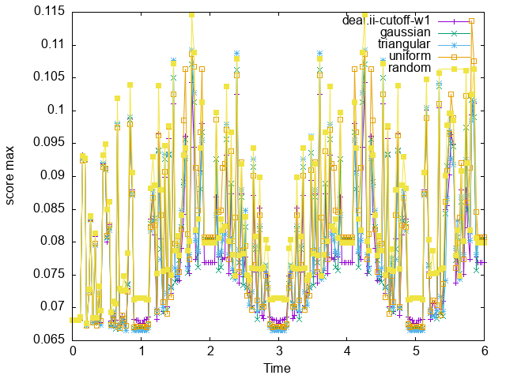

# Particle distribution benchmark
*This section was contributed by Jarett Baker-Dunn and Rene Gassmöller*

This benchmark is designed to compare different particle removal algorithms. In particular, it is designed to test the use of a point density function of particle positions to remove particles from the part of the cell which has the highest density of particles.

The point density function is generated using kernel density estimation. Kernel density estimation is a method for generating point density functions from sets of data using a kernel function and a bandwidth value. The point density functions generated through kernel density estimation are not defined continuously, instead, they are defined at discrete points from which the kernel function has been summed.

At each point at which the point density function is defined, the distance between the point in question and every point in the dataset serves as the input to the kernel function. The output of the kernel function between the point in question and each datapoint is summed and scaled by the bandwidth. The bandwidth affects how closely the point density function reflects the measured data. It is important that the bandwidth is small enough to result in a meaningful point density function, but not too high so that the function is overfit to the data.

In ASPECT's particle manager, the kernel function is defined at the location of each particle in the cell, and the particles in the cell serve as the data points on which the kernel function operates. This enables the manager to select the particles with the highest point density values when deleting particles, which works to prevent excessive clustering of particles which can occur with simpler removal algorithms.

The benchmark tests all of the available kernel functions, under constant and oscillating velocity. It also compares the point density removal algorithm to randomly removing excess particles from cells.

The kernel functions tested are:

deal.ii's cutoff-w1 function,
a gaussian function,
a uniform function,
a triangular function.

The gaussian kernel function emulates a gaussian distribution, so that the value it returns given a certain distance is the value of a gaussian distribution at that distance from the center of the curve.

The uniform kernel function returns a constant value as long as the distance it is given is less than the bandwidth.

The value of the triangular kernel function scales linearly with distance, so that the value returned decreases at a constant rate as the distance input increases. The ratio between increasing distance and decreasing return value is 1:1. If the kernel function were to be graphed, the slope of the triangle's edges would be 1.

The cutoff-w1 kernel function is implemented by the deal.ii library. It is similar to the triangular kernel function in that the return value decreases with increasing distance, but it is not linear.

After testing each kernel function and evaluating their performance using the particle distribution score and particles distributions statistics postprocessors, the cutoff-w1 function was chosen as the default function since it performed the best numerically.

Figure shows a time-based plot of the maximum of the distribution score (calculated using the Particle Distribution Score postprocessor, which uses a histogram based method) under oscillating velocity.

The benchmarks work by advecting particles across a cell refinement boundary, causing ASPECT to remove excess particles as particles move from smaller, finer cells into larger. coarser cells. Under constant velocity, each particle crosses the refinement boundary only once and in one direction. Under oscillating velocity, each particles crosses the refinement boundary multiple times and in two directions (as long as it is not removed by the particle manager). This means that unwanted particle clustering mostly has the potential to occur in the coarse cells at the refinement boundary. Because much of the potential for clustering occurs in a small fraction of the total cells, the maximum value of the distribution score across the entire model is a good way to analyize how effective each method is at avoiding particle clustering.
