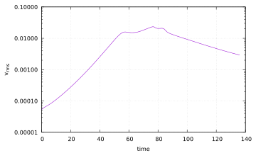

# Polydiapirism

*This section was contributed by Cedric Thieulot.*

Diapirs are a type of geologic intrusion in which a more mobile and ductily
deformable material (e.g., salt) is emplaced into (brittle) overlying rocks.
As salt domes are capable of trapping petroleum and natural gas these
structures have been extensively studied {cite}`jackson:hudec:2017`.

We consider in this experiment the three-layer viscous Rayleigh-Taylor
instability proposed by Weinberg and Schmeling {cite}`weinberg:schmeling:1992`
and we focus in what follows on the case II of that publication. The domain is
a 2D Cartesian box of size $2.24~\text{ m} \times 1~\text{ m}$. Gravity is
Earth-like ($9.81~\text{ m s}^{-2}$). Boundary conditions are
free-slip on the sides and top and no-slip at the bottom. All three layers are
initially horizontal. The top layer (fluid 1) has a thickness of
$0.75~\text{ m}$, a viscosity $\eta_1=100~\text{ Pa s}$ and a density
$\rho_1=100~\text{ kg m}^{-3}$. The middle layer (fluid 2) has a
thickness $0.125~\text{ m}$ with $\rho_2=90~\text{ kg m}^{-3}$ and
$\eta_2=1~\text{ Pa s}$. The bottom layer (fluid 3) has a thickness
$0.125~\text{ m}$ with $\rho_3=89~\text{ kg m}^{-3}$ and
$\eta_3=1~\text{ Pa s}$. The two interfaces between the layers are
perturbed by a random noise of amplitude $\pm 0.001~\text{ m}$. Since fluid 3 is
lighter than fluid 2 and fluid 2 is lighter than fluid 1, both interfaces are
unstable. We observe that interface 2-3 deforms first, produces domes which
are subsequently incorporated in the domes being generated at the interface
1-2, as shown in {numref}`fig:polydiapirs_density_a` through {numref}`fig:polydiapirs_density_d`. The root mean square velocity
({numref}`fig:polydiapirs_vrms`) shows two slopes in the early stages ($t<50~\text{ s}$)
corresponding to the two different growth rates of the interfaces, as
explained by linear stability analysis {cite}`weinberg:schmeling:1992,ramberg:1981`.


```{figure-md} fig:polydiapirs_density_a


Polydiapirism benchmark: Density field at $t=0$ s.
```

```{figure-md} fig:polydiapirs_density_b


Polydiapirism benchmark: Density field at $t=25$ s.
```

```{figure-md} fig:polydiapirs_density_c


Polydiapirism benchmark: Density field at $t=50$ s.
```

```{figure-md} fig:polydiapirs_density_d


Polydiapirism benchmark: Density field at $t=75$ s.
```

```{figure-md} fig:polydiapirs_vrms


Polydiapirism benchmark: Root mean square velocity as a function of time
```
