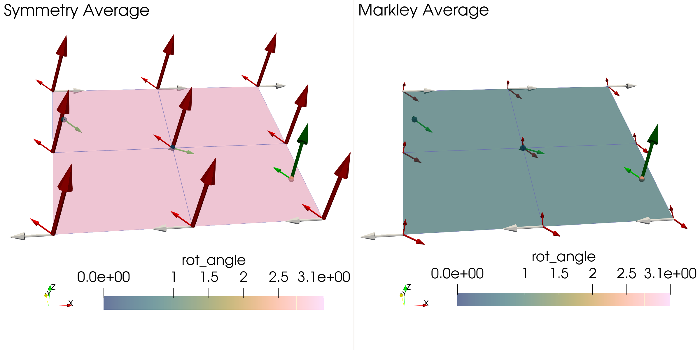
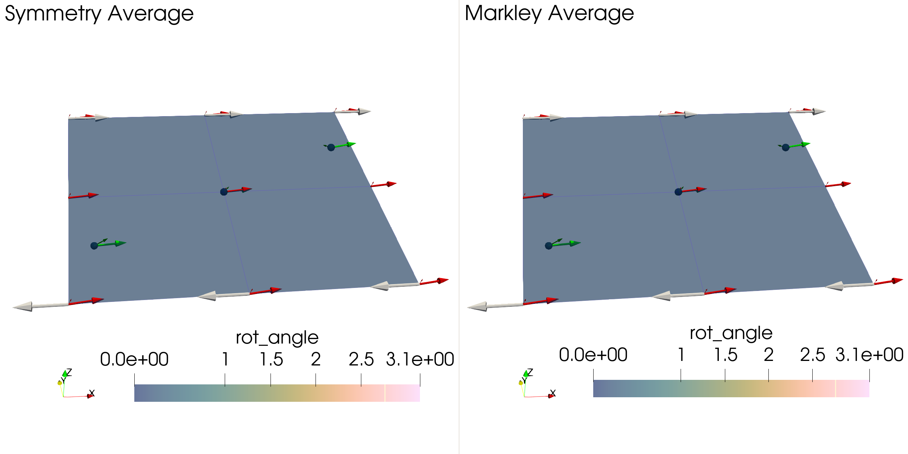
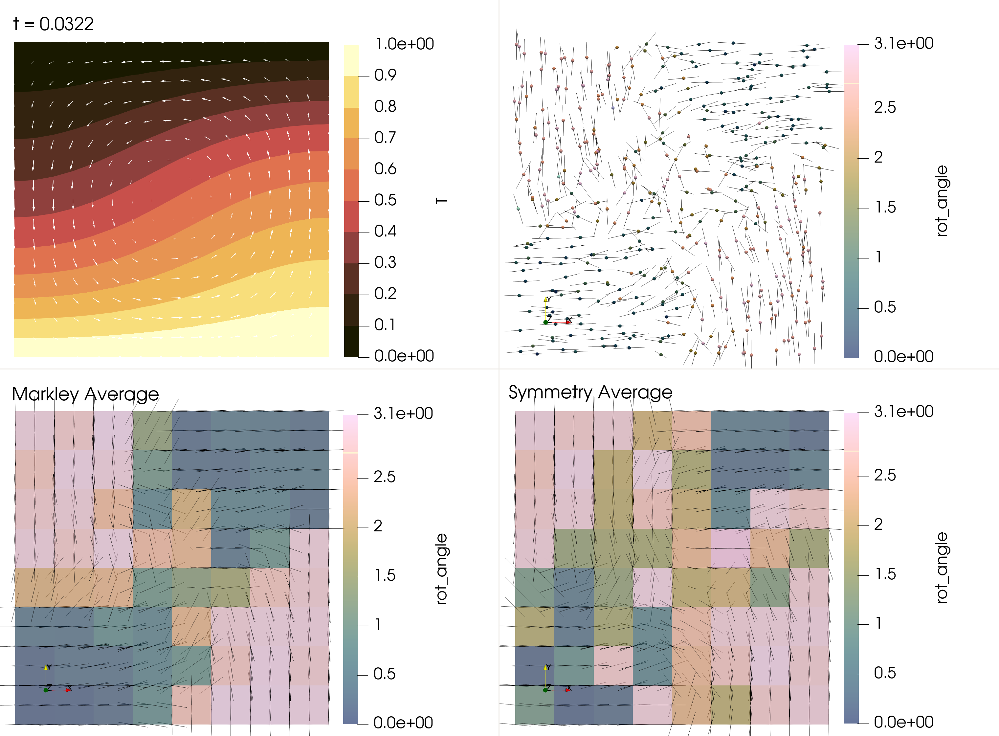
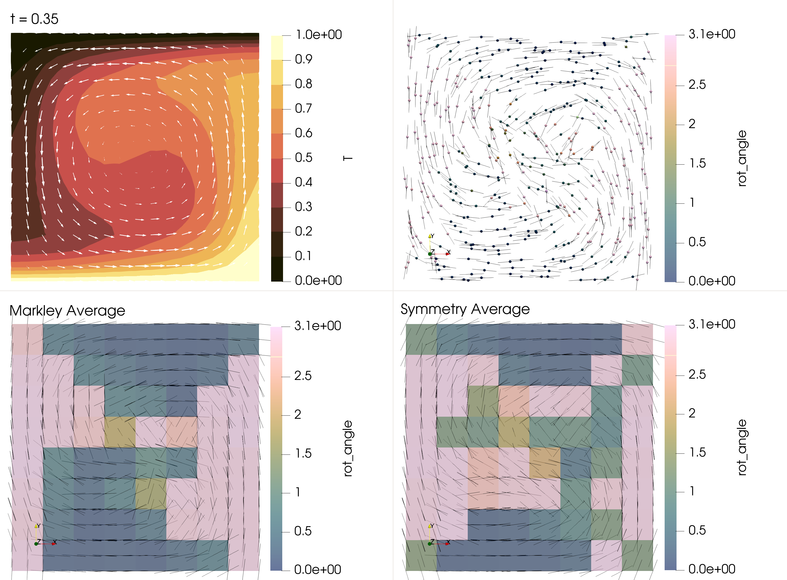

```{tags}
category:benchmark
feature:2d
feature:cartesian
feature:particles
feature:quaternions
```

(sec:benchmarks:particle_distribution)=
# Particle interpolator for crystal orientation
*This section was contributed by Theo Häußler*

## Theoretical Background
Any rotation in 3D can be represented by a 3x3 orthogonal matrix, formally the group $O(3)$,which preserves orientation, the group $SO(3)$. For a crystal with certain symmetries there is operations, which leave the crystal orientation invariant. For example a 180°-rotation around $z$ is defined by the rotation $\bm{P}_z = \mathrm{diag}(-1,-1,1) \text{ ,}$ and would leave a crystal with monoclinic symmetry around $z$ invariant. Following {cite}`man:2022` Chapter 6, one can define the set of all symmetry operations as,
```math
G_{cr} = \{\bm{P}_1,\ \dots ,\ \bm{P}_{N_{cr}}\} \subset SO(3) \text{ ,}
```
with $\bm{P_1}=\bm{I}$ and $N_{cr}$ the number of crystal symmetries. Each crystal orientation then has $N_{cr}$ representations such that one crystal orientation is defined by the set,
```math
\bm{R}G_{cr} = \{ \bm{R}\bm{P}_i:P_i\in G_{cr} \}
```
Formally, the space of crystal orientation is then defined as a quotient set of the space of rotations,
```math
SO(3)/G_{cr} = \{\bm{R}G_{cr}:\bm{R}\in SO(3)\}
```
To define an average between crystal orientations we need to define a distance between two objects in the space $SO(3)/G_{cr}$. If we have two orientations $\bm{R}_1G_{cr}$ and $\bm{R}_2G_{cr}$, we find a distance by picking the symmetry operations $\bm{P}_i$ of one of the crystal orientations such that it is closest to the other. Formally we can write ({cite}`man:2022` Chapter 6.4),
```math
d_{SO(3)/G_{cr}} (\bm{R}_1G_{cr}, \bm{R}_2G_{cr}) = \min_{\bm{P} \in G_{cr}} d(\bm{R}_1, \bm{R}_2\bm{P} ) \text{ ,}
```
here $d(\cdot, \cdot)$ is a metric in the space of rotations.

## Definition of an Average

An average in the space of rotations is defined as the rotation, which minimizes the squared distance to all samples {cite}`moakher:2002`,
```math
:label: eqn:rotation_average
\bar{\bm{R}} =  \underset{\bm{R}\in SO(3)}{\rm argmin}\sum_n d^2(\bm{R}_i,\bm{R}) \text{ .}
```
The two definitions of the metric distance we consider are the euclidian distance (e.g. straight line through the ambient space),
```math
:label: eqn:rotation_euclidian_norm
d_{\rm{eucl.}}(\bm{R}_1,\bm{R}_2) = ||\bm{R}_1- \bm{R}_2||_F
```
and the geodesic or Riemannian distance (e.g. arc following the curvature of the space),
```math
:label: eqn:rotation_riemann_norm
d_{\rm{geod.}}(\bm{R}_1,\bm{R}_2) =  ||\log(\bm{R}_1^T\bm{R}_2)||_F \text{ .}
```
In both cases $|| \cdot ||_F$ denotes the Frobenius norm, $||\bm{A}||_F:= \sqrt{\mathrm{Tr}(\bm{A}^T \bm{A}) }$. For a general crystal symmetry The minimization problem we have to solve becomes,
```math
:label: eqn:rotation_symmetry_average
\bar{\bm{R}} =  \underset{\bm{R}\in SO(3)}{\rm argmin}\sum_i d_{SO(3)/G_{cr}}^2(\bm{R}_i G_{cr},\bm{R}G_{cr}) = \underset{\bm{R}\in SO(3)}{\rm argmin}\sum_i \min_{\bm{P}_i \in G_{cr}} d^2(\bm{R}_i\bm{P}_i,\bm{R})
```
This is a combinatoric optimization problem for the problem of finding the optimal fundamental zone where all rotations are closest to one another. We can also rewrite the problem as a minimization problem for the objective function,
```math
:label: eqn:objective_function
F(\bm{R}, \{\bm{P}_i\}) =  \sum_i d^2(\bm{R}_i\bm{P}_i,\bm{R}) \text{ .}
```

## Quaternions

To efficently solve this problem we represent rotations by unit quaternions $\bm{q} \in \mathbb{H}$.
With the quaternion product $\circ$ we can write,
```math
\bm{v}' = \bm{R}\cdot \bm{v} = \bm{q}\circ \bm{v} \circ \bm{q}^{-1} \text{ .}
```
This lets us define a rotation matrix $\bm{R}(\bm{q})$ and a backwards transform $\bm{q}(\bm{R})$.
Just as for rotation matrices we can write a rotation by first $\bm{q}_1$ and then $\bm{q}_2$ as $\bm{q}' = \bm{q}_2 \circ \bm{q}_1$. If we rewrite the symmetry operations in terms of quaternions, $\bm{g}_i = \bm{q}(\bm{P}_i)$, one crystal orientation then becomes the set $\bm{q}G_{cr} = \{\bm{q}\circ\bm{g}_i:g_i \in G_{cr} \}$.
<!-- Otherwise, we treat quaternions as a 4 dimensional vector of norm one. The scalar part is related to the rotation angle $\theta$ and a vector part points in the direction of the rotation axis $\bm{u}$,
```math
 \bm{q} = (\cos (\alpha/2), \sin(\alpha/2)\bm{u})^T \text{ .}
``` -->
Quaternions also enable us to efficiently compute the Riemannian distance as {cite}`Huynh:2009`,
```math
d_{\rm geod.}(\bm{q}_1, \bm{q_2}) = 2\arccos(|\bm{q}_1\cdot\bm{q}_2|) \text{ .}
```
Using the last two statements we can define the objective function in terms of quaternions,
```math
F(\bar{\bm{q}}, \{\bm{g}_i\}) = \frac{1}{\sum_j w_j}\sum_i w_i[\ 2\arccos(|\bar{\bm{q}}\cdot(\bm{q}_i\circ\bm{g}_i)|)\ ]^2 \text{ ,}
```
where $\cdot$ is the dot product for vectors in $\mathbb{R}^4$. This is a slight generalization as $w_i$ are weights ascociated with each rotation (quaternion). In the future a distance weighting could be implemented based on these. Quaternions are also convenient as there exists a well defined average. {cite}`markley:etal:2007` show that the eigenvector corresponding to the maximum eigenvalue of the matrix,
```math
    K = 4\sum_i w_i\bm{q}_i\bm{q}_i^T - \bm{I}_4\sum_i w_i \text{ ,}
```
is a maximum likelyhood estimator of the minimization problem defined in Equ. {math:numref}`eqn:rotation_average` for the euclidian norm Equ. {math:numref}`eqn:rotation_euclidian_norm`. I will give the result of this procedure the name $\bar{\bm{q}}_{\rm mk07}$ and define it as,
```math
    \bar{\bm{q}}_{\rm mk07}(\{\bm{q}_i\}, \{w_i\}) =  \underset{\bm{q}\in \mathbb{H}}{\rm argmin} \sum_i w_i d^2_{\rm eucl.}(\bm{R}(\bm{q}_i), \bm{R}(\bm{q}))
```
This average is valid for general rotations or crystals with triclinic symmetry (no symmetry objects except the identity). In the interpolator this function is called markley average.

## Algorithm

I propose the following algorithm to solve the optimization problem {math:numref}`eqn:rotation_symmetry_average`. Our mean value and the set of symmetry operations will be denoted as $\bar{\bm{q}}^n$ and $\{\bm{g}^n_i\}$ for each iteration $n$ restricted to a maximum number of iterations.

  1. Pick an initial guess $\bar{\bm{q}}^0$ and compute the objective function $F^0(\bar{\bm{q}}^{0}, \{\bm{g}_i^0\})$ with $\bm{g}_i^0 = (1, \bm{0})$ (no symmetrization).
  2. Project all rotations in the fundamental zone around the guess.
     - For each quaternion $\bm{q}_i$ compute the geodesic distances $d_{\rm geod.}(\bm{q}_iG_{cr}, \bar{\bm{q}}^n)$ for all elements in the set $\bm{q}_i G_{cr}$.
     - Pick $\bm{q}_i' = \bm{q}_i\circ\bm{g}_i^n$ such that $d_{\rm geod.}(\bm{q}_i', \bar{\bm{q}}^n)$ is minimal.
  3. Compute the markley average $\bar{q}^{n+1} = \bar{\bm{q}}_{\rm mk07}(\{\bm{q}_i'\})$.
  4. Compute the objective function $F^{n+1}(\bar{\bm{q}}^{n+1}, \{\bm{g}_i^n\})$.
  5. Check if the objective function got smaller, $F^n > F^{n+1}$ ?
     - true : repeat 2,3 and 4
     - false: return $\bar{\bm{q}}^{n+1}$

The choice of the initial guess for the combinatoric optimization matters for a small number of particles. Here we choose to guess the "furthest" rotation from the initial mean, i.e. the rotation  with the maximum geodesic distance from the initial mean value. More information and justification for these choices will be given in a publication at a later point.

## General usage

General remarks for using the quatenion average interpolation scheme.
 **[TODO]** include .prm file parts.

The interpolator requires crystal preferred orientation and cpo bingham average to be active.
The mapped particle properties need to be q.w and q.n[i].


We need to output rotation as quaternions in the cpo bingham average to average them with the quaternion average.


We need to select the quaternion avarage as the particle interpolator.
For the quaternion average one can choose the symmetry group of your objects that are to be averaged. By now orthotropic symmetry and triclinic (no) symmetry are implemented. For all particle properties that are not quaternions you can choose a base interpolation scheme. For this all valid interpolation schemes except the quaternion average are supported.

Ideally we use discontinuouse elements of order zero such that the quaternion components are not smoothed in any way after interpolation. This prevents creating non-normalized quaternions and unphysical rotations.

### Shear Box Benchmark

**[TODO: add description]**
**[TODO: update figures and names]**

```{figure-md} fig:rotation_average_shearbox


Expected output of the shear box model at time zero. White arrows are the applied velocity boundary condition. Dark red arrows are the interpolated rotation axis. Light red is the interpolated 100-axis. Dark green is the rotation axis on the particles. Light green is the 100-axis on the particles. 
```
At time zero one can nicely see how the symmetry average is able to interpolate rotations while taking into account that an orinetation of $[\bm{v}_1, \bm{v}_2, \bm{v}_2]$ is equivalent to an orientation of $[-\bm{v}_1, -\bm{v}_2, \bm{v}_2]$.

```{figure-md} fig:rotation_average_shearbox


Expected output of the shear box model at time zero. White arrows are the applied velocity boundary condition. Dark red arrows are the interpolated rotation axis. Light red is the interpolated 100-axis. Dark green is the rotation axis on the particles. Light green is the 100-axis on the particles. 
```
At the last time step one can nicely see that both averages align as the crystal orientation stored on particles is close to each other and no rotation needs to be reprojected into the fundamental zone of another.


### Unit Convection Box Benchmark

**[TODO: add description]**
**[TODO: change names to orthotropic/triclinc]**
**[TODO: compare to euler angle average]**

```{figure-md} fig:rotation_average_shearbox


Expected output of a 2d convection box model in its spin up phase. White arrows are the velocity. Black lines are the 100-axis. This is a comparison between the symmetry average and the markley average.  
```

```{figure-md} fig:rotation_average_shearbox


Expected output of a 2d convection box model in steady state phase. White arrows are the velocity. Black lines are the 100-axis. This is a comparison between the symmetry average and the markley average.  
```


## possible next steps

- implement a distance weighting
- enable using different symmetry groups for different minerals
- generalize how the quaternions are called instead of requiring that cpo bingham average is active and the properties are named cpo mineral x q.w/q.n
