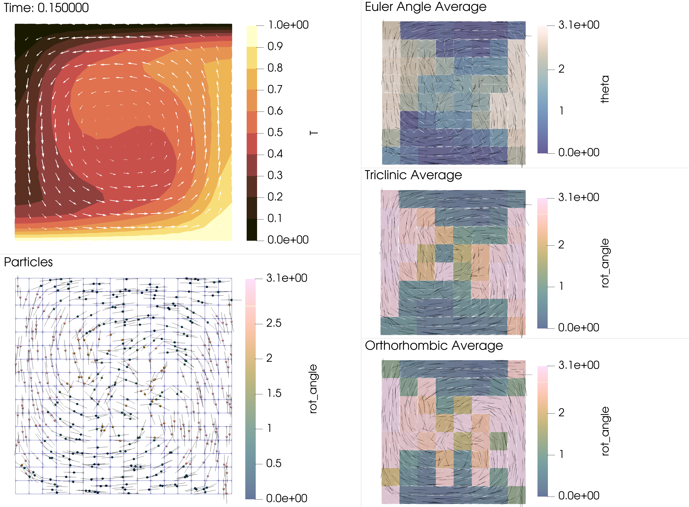

```{tags}
category:benchmark
feature:2d
feature:cartesian
feature:particles
feature:quaternions
```

(sec:benchmarks:particle_distribution)=
# Particle interpolator for rotations and crystal orientation
*This section was contributed by Theo Häußler*

## Theoretical Background
Any rotation in 3D can be represented by a 3x3 orthogonal matrix that preserves orientation, formally the group $SO(3)$. For a crystal with certain symmetries there is operations, which leave the crystal orientation invariant. For example a 180°-rotation around $z$ is defined by the rotation, $\bm{P}_z = \mathrm{diag}(-1,-1,1)$, and would leave a crystal with monoclinic symmetry around $z$ invariant. Following {cite}`man:2022` Chapter 6, one can define the set of all symmetry operations as,
```math
G_{cr} = \{\bm{P}_1,\ \dots ,\ \bm{P}_{N_{cr}}\} \subset SO(3) \text{ ,}
```
with $\bm{P_1}=\bm{I}$ and $N_{cr}$ the number of crystal symmetries. Each crystal orientation then has $N_{cr}$ representations such that one crystal orientation is defined by the set,
```math
\bm{R}G_{cr} = \{ \bm{R}\bm{P}_i:P_i\in G_{cr} \}
```
Formally, the space of crystal orientation is then defined as a quotient set of the space of rotations,
```math
SO(3)/G_{cr} = \{\bm{R}G_{cr}:\bm{R}\in SO(3)\}
```
We can choose one specific representation of the quotient space, e.g. in terms of a range of euler angles. Then we can send all rotation into this range of values by applying the symmetry operations. In crystallography people say they send all rotations into a fundamental zone. A fundamental zone is not unique. 

To define an average between crystal orientations we need to define a distance between two objects in the space $SO(3)/G_{cr}$. If we have two orientations $\bm{R}_1G_{cr}$ and $\bm{R}_2G_{cr}$, we find a distance by picking the symmetry operations $\bm{P}_i$ of one of the crystal orientations such that it is closest to the other. Following ({cite}`man:2022` Chapter 6.4) we can write,
```math
d_{SO(3)/G_{cr}} (\bm{R}_1G_{cr}, \bm{R}_2G_{cr}) = \min_{\bm{P} \in G_{cr}} d(\bm{R}_1, \bm{R}_2\bm{P} ) \text{ ,}
```
here $d(\cdot, \cdot)$ is a metric in the space of rotations.

## Definition of an Average

An average in the space of rotations is defined as the rotation, which minimizes the squared distance to all samples (e.g. {cite}`moakher:2002`),
```math
:label: eqn:rotation_average
\bar{\bm{R}} =  \underset{\bm{R}\in SO(3)}{\rm argmin}\sum_n d^2(\bm{R}_i,\bm{R}) \text{ .}
```
The two definitions of the metric distance we consider are the euclidian distance (e.g. straight line through the ambient space),
```math
:label: eqn:rotation_euclidian_norm
d_{\rm{eucl.}}(\bm{R}_1,\bm{R}_2) = ||\bm{R}_1- \bm{R}_2||_F
```
and the geodesic or Riemannian distance (e.g. arc following the curvature of the space),
```math
:label: eqn:rotation_riemann_norm
d_{\rm{geod.}}(\bm{R}_1,\bm{R}_2) =  ||\log(\bm{R}_1^T\bm{R}_2)||_F \text{ .}
```
In both cases $|| \cdot ||_F$ denotes the Frobenius norm, $||\bm{A}||_F:= \sqrt{\mathrm{Tr}(\bm{A}^T \bm{A}) }$. For a general crystal symmetry, the minimization problem we have to solve becomes,
```math
:label: eqn:rotation_symmetry_average
\bar{\bm{R}} =  \underset{\bm{R}\in SO(3)}{\rm argmin}\sum_i d_{SO(3)/G_{cr}}^2(\bm{R}_i G_{cr},\bm{R}G_{cr}) = \underset{\bm{R}\in SO(3)}{\rm argmin}\sum_i \min_{\bm{P}_i \in G_{cr}} d^2(\bm{R}_i\bm{P}_i,\bm{R})
```
This is a combinatoric optimization problem for finding the optimal fundamental zone where all rotations are closest to one another. We can also rewrite the problem as a minimization problem for the objective function,
```math
:label: eqn:objective_function
F(\bm{R}, \{\bm{P}_i\}) =  \sum_i d^2(\bm{R}_i\bm{P}_i,\bm{R}) \text{ .}
```
With the objective function we can compare different estimates for the average. 

## Quaternions

To efficently solve this minimization problem we represent rotations by unit quaternions, $\bm{q} \in \mathbb{H}$. Similar to complex numbers, Quaternions can be seen as 4 dimensional numbers, $\bm{q} = w + x\bm{i} + y\bm{j} + z\bm{k}$. The quetrnion algebra (e.g. $\bm{i}\bm{j} = \bm{k}$) defines the quaternion product $\circ$, which can be related to an active rotation of a vector $\bm{v}$. By representing the vector as a quaternion with no scalar part $\bm{v} = 0 + v_x\bm{i} + v_y\bm{j} + v_z\bm{k}$, we can write, 
```math
\bm{v}' = \bm{R}\cdot \bm{v} = \bm{q}\circ \bm{v} \circ \bm{q}^{-1} \text{ .}
```
With some algebra we can write the right hand side as a rotation matrix and find the function $\bm{R}(\bm{q})$ and the backwards transform $\bm{q}(\bm{R})$ (https://en.wikipedia.org/wiki/Quaternions_and_spatial_rotation). Phyisically, unit quaternions are an axis angle representation of a rotation. The scalar part gives $\cos(\alpha/2)$ and the vector part gives $\sin(\alpha/2)\bm{n}$. Here $\alpha$ is the rotation angle and $\bm{n}$ is the normalized rotation axis. Each rotation then can be represented by a quaternion, $\bm{q}$ or $-\bm{q}$, as rotating by the negative angle around the negative axis is exactly the same. Therefore, quaternions are a double cover of the space of rotations and we will work in the half space, where $q.w > 0$.  
Just as for rotation matrices we can write a rotation by first $\bm{q}_1$ and then $\bm{q}_2$ as $\bm{q}' = \bm{q}_2 \circ \bm{q}_1$. If we rewrite the symmetry operations in terms of quaternions, $\bm{g}_i = \bm{q}(\bm{P}_i)$, one crystal orientation then becomes the set $\bm{q}G_{cr} = \{\bm{q}\circ\bm{g}_i:g_i \in G_{cr} \}$. For orthotropic symmetry the set of symmetry operations is (e.g. {cite}`Kagan:1991`), $G_{\rm ortho.} = \{\pm 1, \pm \bm{i}, \pm \bm{j}, \pm \bm{k}\}$.

Quaternions also enable us to efficiently compute the Riemannian distance as {cite}`Huynh:2009`,
```math
d_{\rm geod.}(\bm{q}_1, \bm{q_2}) = 2\arccos(|\bm{q}_1\cdot\bm{q}_2|) \text{ .}
```
With the riemannian metric and the symmetry operations we can define the objective function in terms of quaternions as,
```math
F(\bar{\bm{q}}, \{\bm{g}_i\}) = \frac{1}{\sum_j w_j}\sum_i w_i[\ 2\arccos(|\bar{\bm{q}}\cdot(\bm{q}_i\circ\bm{g}_i)|)\ ]^2 \text{ ,}
```
where $\cdot$ is the dot product for vectors in $\mathbb{R}^4$. This is a slight generalization as $w_i$ are weights ascociated with each rotation (quaternion). In the future a distance weighting could be implemented based on these. 

Quaternions are also convenient as there exists a well defined average. {cite}`markley:etal:2007` show that the minimization defined in Equ. {math:numref}`eqn:rotation_average` for the euclidian norm Equ. {math:numref}`eqn:rotation_euclidian_norm` can be reformulated into,
```math
    :label: eqn:markley_average_maximization
    \bar{\bm{q}} = \underset{\bm{q}\in \mathbb{H}}{\rm argmax} \ \bm{q}^T\bm{K}\bm{q}
```
with the 4x4 traceless matrix, 
```math
    \bm{K} = 4\sum_i w_i\bm{q}_i\bm{q}_i^T - \bm{I}_4\sum_i w_i \text{ .}
```
The eigenvector corresponding to the maximum eigenvalue of $\bm{K}$ solves the maximization problem Equ. {math:numref}`eqn:markley_average_maximization`. As the matrix is traceless the largest eigenvalue will always be positive. I will give the result of this procedure the name $\bar{\bm{q}}_{\rm mk07}$ and define it as,
```math
    \bar{\bm{q}}_{\rm mk07}(\{\bm{q}_i\}, \{w_i\}) =  \underset{\bm{q}\in \mathbb{H}}{\rm argmin} \sum_i w_i d^2_{\rm eucl.}(\bm{R}(\bm{q}_i), \bm{R}(\bm{q}))
```
**Note: This average is valid for general rotations** or crystals with triclinic symmetry (no symmetry objects except the identity). In the interpolator this function is called markley average.

## Algorithm

I propose the following algorithm to solve the optimization problem {math:numref}`eqn:rotation_symmetry_average`. Our mean value and the set of symmetry operations will be denoted as $\bar{\bm{q}}^n$ and $\{\bm{g}^n_i\}$ for each iteration $n$. $n$ is restricted to a maximum number of iterations set to 50 as I have not seen more than 20 iteration for 1000 crystal orientations.

  1. Pick an initial guess $\bar{\bm{q}}^0$ and compute the objective function $F^0(\bar{\bm{q}}^{0}, \{\bm{g}_i^0\})$ with $\bm{g}_i^0 = (1, \bm{0})$ (no symmetrization).
  2. Project all rotations in the fundamental zone around the guess.
     - For each quaternion $\bm{q}_i$ compute the geodesic distances $d_{\rm geod.}(\bm{q}_iG_{cr}, \bar{\bm{q}}^n)$ for all elements in the set $\bm{q}_i G_{cr}$.
     - Pick $\bm{q}_i' = \bm{q}_i\circ\bm{g}_i^n$ such that $d_{\rm geod.}(\bm{q}_i', \bar{\bm{q}}^n)$ is minimal. In otherword find the representation in $\bm{q}_i G_{cr}$ that is closest to the current mean value.
  3. Compute the markley average $\bar{q}^{n+1} = \bar{\bm{q}}_{\rm mk07}(\{\bm{q}_i'\})$.
  4. Compute the objective function $F^{n+1}(\bar{\bm{q}}^{n+1}, \{\bm{g}_i^n\})$.
  5. Check if the objective function got smaller, $F^n > F^{n+1}$ ?
     - true : repeat 2,3 and 4
     - false: return $\bar{\bm{q}}^{n+1}$

The choice of the initial guess for the combinatoric optimization matters for a small number of particles. Here we choose to guess the rotation with the maximum geodesic distance from the initial mean value. For a unimodal or antipodal distribution this is likely to be close to the actual mean. More information and justification for these choices will be given in a publication at a later point.

## Benchmark cases 

This benchmarks consist of two models each set in a unit box in 2D. 
1. The first case is a shear box with a prescibed stokes solution. See for reference the prm [olivineA.prm](../../../cookbooks/crystal_preferred_orientation_olivine_fraters_billen_2021/olivineA.prm) and documentation [crystal_preferred_orientation_olivine_fraters_billen_2021.md](../../../cookbooks/crystal_preferred_orientation_olivine_fraters_billen_2021/doc/crystal_preferred_orientation_olivine_fraters_billen_2021.md). 
2. The second case is a convection box with an evolving temperature and velocity field. See for reference the .prm [convection-box](../../../cookbooks/convection-box/convection-box.prm) and the documentation [convection-box.md](../../../cookbooks/convection-box/doc/convection-box.md).
For each of them we track the crystal preferred orientation on particles and interpolate the output rotation to the grid. The changes done to the prm files mentioned above are as follows.

I added compositional fields and mapped particle properties to activate the particle interpolator. 

```{literalinclude} compositional_field.part.prm
```

With the Postprocessor and the Particles we generate an average crystal orientation and specify the particle interpolator.

```{literalinclude} particle.part.prm
```

The full prm is located in [/benchmarks/rotation_average/rotation_box_orthorhombic.prm](../rotation_box_orthorhombic.prm). 

The output presented below can be derived from quaternions by recovering the rotation angle $\alpha$ and rotation axis $\bm{n}$. They can then be used in the [Rodriguez formula](https://en.wikipedia.org/wiki/Rodrigues%27_rotation_formula) to rotate the 100-axis (or a-axis) from the crystal frame $\bm{v}_a^{cr} = (1,0,0)^T$ into the lab frame $\bm{v}_a$, 
```math
\begin{align}
    \alpha &= 2\mathrm{arccos}(q.w) \text{ ,} \\
    \bm{n} &= \frac{1}{\sin(\alpha/2)}(q.x,\ q.y,\ q.z)^T \text{ ,} \\
    \bm{v}_a &= \cos(\alpha) \bm{v}_a^{cr} + \sin(\alpha)(\bm{n}\times\bm{v}_a^{cr}) + (1-\cos\alpha) \bm{n}(\bm{n}\cdot\bm{v}_a^{cr}) \text{ .}
\end{align}
```
For euler angles the first row of the passive rotation matrix defined in `aspect::Utilities::zxz_euler_angles_to_rotation_matrix` gives back the a-axis.
```math
\bm{v}_a = (\cos(\phi_2)\cos(\phi_1) - \cos(\theta)\sin(\phi_1)\sin(\phi_2),\ -( \cos(\phi_2)\sin(\phi_1) + \cos(\theta)\cos(\phi_1)\sin(\phi_2)),\ -\sin(\phi_2)\sin(\theta) \ )
```

### Shear Box Benchmark

```{figure-md} fig:rotation_average_shearbox


Expected output of the shear box model at time zero. White arrows are the applied velocity boundary condition. Dark red arrows are the interpolated rotation axis. Light red is the interpolated 100-axis. Dark green is the rotation axis on the particles. Light green is the 100-axis on the particles. 
```
At time zero one can nicely see how the symmetry average is able to interpolate rotations while taking into account that an orientation of $[\bm{v}_1, \bm{v}_2, \bm{v}_2]$ is equivalent to an orientation of $[-\bm{v}_1, -\bm{v}_2, \bm{v}_2]$.

```{figure-md} fig:rotation_average_shearbox


Expected output of the shear box model at time t=3.5. White arrows are the applied velocity boundary condition. Dark red arrows are the interpolated rotation axis. Light red is the interpolated 100-axis. Dark green is the rotation axis on the particles. Light green is the 100-axis on the particles. 
```
At the last time step one can see that both averages align as the crystal orientation of the average crystal orientation of the 3 particles is close to each other and no rotation needs to be reprojected into the fundamental zone of another.

### Unit Convection Box Benchmark

```{figure-md} fig:rotation_average_shearbox


Expected output of a 2d convection box model in its spin up phase. White arrows are the velocity. Black lines are the 100-axis tracked on particles. White lines is the average 100-axis interpolated to the model grid.  
```

```{figure-md} fig:rotation_average_shearbox


Expected output of a 2d convection box model in its steady state phase. White arrows are the velocity. Black lines are the 100-axis tracked on particles. White lines is the average 100-axis interpolated to the model grid.
```


## possible next steps

- implement a distance weighting
- enable using different symmetry groups for different minerals
- generalize how the quaternions are called instead of requiring that cpo bingham average is active and the properties are named cpo mineral x q.w/q.n
