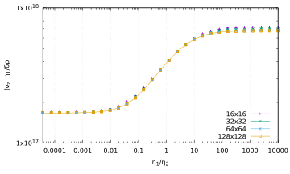

# The sinking block benchmark

This benchmark is based on the benchmark presented in (Gerya 2010) and
extended in (Thieulot 2011). It consists of a two-dimensional
$512~\si{\km}\times 512~\si{\km}$ domain filled with a fluid (the
"mantle") of density $\rho_1=3200\si{\kg\per\cubic\meter}$ and
viscosity $\eta_1=10^{21}~\si{\pascal\second}$. A square block of size
$128~\si{\km}\times 128~\si{\km}$ is placed in the domain and is centered at
location $(x_c,y_c)=(256~\si{\km},384~\si{\km})$ so as to ensure that its
sides align with cell boundaries at all resolutions (GMR level $\geq 3$). It
is filled with a fluid of density $\rho_2=\rho_1+\delta \rho$ and viscosity
$\eta_2$. The gravity vector points downwards with
$|\boldsymbol{g}|=10~\si{\meter\per\square\second}$. Boundary conditions are
free slip on all sides. Only one time step is carried out and we measure the
absolute velocity $|v_z|$ in the middle of the block.

In a geodynamical context, the block could be interpreted as a detached slab
or a plume head. As such its viscosity and density can vary (a cold slab has a
higher effective viscosity than the surrounding mantle while it is the other
way around for a plume head). The block densities can then vary from a few
units to several hundreds of $\si{\kg\per\cubic\meter}$ and the viscosities by
several orders of magnitude to represent a wide array of scenarios. The
velocity field obtained for $\eta_2=10^{27}~\si{\pascal\second}$ and
$\delta\rho=32~\si{\kg\per\cubic\meter}$ is shown in Figure&nbsp;[1].

As shown in (Thieulot 2011) one can independently vary $\eta_1$, $\rho_2$,
$\eta_2$, and measure $|v_z|$ for each combination: the quantity
$|v_z| \eta_1/\delta\rho$ is then found to be a simple function of the ratio
$\eta^\star=\eta_1/\eta_2$: at high enough mesh resolution all data points
collapse onto a single line. The shell script *run_benchmark* in the folder
runs the experiment for values
$\eta_2\in [10^{17},10^{26}]~\si{\pascal\second}$ and
$\delta\rho=8,32,128~\si{\kg\per\cubic\meter}$. Results are shown in
Figure&nbsp;[2] and we indeed recover the expected trend with all data
points forming a single smooth line.

```{figure-md} fig:sinking_block1


 Density field with velocity arrows for \eta_2=10^{27}~\si{\pascal\second} and \delta\rho=32~\si{\kg\per\cubic\meter}
```

```{figure-md} fig:sinking_block2


Scaled velocity measurements as a function of the viscosity contrast between surrounding medium and block for all experiments.
```

<div id="refs" class="references csl-bib-body hanging-indent">

<div id="ref-gery10" class="csl-entry">

Gerya, Taras. 2010. *Numerical Geodynamic Modelling*. Cambridge University
Press.

</div>

<div id="ref-thie11" class="csl-entry">

Thieulot, C. 2011. "<span class="nocase">FANTOM: two- and
three-dimensional numerical modelling of creeping flows for the solution of
geological problems</span>."
*Phys.&nbsp;Earth.&nbsp;Planet.&nbsp;Inter.* 188: 47--68.

</div>

</div>

  [1]: #fig:sinking_block1
  [2]: #fig:sinking_block2