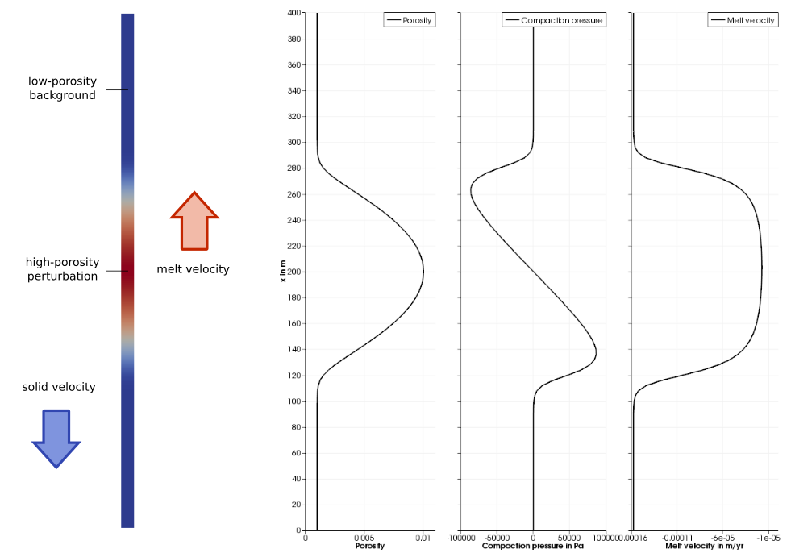

(sec:benchmarks:solitary_wave)=
# The solitary wave benchmark

*This section was contributed by Juliane Dannberg and is based on a section in
{cite:t}`dannberg:heister:2016` by Juliane Dannberg and Timo Heister.*

One of the most widely used benchmarks for codes that model the migration of
melt through a compacting and dilating matrix is the propagation of solitary
waves (e.g. {cite}`simpson:spiegelman:2011,keller:etal:2013,schmeling:2000`).
The benchmark is intended to test the accuracy of the
solution of the two-phase flow equations as described in
{ref}`sec:methods:melt-transport` and makes use of the fact that there is an
analytical solution for the shape of solitary waves that travel through a
partially molten rock with a constant background porosity without changing
their shape and with a constant wave speed. Here, we follow the setup of the
benchmark as it is described in {cite:t}`barcilon:richter:1986`, which considers
one-dimensional solitary waves.

The model features a perturbation of higher porosity with the amplitude
$A \phi_0$ in a uniform low-porosity ($\phi=\phi_0$) background. Due to its
lower density, melt migrates upwards, dilating the solid matrix at its front
and compacting it at its end.

Assuming constant shear and compaction viscosities and using a permeability
law of the form
```{math}
k_\phi = k_0 \phi^3,
```
implying a Darcy coefficient
```{math}
K_D(\phi) = \frac{k_0}{\eta_f} \phi^3 ,
```
and the non-dimensionalization
```{math}
\begin{aligned}
x &= \delta x'
  && \text{ with the compaction length } \delta = \sqrt{K_D(\phi_0)(\xi + \frac{4}{3}\eta)} , \\
\phi &= \phi_0 \phi '
  && \text{ with the background porosity } \phi_0 , \\
(\mathbf u_s, \mathbf u_f) &= u_0 (\mathbf u_s, \mathbf u_f)'
  && \text{ with the separation flux } \phi_0 u_0 = K_D(\phi_0) \Delta\rho g ,
\end{aligned}
```
the analytical solution for the shape of the solitary wave can be written in
implicit form as:
```{math}
\begin{aligned}
x(\phi) &= \pm (A + 0.5)
\left[ -2 \sqrt{A-\phi} + \frac{1}{\sqrt{A-1}}
\ln \frac{\sqrt{A-1} - \sqrt{A-\phi}}{\sqrt{A-1} + \sqrt{A-\phi}} \right]
\end{aligned}
```
and the phase speed $c$, scaled back to physical units, is $c = u_0 (2A+1)$.
This is only valid in the limit of small porosity $\phi_0 \ll 1$.
{numref}`fig:setup-solitary-wave` illustrates the model setup.

```{figure-md} fig:setup-solitary-wave


Setup of the solitary wave benchmark. The domain is 400 m high and
includes a low porosity ($\phi = 0.001$) background with an initial
perturbation ($\phi = 0.1$). The solid density is 3300 kg/m$^3$ and
the melt density is 2500 kg/m$^3$. We apply the negative phase speed of
the solitary wave $ u_s = -c e_z$ as velocity boundary condition, so
that the wave will stay at its original position while the background
is moving.
```

The parameter file and material model for this setup can be found in
[benchmarks/solitary_wave/solitary_wave.prm](https://www.github.com/geodynamics/aspect/blob/main/benchmarks/solitary_wave/solitary_wave.prm) and
[benchmarks/solitary_wave/solitary_wave.cc](https://www.github.com/geodynamics/aspect/blob/main/benchmarks/solitary_wave/solitary_wave.cc). The most relevant sections are
shown in the following paragraph.

```{literalinclude} solitary_wave.prm
```

The benchmark uses a custom model to generate the initial condition for the
porosity field as specified by the analytical solution, and its own material
model, which includes the additional material properties needed by models with
melt migration, such as the permeability, melt density and compaction
viscosity. The solitary wave postprocessor compares the porosity and pressure
in the model to the analytical solution, and computes the errors for the shape
of the porosity, shape of the compaction pressure and the phase speed. We
apply the negative phase speed of the solitary wave as a boundary condition
for the solid velocity. This changes the reference frame, so that the solitary
wave stays in the center of the domain, while the solid moves downwards. The
temperature evolution does not play a role in this benchmark, so all
temperature and heating-related parameters are disabled or set to zero.

And extensive discussion of the results and convergence behavior can be found
in {cite:t}`dannberg:heister:2016`.
