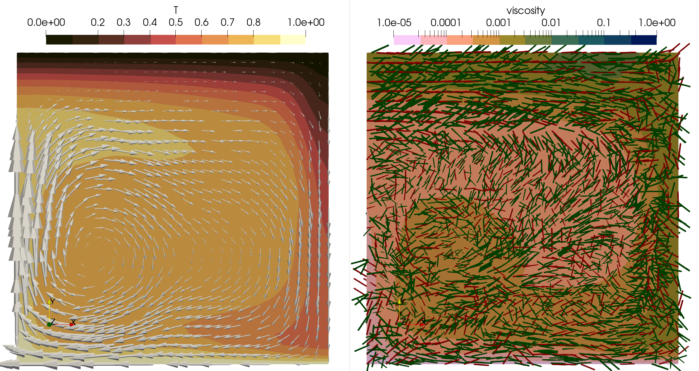

```{tags}
category:benchmark
feature:2d
feature:cartesian
feature:nonlinear-solver
feature:plasticity
feature:anisotropic-viscosity
```

(sec:benchmarks:tosi-aniso-benchmark)=
# The anisotropic Tosi benchmark

*This section was contributed by Theo Häußler.*

This section discusses the coupled anisotropic viscoplastic thermal convection
described by {cite}`rathmann:etal:2024` building on {cite:t}`tosi:etal:2015`.
Coupled means that with the stokes flow a crystal preferred orientation develops, 
which leads to an anisotropic viscosity. The results are published in the original 
papers and what follows is a brief description of the setup and the results of the benchmark. 

TODO: add reference rathmann

In the benchmark we solve for Boussinesq convection in a box of $1 \times 1$ dimensions with free slip boundary conditions. The initial temperature distribution considers a linear depth profile with a slight perturbation to start convection. Top and bottom boundaries are set to a fixed temperature value. The parameters correspond to Case 2 in the Tosi benchmarks. Case 2 itself is set up to produce a stable convective regime with plumes passing the lid in the initiation phase. 

The other input files describe the variations on this one case done by Rathmann et. al.. 
The original rheology used in the Tosi et.al. benchmarks combines a linear and a plastic component of the viscosity in a harmonic average, 
```{math}
:label: eq:tosi-aniso-benchmark-ave-visc
\eta(T,\epsilon,z) = 2 \left(\frac{1}{\eta_\text{linear}}+\frac{1}{\eta_\text{plastic}}\right)^{-1}
```
```{math}
:label: eq:tosi-aniso-benchmark-lin-visc
  \eta_\text{linear}(T,z) = \exp(-\ln(\eta_T) T + \ln(\eta_Z) z)
```
```{math}
:label: eq:tosi-aniso-benchmark-plast-visc
  \eta_\text{plastic}(\dot\epsilon) = \eta^\ast + \frac{\sigma_y}{\sqrt{\dot\epsilon:\dot\epsilon}}
```
where $\eta^\ast$ is the constant effective viscosity at high stresses and $\sigma_y$ is the yield stress. In Case 2 the yield stress is choosen as 1 and the effective viscosity is $10^{-3}$.
The term $\sigma_y/\sqrt{\dot\epsilon:\dot\epsilon}$ can be seen as an isotropic viscosity,
```math
% :label: eq:tosi-isotropic-viscosity
\eta_{0, \text{iso}}(\dot{\boldsymbol{\epsilon}}) = A^{-1/n}\left[\dot{\boldsymbol{\epsilon}}:\dot{\boldsymbol{\epsilon}} \right]^{(1-n)/2n} \text{ ,}
```
where the stress exponent goes to $n\to\infty$. Therefore, Rathmann et.al. call Case 2 in the Tosi benchmarks the plastic case. If $n=3.5$ one can call it the viscoplastic isotropic case. $A$ is a rate factor which has been chosen by Rathmann et. al. to approximately match the time the first plume passes the lid. 

## Anisotropic Viscoplastic

This viscoelastic rheology was ammended by Rathmann et. al. by introducing a viscosity $\eta_0(\dot{\boldsymbol{\epsilon}})$ dependent on an orthotropic strain-rate invariant, 
```{math}
:label: eq:tosi-aniso-benchmark-plast-visc
  \eta_\text{plastic}(\dot\epsilon) = \eta^\ast + \eta_0(\dot{\boldsymbol{\epsilon}})
```
The orthotropic strain-rate invariant used by Rathmann et.al. can be written in terms of 6 material dependent Hill coefficients $H_i$ (see {cite}`Hill 1948`), which define the anisotropic viscous behaviour. Orthotropic invariant meaning it is invariant under reflection of the strain rate with respect to the directions of some principal symmetry frame. For our purposes this is the principal crystal reference frame (see [CPO induced Anisotropic Viscosity](https://aspect-documentation.readthedocs.io/en/latest/user/cookbooks/cookbooks/CPO_induced_anisotropic_viscosity/doc/CPO_induced_anisotropic_viscosity.html)) With the strain-rate in the principal frame $\dot{\boldsymbol{\epsilon}}'$ we can write, 
```math
% :label: eq:anisotropic-viscosity
\eta_0(\dot{\boldsymbol{\epsilon}}) = A^{-1/n}\left[\sum_i\frac{2}{3\gamma}(\dot{\epsilon}_{ii}'^2(4H_{i}+H_{j_i}+H_{k_i}) + 2 \dot{\epsilon}_{j_ij_i}' \dot{\epsilon}_{k_ik_i}' (H_i-2H_{j_i}-2H_{k_i}))+ 3/H_{i+3}\dot{\epsilon}_{j_ik_i}'^2 \right]^{(1-n)/2n} \text{ .}
```
Furthermore, an anisotropic unitless rank 4 tensor for viscosity is added to the consitutive equations, 
```math
% :label: eq:anisotropic-constitutive equations
\boldsymbol{\tau} = \eta(T,z, \dot{\boldsymbol{\epsilon}}) \mathcal{V}:\dot{\boldsymbol{\epsilon}}
```
In the principal frame we impose that the anisotropic tensor exhibits orthotropic symmetry and we can write in Kelvin-Mandle notation as, 
```math
% :label: eq:anisotropic-viscosity-tensor
\begin{align}
    \mathcal{V} &= \frac{2}{3\gamma}\begin{pmatrix}
    4H_1+H_2+H_3& 
    -2H_1-2H_2 +H_3  & 
    -2H_1-2H_3 +H_2 & 0 & 0 & 0 \\
    & 4H_2+H_1+H_3 & 
        -2H_2-2H_3 +H_1  & 0 & 0 & 0 \\
    & & 4H_3+H_1+H_2 & 0 & 0 & 0 \\
        &       &       & 9\gamma/(4H_4) & 0 & 0 \\
        &       &       &   & 9\gamma/(4H_5) & 0 \\
 \text{sym} & & & & & 9\gamma/(4H_6) 
    \end{pmatrix} \text{ ,}
\end{align}
```
where $\gamma$ is defined as in Rathmann et.al. as $\gamma=\sum_i H_{j_ij_i}H_{k_ik_i}$
In the isotropic case the Hill coefficients are prescribed as $H_1, H_2, H_3 =0.5$ and $H_4, H_5 H_6=1.5$, which reduces equation {math:numref}`eq:anisotropic-viscosity` to equation {math:numref}`eq:tosi-isotropic-viscosity` only with the deviatoric strain-rate $\dot{\boldsymbol{\epsilon}}^d$. As the Tosi benchmarks use the bousinesq formulation they are equivalent $\dot{\boldsymbol{\epsilon}} = \dot{\boldsymbol{\epsilon}}^d$. Similarly, the anisotropic tensor projects the strain-rate to its deviator $\mathcal{V}:\dot{\boldsymbol{\epsilon}} = \dot{\boldsymbol{\epsilon}}^d$, which again is the same.

## Implementation 

The tosi-aniso.cc plugin is a reduced version of tosi.cc, which omits depth dependence, but therefore includes anisotropic viscosity. The anisotropic tensor and the anisotropic viscosity are computed by using the CPO_AV_3D material model from cookbooks/CPO_induced_anisotropic_viscosity/plugin/cpo_induced_anisotropic_viscosity.cc as a base model. The Tosi Rathmann Material model wrapps the initialize and create_additional_named_outputs functions of the CPO_AV_3D material model. Those generate the anisotropic viscosity tensor also called stress strain director as an additional output and choose the correct assembler using this anisotropic viscosity tensor. 

## Results

In the anisotropic case we can see 

```{figure-md} fig:tosi-rathmann-aniso-viscoplast


 Temperature field after 0.1 for anisotropic viscoplastic case of {cite}`rathmann:etal:2024`.
```

The Plastic Case corresponds to mobile-lid convection, with the descending cold lid cooling the cell's interior (Fig. 2 of {cite:t}`tosi:etal:2015`). In the viscoplastic case temperature is distributed through the cell faster reducing the viscosity compared to the plastic case. This delays the time the second plume passes the lid. The anisotropic viscoplastic case seems to further reduce the viscosity of convection and delay the second plume. 


This can be seen by comparing the mean temperature and mean top velocity evolution. 

```{figure-md} fig:tosi-benchmark-results3


 Velocity field in steady-state for case 1 of {cite}`tosi:etal:2015`.
```
