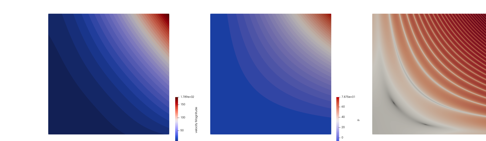
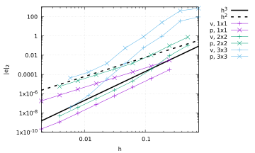

# Viscosity grooves benchmark

*This benchmark was designed by Dave May and this section was contributed by
Cedric Thieulot.*

The domain is a two-dimensional Cartesian box of size $L\times L$. The
velocity and pressure fields are given by
```{math}
\begin{aligned}
u(x,y) &=& x^3 y + x^2 + xy + x, \\
v(x,y) &=& -\frac{3}{2}x^2y^2 - 2xy - \frac{1}{2}y^2 - y, \\
p(x,y) &=& x^2y^2 + xy + 5 + p_0,
\end{aligned}
```
where $p_0$ is a constant to
be determined based on the type of pressure normalization. The viscosity is
chosen to be
```{math}
\eta(x,y)=-\sin(p)+1+\epsilon = -\sin (x^2y^2 + xy + 5) + 1 + \epsilon,
```
where $\epsilon$ controls the viscosity contrast. It is easy to verify that
the flow is incompressible as the velocity field satisfies
$\nabla\cdot \mathbf u = 0$. The right hand side term of the Stokes equation
is obtained by inserting the expressions for velocity, pressure and viscosity
in the momentum conservation equation, see {cite:t}`thieulot:2019` for details. The
velocity, pressure and right hand side magnitude are shown in {numref}`fig:benchmark-grooves-3x3`
for $L=3$ and $\epsilon=0.1$.

The $p_0$ constant can be determined by requiring that the pressure is
normalized over the volume of the domain:
```{math}
\int_\Omega p dV=
\int_0^L\int_0^L p(x,y) \, dx dy =
\int_0^L\int_0^L (x^2y^2+xy+5)\, dx \, dy + \int_0^L \int_0^L p_0 \, dx \, dy =0.
```
It then follows that:
```{math}
p_0 =-  \frac{1}{L^2}  \int_0^L\int_0^L (x^2y^2+xy+5) dx dy
= -\frac{L^4}{9}-\frac{L^2}{4} - 5.
```

```{figure-md} fig:benchmark-grooves-3x3


 Viscosity grooves benchmark: From left to right, velocity field, pressure field, and norm of the right hand side of the momentum equation, for a 3\times 3 domain with \epsilon=0.1.
```

As seen in {numref}`fig:benchmark-grooves-domains`, the value of $\epsilon$ controls the viscosity
field amplitude: when the $\sin$ term of the viscosity takes value 1, the
viscosity is then equal to $\epsilon$; when the $\sin$ is equal to $-1$, the
viscosity is then $2+\epsilon$. In other words, the ratio between maximal and
minimal viscosity in the domain is of the order $\frac{2}{\epsilon}$.

Another interesting aspect of this benchmark is the fact that increasing the
domain size adds complexity to it as it increases the number of low viscosity
zones and the spacing between them decreases.

```{figure-md} fig:benchmark-grooves-domains


 Viscosity grooves benchmark: Viscosity field for three domain sizes: 1\times 1, 2\times 2 and 3\times 3.
```

The velocity and pressure errors (in the $L_2$ norm) are measured for
$L=1,2,3$, global refinement levels 3 to 9 (resolutions $8\times 8$ to
$512\times 512$) and $\epsilon=10^{-1},10^{-2},10^{-3}$. {numref}`fig:benchmark-grooves-errors`
shows the velocity and pressure error convergence as a function of the mesh
size for $\epsilon=0.1$ (results are identical for the other two $\epsilon$
values). The expected convergence rates (cubic convergence for velocity and
quadratic for pressure) are recovered for the $1\times 1$ domain at all
resolutions. These rates are recovered for the $2\times 2$ domain for
resolutions above level 6. We find that the multitude of low viscosity bands
in the upper right corner of the $3\times 3$ domain will require a refinement
level larger than 9 to recover the optimal convergence rates.

```{figure-md} fig:benchmark-grooves-errors


Viscosity grooves benchmark: Velocity and pressure error convergence as a function of the mesh size <span class="math inline"><em>h</em></span> for 3 domain sizes.
```
