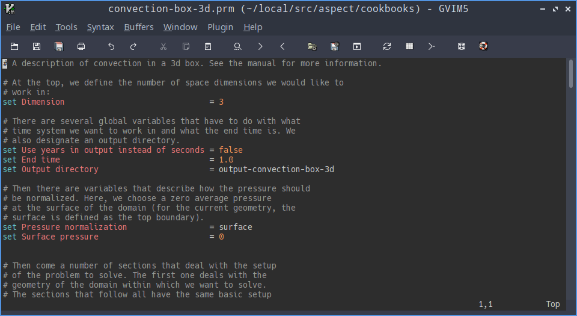

Syntax highlighting for Aspect/Deal.II prm files
=======

## Vim editor syntax highlighting

To install syntax highlighting in vim, copy the file `vim.prm` to `~/.vim/syntax/vim.prm`, and add the following lines to `~/.vimrc`:

    au! Syntax prm source $HOME/.vim/syntax/prm.vim
    au BufRead,BufNewFile *.prm set filetype=prm

