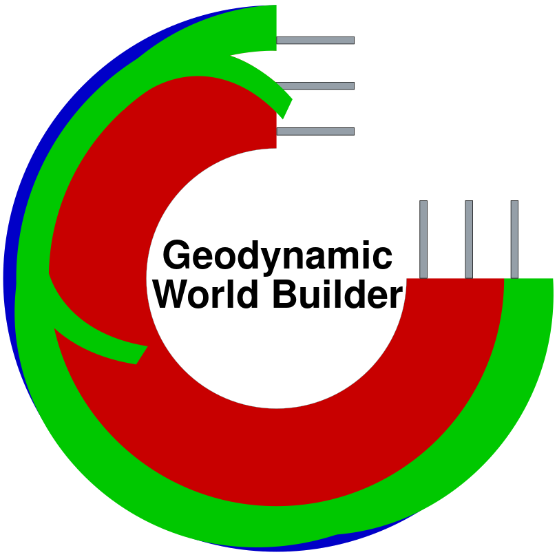
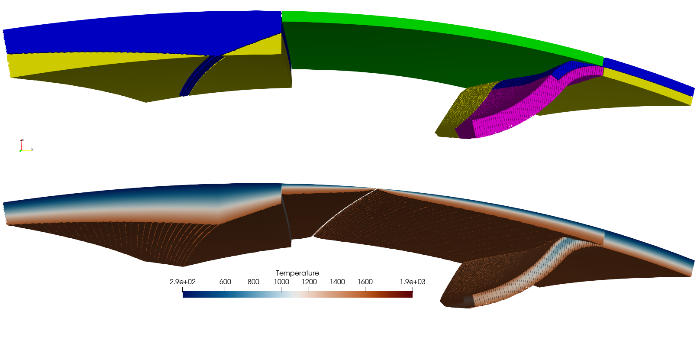

 &nbsp;&nbsp;&nbsp;&nbsp; 

# The Geodynamic World Builder (GWB)

## What is the Geodynamic World Builder?
The Geodynamic World Builder (GWB) is an open source code library intended to set up initial conditions for computational geodynamic models and/or visualize complex 3d tectonic settings in both Cartesian and Spherical geometries. The inputs for the JSON-style parameter file are not mathematical, but rather a structured nested list describing tectonic features, e.g., a continental, an oceanic or a subducting plate. Each of these tectonic features can be assigned a specific temperature profile (e.g., plate model) or composition label (e.g., uniform). For each point in space, the GWB can return the composition and/or temperature. It is written in C++, but can be used in almost any language through its C and Fortran wrappers. Various examples of 2D and 3D subduction settings are presented.

For more information see the [GWB site](https://geodynamicworldbuilder.github.io/), see the automatically generated extensive [online User Manual](https://gwb.readthedocs.io) or the automatically generated [code documentation](https://codedocs.xyz/GeodynamicWorldBuilder/WorldBuilder/index.html).

## Frequently Asked Questions (FAQ)
### What are the minimum requirements to compile the library and tools?
Currently, GWB requires only a C++14 compiler and CMake version higher than 2.8.12 to compile the library tools. Note that for some optional features (such as certain wrappers and unity build) a higher version of CMake and other dependencies may be needed (e.g., a Fortran compiler to compile the Fortran wrapper).
### What do I do when I have a question or want to request a feature?
If you have a question about the code and you can not find the answer easily in the documentation or the question is not already raised as an [issue](https://github.com/GeodynamicWorldBuilder/WorldBuilder/issues), please let us know by opening an [issue on github](https://github.com/GeodynamicWorldBuilder/WorldBuilder/issues/new). This is also the preferred method for asking for new features for GWB.

### I found a mistake in the documentation or code, what should I do?
Please do not keep it to yourself and let us know. Others will also profit from mistakes being found and fixed. Even if it is just a typo in the documentation feel free to raise an issue or, even better, make a pull request to fix the issue.

### Is there a way to ask a quick question or chat with the developers or other users?
We are now also experimenting with matrix chat ([#gwb:matrix.org](https://app.element.io/#/room/#gwb:matrix.org)). [Matrix](https://matrix.org) is an open source distributed chat protocol (a description of how to communicate). The matrix is not limited to one client, but using the [Element](https://element.io) client is generally recommended. Element can be used as a desktop, mobile or web application. Since the main developer is already present on matrix, a special space has been created for the World Builder allowing the option for multiple rooms. You can join the main room [here](https://app.element.io/#/room/#gwb:matrix.org). This is the easiest way since you can just open it in your browser. If you want to join the whole space in any client, use this link: [https://matrix.to/#/!vhukRUGUINnZOIutoQ:matrix.org](https://matrix.to/#/!vhukRUGUINnZOIutoQ:matrix.org). 

Feel free to join!

### How to cite?
The developers of the Geodynamic World Builder request that you cite the following publication:

Fraters, M., Billen, M., Gassmöller, R., Saxena, A., Heister, T., Li, H., Douglas, D., Dannberg J., Bangerth W. and Wang, Y.: The Geodynamic World Builder: A planetary structure creator for the geosciences, Journal of Open Source Software, [https://doi.org/10.21105/joss.06671](https://doi.org/10.21105/joss.06671), 2024.

Fraters, M., Thieulot, C., van den Berg, A., and Spakman, W.: The Geodynamic World Builder: a solution for complex initial conditions in numerical modelling, Solid Earth, [https://doi.org/10.5194/se-10-1785-2019](https://doi.org/10.5194/se-10-1785-2019), 2019.

And cite the specific version of the software used. The current release can be cited as:

Menno Fraters and others. August 2024. The Geodynamic World Builder v1.0.0. Zenodo. [https://doi.org/10.5281/zenodo.13352667](https://doi.org/10.5281/zenodo.13352667).

### How can I follow the progress of this project?
There are multiple ways in which you can follow this project:
 1. Watch the repository on github. This will give you an update of what is happening in the repository. This happens automatically and you can set it up to notify you for different kinds of events. 
 2. Follow the [World Builder Mastodon account](https://social.mfraters.net/@world_builder). This is a manually updated feed which updates when there are new releases or major new features merged into the main branch. More general news related to the project may also be posted.
 3. Subscribe to the Mastodon RSS feed: https://social.mfraters.net/@world_builder.rss. This will show exactly the same information as the Mastodon account, but you can use any RSS reader.
 4. Visit the [World Builder website](https://geodynamicworldbuilder.github.io/). Besides all kinds of useful information and links, it also contains a RSS feed viewer for the World Builder Mastodon account.
 5. Join the [main GWB Matrix chat room](https://app.element.io/#/room/#gwb:matrix.org) or the whole [GWB Matrix space](https://matrix.to/#/!vhukRUGUINnZOIutoQ:matrix.org)!
