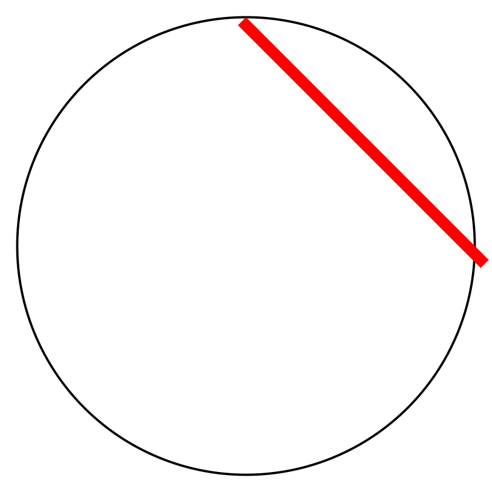
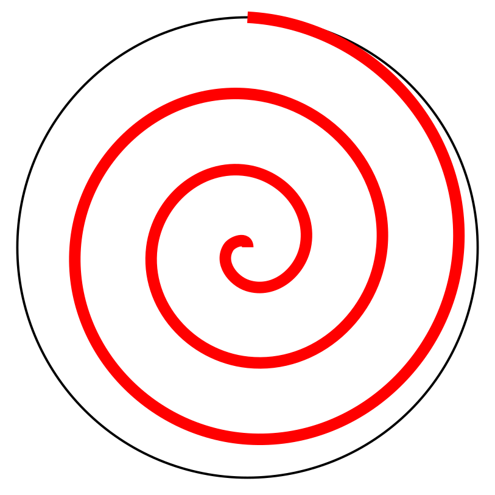

(part:user_manual:chap:concepts:sec:const_angle_spherical)=
Constant angle in spherical domain issue
========================================

There is one last concept we need to discuss before we can move on to {ref}`part:user_manual:chap:basic_starter_tutorial:sec:index`, this  is the problem of defining a constant angle in a sphere. This does not matter for Cartesian models but is important for line features in spherical models.

When defining a line with a certain angle to the surface in a sphere, you can look at this in one of two ways. The first option is to define a constant angle at its starting point. This works mostly fine except for large distances where it will burst through the surface of the planet out into space. This can be seen in the left figure below. The other option is to define a constant angle with respect to the surface above. This results in a logarithmic spiral as seen in the right figure below.

::::{grid} 2

:::{grid-item-card}

**Constant angle with the starting position**

:::
:::{grid-item-card}

**Constant angle with the surface above the current position**

:::
::::

Currently only the first option (left figure), and something in between the first and second option (right figure) has been implemented in the GWB. For this in between option, the angle of each line segment can be adjusted to the correct angle with respect to the surface. Implementing this fully (right figure) is possible if there is enough interest. 

In the GWB this concept is defined in the spherical coordinate system through something called a `depth method`. The left figure method is called `starting point` because the angle is set and kept relative to the starting point. The in between option is called `begin segment` because the angle is relative to the beginning of each segment. The right figure method is called `contiuous` and is not implemented.
