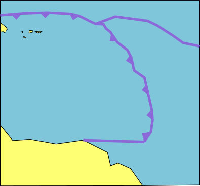
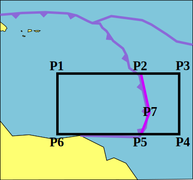
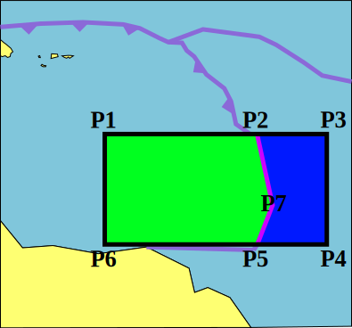
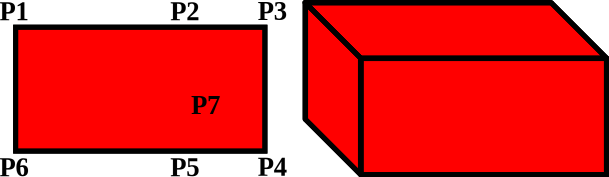
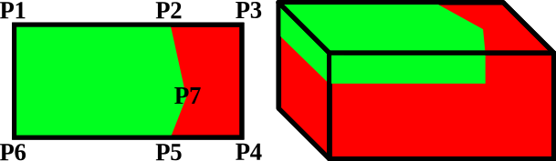
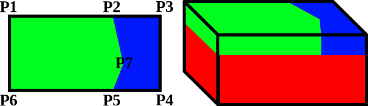
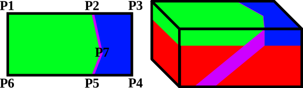

(part:user_manual:chap:concepts:sec:painting_the_world)=
Painting in the world
=====================

In the last section we introduced the concept of a feature. In this section we are going to discuss how features are placed inside the world and how they can interact with each other. 

GWB features are primarily defined by the user as 2D features on a map. The user first provides 2D coordinates of where the feature is located. After prescribing its location, the user then provides information to make the feature a 3D object. 

GWB features are specified as a list. The GWB goes through this list sequentially from top to bottom and adds each feature to the world in this order. If there is any overlap, the user can decide what to do (how to blend the old and new value), but by default each feature overwrites the old value with the new value. You can think of it like painting, where each feature adds a layer of paint and the painter can decide to completely paint over an area or create an interesting blend!

Starting with a topographic map
-------------------------------

In this section we will take a map of a region and start to make a model. 

Below you can see three figures. In the leftmost one we start with a map of the region of interest - in this case a simplified map of the eastern Caribbean plate. For simplicity's sake, we will focus on a small part as indicated by the black box in the middle figure. Next, we define important points P1 to P7 on the box. These points are defined by the different tectonic units in the area. In the figure to the right, P1, P2, P7, P5 and P6 define the area to the left of the trench (green) which represents the Caribbean plate. P2, P3, P4, P5 and P7 define the area to the right of the trench (blue) which represents the Atlantic part of the South American plate. Finally, P2, P7 and P5 describe a line for the trench (magenta).

::::{grid} 3

:::{grid-item-card}

**Starting with a "geologic map"**

:::
:::{grid-item-card}

**Selecting a region and define points**

:::
:::{grid-item-card}

**Coloring in the rest of the region**

:::
::::

Using the topographic map to make a 3D model
--------------------------------------------

Now that we have colored in our map, let's make a 3D setup. This is illustrated in the series of figures below. The left side of each figure shows the map view as shown in the previous subsection. The right part of each figure shows a 3D rendering of the setup. We are going to call the colors we are adding compositions. You can think of this as different types of rock.

:::{card}

**We start with a box without compositions**

:::

To show how we stack features, let's first add a composition for the mantle by using a feature called a `mantle layer`. We give the feature the coordinates P1, P3, P4 and P6 to start the surface which will be given a thickness to fill the whole model. In the figure below, this area now defined as the mantle composition is shown in red.

:::{card}

**Next we add a mantle composition**

:::

Next, let's add the overriding Caribbean plate. We know that it is oceanic lithosphere so we are going to use a feature called `oceanic plate`. Like before, we provide it with the map view coordinates (P1, P2, P7, P5 and P6) and give it a thickness of 90km. In the figure below, a part of the area which was red before is now *painted over* in green representing a different composition.

:::{card}

**Now we add an overriding plate**

:::

We do the same thing for the Atlantic part of the South American plate and color it blue like before.

:::{card}

**Then we add an oceanic plate**

:::

Lastly, let's add the subducting lithosphere using a feature called `subducting plate`. First, we must provide the location of the trench to the subducting plate (P2, P7 and P5). Next, we must provide the angle of the plate with respect to the surface and its thickness. In practice the slab can have different segments with different angles and thicknesses but for simplicity here, we are restricting ourselves to a single slab segment with a constant angle and thickness. Like before, we are going to color in the area (magenta) and overwrite the existing colors. Congratulations, you have made your first 3D model! 

:::{card}

**Finally, we add a slab, the "Painting" of the model is now complete**

:::
