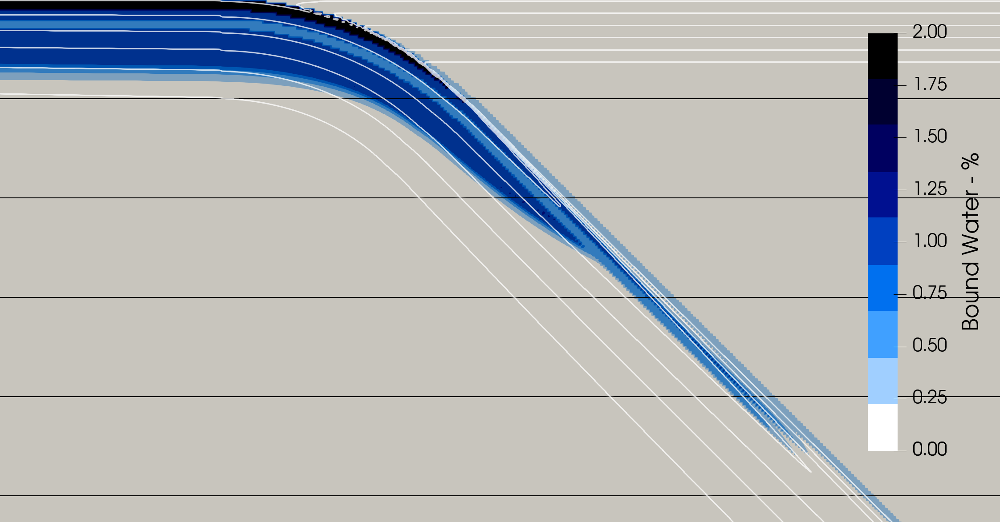
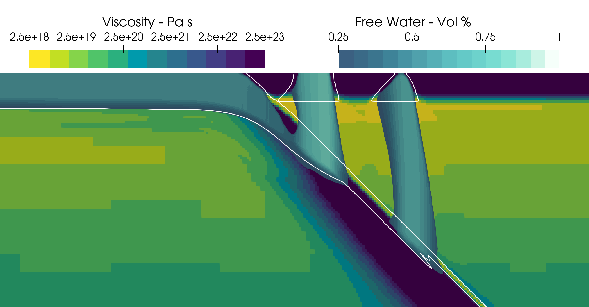
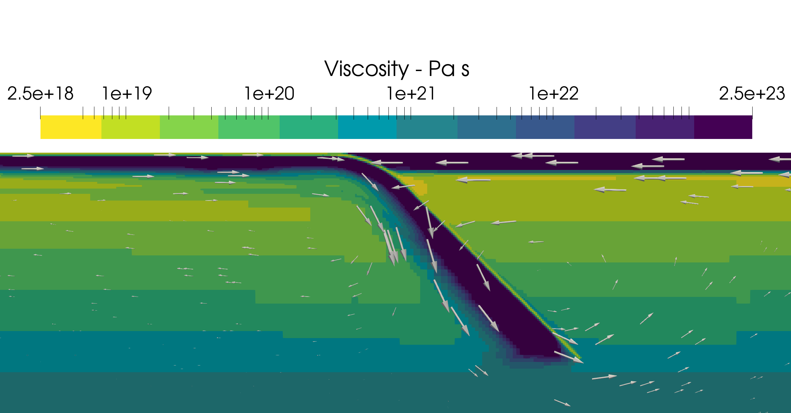
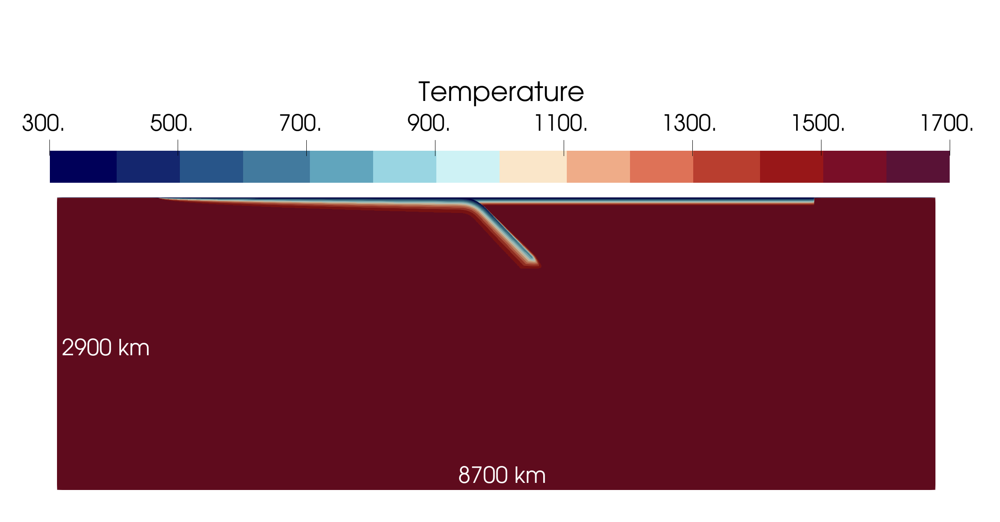

(sec:cookbooks:2D-subduction-two-phase-flow)=
# 2D Subduction Model with Parameterized Solid-Fluid Reactions

*This section was contributed by Daniel Douglas.*

In this cookbook we expand on what was demonstrated in the {ref}`sec:cookbook:tian_parameterization_kinematic_slab` cookbook by building towards a dynamic model of subduction that includes reactive fluid transport at varying degrees of fluid--solid coupling. In this cookbook, we make the setup more complex in incremental steps. For this cookbook, ASPECT must be compiled with the Geodynamic WorldBuilder (GWB), which can be done by setting `ASPECT_WITH_WORLD_BUILDER=ON` when compiling ASPECT. The GWB is a powerful tool which allows ASPECT users to generate complicated initial conditions, and we will use it to generate the temperature and hydration state of a two-dimensional subduction zone. Using ASPECT with the GWB requires specifying the path to a worldbuilder (.wb) file in the ASPECT input file, as well as specifying that the initial temperature and composition is being generated with the GWB. These lines look like this:
```{literalinclude} fixed_slab.part.prm
```

The worldbuilder file can be found at [cookbooks/2D-subduction-two-phase-flow](https://www.github.com/geodynamics/aspect/blob/main/cookbooks/2D-subduction-two-phase-flow/). However, this cookbook will only focus on the ASPECT side of the mode. For more details on the worldbuilder and how to use it, specifically in the context of using geodynamic software like ASPECT for modeling subduction zones, please refer to the GWB manual. There are two comprehensive guides that are relevant to this cookbook, the first focuses on defining a complex  and compo which contains a few extremely comprehensive guides on what the parameters mean, and how to build a worldbuilder file specifically for subduction zone modeling.

```{figure-md} fig:initial-bound-water


 Test1
```

```{figure-md} fig:final-water


 Test1
```

```{figure-md} fig:initial-viscosity


 Test1
```

```{figure-md} fig:model-overview


 Test1
```
