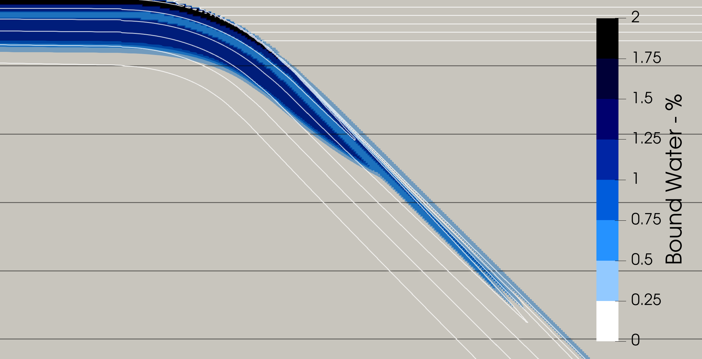

(sec:cookbooks:2D-subduction-two-phase-flow)=
# 2D Subduction Model with Parameterized Solid-Fluid Reactions

*This section was contributed by Daniel Douglas.*

In this cookbook we expand on what was demonstrated in the {ref}`sec:cookbooks:tian_parameterization_kinematic_slab` cookbook by incrementally building towards a dynamic model of subduction that includes reactive fluid transport at varying degrees of fluid--solid coupling.

This cookbook requires that ASPECT is compiled with the Geodynamic World Builder (GWB), which is enabled by setting `ASPECT_WITH_WORLD_BUILDER=ON`
when configuring ASPECT with CMake (this is the default setting). The GWB is a powerful tool that allows ASPECT users to create complex initial
conditions. In this example, we will use it to define the temperature and hydration state of a two-dimensional subduction zone. To use GWB with
ASPECT, you must specify the path to a World Builder (.wb) file in the ASPECT input file, and indicate that the initial temperature and composition
are generated using GWB. These settings look like this:
```{literalinclude} input_world_builder.part.prm
```

```{figure-md} fig:model-overview


 The model domain coloured by the model temperature. The subducting plate descends into the mantle at a constant dip of 45&deg;. The temperature of the mantle is fixed to 1573 K, the overriding plate is defined with a linear geotherm, and the subducting plate with a plate cooling model with a convergence rate of 3 cm/yr.
```

The World Builder file can be found at [cookbooks/2D_subduction_with_two_phase_flow](https://www.github.com/geodynamics/aspect/blob/main/cookbooks/
2D_subduction_two_phase_flow/). However, this cookbook will only focus on the ASPECT side of the model. For more details on the World Builder and how
to use it, specifically in the context of using geodynamic software like ASPECT for modeling subduction zones, please refer to the GWB manual. There
are two comprehensive guides that are relevant to this cookbook, the first focuses on defining a [complex slab geometry and initial thermal
distribution](https://gwb.readthedocs.io/en/latest/user_manual/cookbooks/simple_subduction_2d_cartesian/doc/README.html), and the second demonstrates
how to define an [initial hydration state of a subducting plate](https://gwb.readthedocs.io/en/latest/user_manual/cookbooks/
2d_cartesian_hydrated_slab/doc/README.html).

The model domain is a rectangular box spanning 8700 km × 2900 km {numref}`fig:model-overview`. The trench is located at x = 4000 km. The subducting
plate is 3000 km long and 120 km thick, while the overriding plate is 2500 km long and 80 km thick. The slab geometry is relatively simple: beginning
at the trench, the slab bends to a dip of 45&deg; over a (slab) length of 300 km, then continues into the mantle at a constant 45&deg; dip for an
additional 800 km (measured along the slab, not by depth). The subducting plate forms at a spreading center located 3000 km from the trench, and the
temperature of the plate is initialized using a plate cooling model assuming a convergence rate of 3 cm/yr. This results in a 100 Myr old plate just
before subduction. The overriding plate has a linear temperature gradient from a surface temperature of 273 K to 1573 K at the base of the plate. The
subducting plate consists of multiple lithological layers: a 10 km thick sediment layer at the top, followed by a 10 km thick mid-ocean ridge basalt
(MORB) layer, underlain by a 10 km thick gabbro layer. The remainder of the subducting plate, along with the mantle and the overriding plate, is
comprised of peridotite. The initial hydration states of the layers within the subducting plate are as follows: sediment contains up to 2 wt% bound
water, MORB up to 1 wt%, gabbro up to 0.5 wt%, and peridotite within the subducting plate up to 1 wt%. These values are then multiplied by a factor
of 1.05, resulting in a 5% excess of bound water relative to the equilibrium value {numref}`fig:initial-bound-water`. This disequilibrium triggers
continuous fluid release from the subducting plate, and is meant to represent the continuous input of the slab into the trench.

```{figure-md} fig:initial-bound-water


 The initial water content within the subducting plate. The model includes layered lithologies. From top to bottom: 10 km of sediment with 2 wt% H$_2$O, 10 km of MORB with 1 wt% H$_2$O, 10 km of gabbro with 0.5 wt% H$_2$O, and 90 km of peridotite with 1 wt% H$_2$O. The white contours show isotherms at 200 K intervals spanning 300 K to 1300 K, and the black contours show depths at 100 km intervals.
```

Once water is released from the subducting plate, it is advected according to either the Darcy velocity or the fluid velocity (from the fully coupled
McKenzie equations (to be implemented)). The solid velocity is still computed each time step, as the presence of bound or free fluids act to reduce
the solid viscosity and thereby impact the solid velocity. Since the fluid velocity depends on the solid velocity in both advection cases, updating
the solid velocity every time step is important, even if we do not advect the solid in this setup {numref}`fig:velocity-temperature`.
The total solid viscosity is determined via:

```{math}
:label: eq:creep-viscosity
\eta_i = \frac{1}{2}A_i^{-\frac{1}{n_i}} \dot{\epsilon}_{ii}^{\frac{1 - n_i}{n_i}} d^{m_i} f_{H_2O}^{-r_i} \text{exp}\left(-\alpha \phi \right) \text{exp}\left( \frac{E_i + PV_i}{n_i RT} \right)
```

```{figure-md} fig:velocity-temperature


 The temperature of the model within the immediate vicinity of the subduction zone. The vectors show the direction of and are scaled by the velocity of the solid phase. The cool, dense slab generates corner flow style convection patterns in the mantle wedge.
```

where $i$ denote the deformation mechanism (diffusion or dislocation creep), $n_i$ is the stress exponent, $m_i$ is the grain size exponent, $r_i$ is
the water fugacity exponent, $A_i$ is a prefactor, $E_i$ is the activation energy, $V_i$ is the activation volume, $d$ is the grain size, $P$ is
pressure, $T$ is temperature, and $R$ is the gas constant. The presence of water reduces the viscosity via the terms
$\text{exp}\left(-\alpha \phi \right)$, where $\alpha$ is an exponent constant and $\phi$ is the volume fraction of free water,
and through $f_{H_2O}$, which is the water fugacity determined based on the amount of water within the solid {numref}`fig:viscosity-comparison`. In
the input file, enabling this behaviour looks like this:
```{literalinclude} input_water_viscous_weakening.part.prm
```

```{figure-md} fig:viscosity-comparison


 The viscosity of the model within the immediate vicinity of the subduction zone just after the beginning of the model run-time (top) and at the end of the model run-time (bottom). The viscosity within the mantle wedge and the overriding plate is notably reduced due to the presence of free and bound-fluid (see {numref}`fig:fluid-pathways`)
```

In these models, the water density (1000 kg/m$^3$) is significantly lower than the solid density (3300 kg/m$^3$), so the fluid velocity is dominantly
vertical due to the high buoyancy force experienced by the fluid. However, corner flow in the mantle wedge does impose a trench-ward horizontal
component to the fluid velocity. As the fluid ascends through the hot peridotite mantle wedge, the PT conditions do not allow for the free fluid to
be reabsorbed into the solid phase {numref}`fig:fluid-pathways`. However, when the free fluid starts ascending through the cooler overriding plate,
the temperature is sufficiently low that hydration of the overriding plate begins to occur {numref}`fig:fluid-pathways`. The free fluid in the mantle
wedge leads to a reduction of wedge viscosities, and the combination of free fluid and bound fluid in the overriding plate leads localized reductions
of the overriding plate viscosity {numref}`fig:viscosity-comparison`. Within the model where the fluid is advected with the Darcy velocity, two
distinct bands of free water can be seen seeping out of the subducting plate. The first band produces a larger flux of water, is centered around a
distance of ~175 km landward of the trench, and is sourced from the subducting peridotite layer. The second band is lower in flux magnitude, is
centered around a distance of ~400 km landward from the trench, and is sourced from the gabbro and MORB layers.

```{figure-md} fig:fluid-pathways


 The viscosity distribution near the start of the model run (top) and at end of the model run (bottom), with the free fluid overlain on top. White contour shows where the bound water makes up 0.5 wt% of the solid.
```

## Extending the Model
There are several parameters which will dictate the magnitude of fluid flux and the fluid pathways within this cookbook. To investigate the
importance of these parameters, here are some suggestions for how to tweak the .prm files:

-   Change the `Disequilibrium percentage` parameter. The value used in this cookbook is 5%, and increasing this value will lead to a larger flux of fluid off the subducting plate.
-   Change the `Fluid reaction time scale for operator splitting` parameter. The value used in this cookbook is 10,000 years, and increasing this will lead to a decrease in the fluid flux off the subducting plate.
-   Changing the `Reference permeability` parameter. Decreasing the reference permeability will decrease the magnitude of the vertical fluid velocity, leading to more lateral advection of the fluid within the mantle wedge as it ascends.
