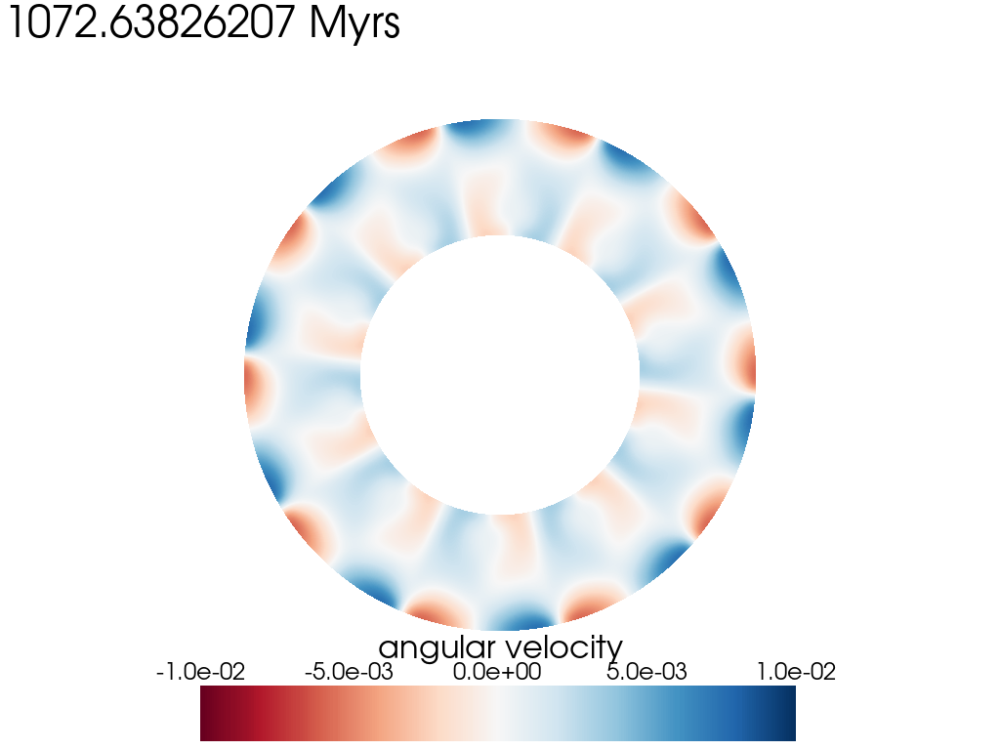
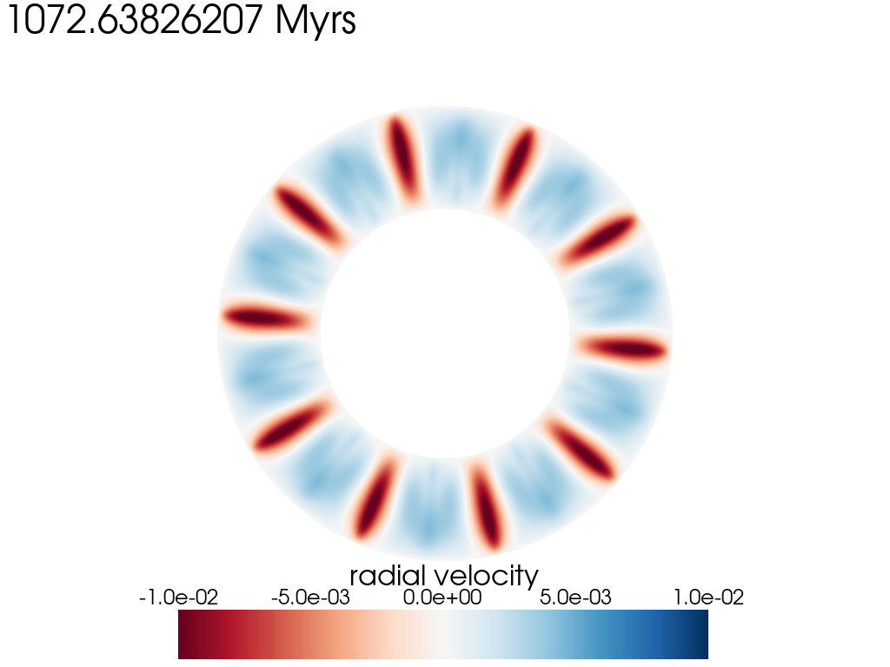
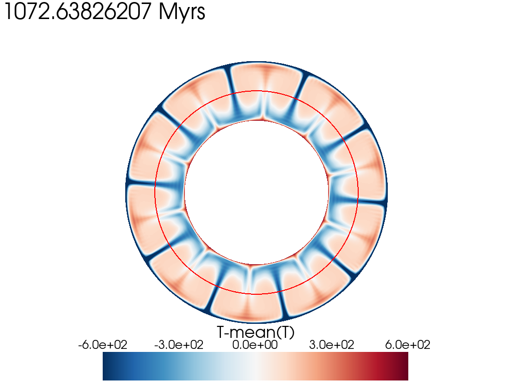

(sec:cookbooks:2d_annulus_visualization)=
# Two-dimensional cylindrical annulus visualization

*This section was contributed by Madeleine Kerr.*

This cookbook describes how to use the Python package pyvista to read in time series data from ASPECT .pvd and .pvtu output files (commonly written as 'solution.pvd' or 'solution-00000.pvtu' within the automatically generated [output/solution/] folder). This particular script has the built-in assumption that the model has a 2D cylindrical annulus geometry since it extracts radial and angular velocity from x,y coordinates and velocities and uses the inner and outer radius to threshold the mesh and perform operations.

The input file to generate the model that created the accompanying figures can be found at [cookbooks/2D_annulus_visualization/2D_annulus_example.prm]. The ASPECT parameter file is a simple modification of the onset_of_convection cookbook.

## How to get started
Since this Python script utilizes pyvista, you should install this package using anaconda following the instructions in the README.md file found in the directory [/aspect/contrib/python/]. Other python scripts that contribute to ASPECT's  functionality can be found within that directory, as well as another 2D pyvista visualization tutorial for a box geometry called 'pyvista_2d_example.py', contributed by John Naliboff.

More information about installing Python via anaconda can be found here: <https://docs.anaconda.com/free/anaconda/install/index.html>

For those without a lot of python scripting experience, copy this script ".py" file into some directory where you store analysis scripts or make a new directory and store the script there. Make sure the "dir" variable within the script is the full path to the model directory in which "output/" is a subdirectory containing the files log.txt, solution.pvd, and  the "solution/" directory. Follow instructions in [/aspect/contrib/python/README.md] to set up your anaconda environment with pyvista. Then, in a terminal window and within the analysis script directory containing the ".py" file, run

    $ python pyvista_2d_annulus_example.py


## Modifying inputs to the scripts

Most of the script can be run without modification for your models. The only inputs you will need to adjust yourself are:

    dir = 'String/Path/To/Your/Model/Directory/'

where the model directory is the one which contains the [output/] directory.

The initial and final integer number of solution outputs you would like to visualize:

    out_n_min=0 # The initial solution file to visualize: i.e. 'solution-00000.pvtu'
    out_n_max=25 # The final solution file to visualize: i.e. 'solution-00025.pvtu'

and the inner and outer radius of the annulus from the geometry of your model:
    r_inner = 3481000 # units in m
    r_outer = 6371000 # units in m.

## What the script does

This script can be treated as a template and modified based on the fields you are interested in examining. A simple pyvista plot to show and not save the image has the basic form:

    pl = pv.Plotter()
    pl.add_mesh(
        mesh,
        scalars="p"
        clim=[0,1e11], # color bar range from 0 to 100 GPa
        cmap="RdBu",   # color map (or try crameri.vik color map)
        lighting=False, # lighting is useful mainly to show shadows on 3D meshes
                        # but we are plotting in 2D
    )
    pl.view_xy()
    pl.show()
    pl.clear()
    pl.close()

Adding the mesh titled "mesh" and informing the plotter which scalar value to plot on that mesh (in this case the pressure field which is labeled "p") is the minimum you need to plot using pyvista. Additionally, an appropriate choice of color-map is important to make a plot more accessible to those with color blind-ness, and perceptually uniform (linearly increasing brightness, or symmetrically diverging brightness) in order to avoid distorting data with the human eye \cite{crameri:etal:2012}. The scientific color maps by Fabio Crameri are a good resource to use and can be found here: <https://www.fabiocrameri.ch/colourmaps-userguide/> and installed with anaconda.

In the script we plot the field "v_phi", the angular component of the velocity field, which is not an output of ASPECT. To create this new point field, the script performs several operations to:

1. Extract the x and y coordinates of the mesh points. We do this in order to do operations on those values individually since the mesh points are normally a Nxd array where N is the number of mesh points and d is the dimension. We transpose the array (now dxN), and index the first two values as the x and y coordinate arrays respectively. We save the coordinates as new point fields of the mesh called "x" and "y", which are Nx1 arrays that can be operated on and with other Nx1 arrays such temperature, and they can be plotted as a scalar field.
2. Extract the x and y components of the velocity vectors at every point on the mesh in a similar way as extracting x and y coordinates.
3. We can use the new point arrays "x", "y", "v_x" and "v_y", which are Nx1 numpy array objects, to compute the components of the velocity in polar and radial coordinates and plot those fields.

The radial component of the velocity field from cartesian coordinates is
```{math}
v_r = \frac{x\dot{x}+y\dot{y}}{\sqrt{x^2+y^2}},
```
and the angular component is:

```{math}
v_{\phi} = \frac{x\dot{y}-y\dot{x}}{\sqrt{x^2+y^2}},
```

where $\dot{x}$ and $\dot{y}$ are the time derivatives of x and y respectively. These expressions for $v_r$ and $v_{\phi}$ can be found by taking the time derivative of $r=\sqrt{x^2+y^2}$ and $\phi = \text{arctan}(\frac{y}{x})$, respectively.

The script also extracts the "r" and "phi" coordinates of each point in the mesh. This allows us to use the scalar field r to create a new mesh that is a subdomain of the original mesh using the threshold function in pyvista:

    mesh_midmantle = mesh.threshold(
    scalars="r", value=r_inner + 400000, invert=False
    ).threshold(scalars="r", value=r_outer - 400000, invert=True)

All of the point data in the original mesh object are copied into the threshold-ed mesh_midmantle object above. This is useful if you would like to compute the mean value of a field like temperature ("T") within a domain that is only below and above the cold and hot thermal boundary layers respectively.

This script also demonstrates how to use the contour function in the context of 2D annulus convection models. In the line:

    midmantle_contour = mesh.contour(scalars="r", isosurfaces=[(r_outer + r_inner) / 2])

A contour object is created as an isosurface of the radial-coordinate scalar field "r" (i.e. a curve of constant radius, a circle). In this example, that constant radius is at the depth halfway between the surface and the core. Similar to the thresholding process, all the scalar fields of the original mesh object are added to the contour object. Scalar values for all fields  are interpolated from the original mesh point data.

## Figures

Below are figure examples for the three fields computed and plotted in the python script.

```{figure-md} fig:2d_annulus_vphi


 A plot of the angular component of the velocity (m/yr) at a model time of 1.07 Gyrs
```

```{figure-md} fig:2d_annulus_r


 A plot of the radial component of the velocity (m/yr) at a model time of 1.07 Gyrs
```

```{figure-md} fig:2d_annulus_Tdev


 A plot of the deviation of the temperature field (K) from the mean temperature of the model below and above 400 km from the surface and core respectively, at a model time of 1.07 Gyrs.
```

## Input parameters
All input parameters are documented here:
<https://aspect.geodynamics.org/doc/parameter_view/parameters.xml>.

## Pyvista
More information about pyvista classes and functions can be found here:
<https://docs.pyvista.org/version/stable/api/>.
