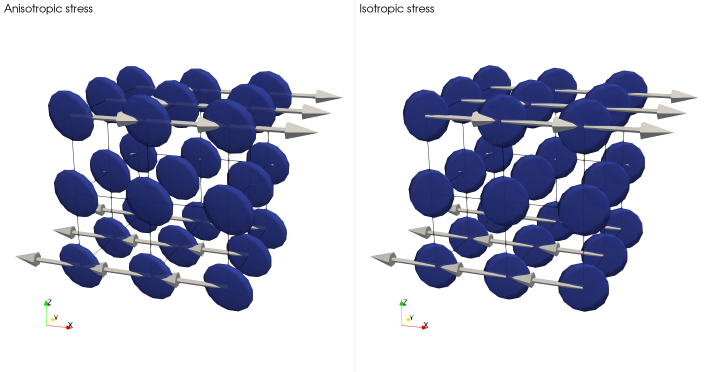

```{tags}
category:cookbook
feature:3d
feature:cartesian
feature:modular-equations
feature:compositional-fields
feature:particles
```

(sec:cookbooks:CPO_induced_anisotropic_viscosity)=
# CPO induced anisotropic viscosity

*This section was contributed by Yijun Wang and Ágnes Király.*

This cookbook explains how to use the CPO-induced anisotropic viscosity material model to set up a shear box model.

## Introduction

Individual crystals of the mineral olivine reorganize their orientations into crystal-preferred orientations (CPO) under deformation. The viscous properties of olivine crystals are direction-dependent (anisotropic), which suggests that the effective viscosity for olivine rocks/aggregates is different when deformations occur in different directions relative to the CPO. This cookbook model computes an anisotropic viscosity based on the CPO evolution predicted by D-Rex ({cite}`fraters_billen_2021_cpo`; {cite}`kaminski2004`) and includes this information in the subsequent modeling process.

Our constitutive equation for the relationship between the strain rate and stress using the anisotropic viscosity tensor is adapted from {cite:t}`signorelli:etal:2021`:

```{math}
:label: eqn:anisotropic_general_stress
\dot{\varepsilon}_{ij} = \gamma J(\sigma_{ij})^{(n-1)} A_{ij} \sigma_{ij}
```

where $\gamma$ is the part of fluidity (the inverse of viscosity) which is temperature- and grain-size dependent:

```{math}
:label: eqn:fluidity
\gamma=\gamma_0 exp \left(\frac{-Q}{RT} \right) /d^m
```

$\gamma_0=1.1\times 10^{5}$ is the isotropic fluidity, $Q=530$ $kJ/mol$ is the activation energy, $R=8.314 m^3 \cdot Pa \cdot K^{−1} \cdot$ $mol^{−1}$ is the gas constant, $d=0.001$ $m$ is the grain size, and $m=0.73$ is the grain size exponent. These values for olivine are taken from rock experiments performed by {cite:t}`hansen:etal:2016` and {cite:t}`HK04`. $J(\sigma_{ij})$ is the equivalent yield stress, where $\sigma_{ij}$ is the deviatoric (anisotropic) stress computed using the tensorial and scalar component of the anisotropic viscosity:

```{math}
:label: eqn:equivalent_yield_stress
J(\sigma_{ij})=(F(\sigma_{11} - \sigma_{22})^2+G(\sigma_{22} - \sigma_{33})^2+H(\sigma_{33} - \sigma_{11})^2+2L\sigma_{23}^2+2M\sigma_{13}^2+2N\sigma_{12}^2)^{1/2}
```

and $A_{ij}$ is the anisotropic tensor of fluidity in Kelvin notation:

```{math}
:label: eqn:anisotropic_fluidity
A_{ij}=\frac{2}{3} \left[
\begin{matrix}
F+H & -F & -H & 0 & 0 & 0 \\
-F & G+F & -G & 0 & 0 & 0 \\
-H & -G & H+G & 0 & 0 & 0 \\
0 & 0 & 0 & L & 0 & 0 \\
0 & 0 & 0 & 0 & M & 0 \\
0 & 0 & 0 & 0 & 0 & N
\end{matrix} \right]
```

$J(\sigma_{ij})$ and $A_{ij}$ are computed using Hill coefficients $H, J, K, L, M,$ and $N$ {cite}`hill:1948`, which describe the anisotropic viscous properties of an olivine aggregate and depend on its CPO. We determine the mean CPO orientation from the eigenvectors associated with the largest eigenvalues of the second-order orientation tensor (or covariance matrix) for all three symmetry axes. The corresponding eigenvalues quantify the dispersion of orientations around these mean orientation {cite}`bingham:1974`. The relationship between the 9 eigenvalues (3 for each axis) and Hill coefficients is derived using regression analysis on a texture database constructed with olivine textures from laboratory experiments, shear box models, and subduction models (Kiraly et al., in rev.). The 9 coefficients and 1 constant for each of the Hill coefficients are given as input in the parameter file. The default values and the equation to compute the Hill coefficients from the eigenvalues (e.g. $a_1, a_2, a_3$ are the eigenvalues of the orientation tensor for a-axis, where $a_1$ is the largest eigen value) are shown below:
```{math}
:label: eqn:hill_coefficients
F = 1.039 a_1^2 - 0.767 a_2 - \frac{0.003}{a_3} + 0.197 b_1^2 + 0.413 b_2 + \frac{0.015}{b_3} - 0.936 c_1^2 - 2.393 c_2 + \frac{0.052}{c_3} + 1.08 \\
G = -2.836 a_1^2 - 1.632 a_2 - \frac{0.001}{a_3} + 0.267 b_1^2 - 0.993 b_2 + \frac{0.003}{b_3} +1.969 c_1^2 + 2.314 c_2 - \frac{0.019}{c_3} + 0.69 \\
H = 1.669 a_1^2 + 0.58 a_2 + \frac{0.003}{a_3} + 0.702 b_1^2 + 0.251 b_2 + \frac{0.000}{b_3} - 2.003 c_1^2 - 2.570 c_2 + \frac{0.071}{c_3} + 0.75 \\
L = -0.325 a_1^2 + 0.728 a_2 + \frac{0.000}{a_3} - 0.665 b_1^2 + 0.515 b_2 + \frac{0.003}{b_3} - 1.027 c_1^2 - 1.263 c_2 + \frac{0.009}{c_3} + 1.60 \\
M = 1.643 a_1^2 - 0.878 a_2 + \frac{0.005}{a_3} + 2.489 b_1^2 + 0.816 b_2 - \frac{0.011}{b_3} - 2.494 c_1^2 - 0.511 c_2 + \frac{0.009}{c_3} + 0.89 \\
N = 0.812 a_1^2 - 0.157 a_2 + \frac{0.002}{a_3} - 1.649 b_1^2 + 0.194 b_2 - \frac{0.01}{b_3} + 1.68 c_1^2 - 0.104 c_2 + \frac{0.02}{c_3} + 1.21
```

In this material model plugin, strain rate, density, temperature, and other parameters are taken as input to compute the anisotropic viscosity, which is passed into the Stokes system to compute the stress. As a result, we adapt {math:numref}`eqn:anisotropic_general_stress` to be:

```{math}
:label: eqn:anisotropic_stress
\sigma_{ij} = \frac{1}{\gamma J(\sigma_{ij})^{(n-1)}} * A_{ij}^{-1} * \dot\varepsilon_{ij}
```

Since the Hill coefficients are defined in the microscopic CPO reference frame, and parameters computed in ASPECT are in the macroscopic model reference frame, several reference frame conversions are needed. First, we need to rotate $\sigma_{ij}$ in {math:numref}`eqn:equivalent_yield_stress` from the model reference frame to the CPO reference frame so that $J(\sigma_{ij})$ is in the CPO reference frame. This is achieved by constructing a matrix from the eigenvectors corresponding with the largest eigenvalues of the covariance matrix for the a-, b-, and c-axis of olivine textures and then we assign the nearest orthogonal matrix to be the rotation matrix R:

```{math}
:label: eqn:rotation_matrix
R = \left[
\begin{matrix}
\verb|max_eigenvector|\_{a1} & \verb|max_eigenvector|\_{b1} & \verb|max_eigenvector|\_{c1} \\
\verb|max_eigenvector|\_{a2} & \verb|max_eigenvector|\_{b2} & \verb|max_eigenvector|\_{c2} \\
\verb|max_eigenvector|\_{a3} & \verb|max_eigenvector|\_{b3} & \verb|max_eigenvector|\_{c3} \\
\end{matrix} \right]
```

We compute the rotation matrix R on the particles and further convert it to Euler angles for computation and memory efficiency. These properties need to be interpolated from particles to fields to be used in the material model. As a result, the anisotropic viscosity material model requires at least one particle in each cell so that all cells can have the texture parameters (Euler angles and eigenvalues) for constructing the rotation matrix R and compute the Hill coefficients. In the material model, the interpolated Euler angles are converted to the rotation matrix again. We use the same notation R to describe the rotation matrix used in the material model in the following paragraphs.

The inverse of the A tensor then needs to be rotated to the model reference frame. Since $A_{ij}^{-1}$ is the Kelvin notation of the rank-4 tensor, we apply the Kelvin notation representation of the R rotation matrix, $R_K$, on $A_{ij}^{-1}$:

```{math}
:label: eqn:rotation_matrix_kelvin
R_K = \left[
\begin{matrix}
R_{11}^2 & R_{12}^2 & R_{13}^2 & \sqrt2* R_{12}* R_{13} & \sqrt2* R_{11}* R_{13} & \sqrt2* R_{11}* R_{12} \\
R_{21}^2 & R_{22}^2 & R_{23}^2 & \sqrt2* R_{22}* R_{23} & \sqrt2* R_{21}* R_{23} & \sqrt2* R_{21}* R_{22} \\
R_{31}^2 & R_{32}^2 & R_{33}^2 & \sqrt2* R_{32}* R_{33} & \sqrt2* R_{31}* R_{33} & \sqrt2* R_{31}* R_{32} \\
\sqrt2* R_{21}* R_{31} & \sqrt2* R_{23}* R_{32} & \sqrt2* R_{23}* R_{33} & R_{22}* R_{33}+R_{23}* R_{32} & R_{21}* R_{33}+R_{23}* R_{31} & R_{21}* R_{32}+R_{22}* R_{31} \\
\sqrt2* R_{11}* R_{31} & \sqrt2* R_{12}* R_{32} & \sqrt2* R_{13}* R_{33} & R_{12}* R_{33}+R_{13}* R_{32} & R_{11}* R_{33}+R_{13}* R_{31} & R_{11}* R_{32}+R_{12}* R_{31} \\
\sqrt2* R_{11}* R_{21} & \sqrt2* R_{12}* R_{22} & \sqrt2* R_{13}* R_{23} & R_{12}* R_{23}+R_{13}* R_{22} & R_{11}* R_{23}+R_{13}* R_{32} & R_{11}* R_{22}+R_{12}* R_{21}
\end{matrix} \right]
```

The final equation involving all reference frame conversions is:

```{math}
:label: eqn:anisotropic_stress_final
\sigma_{ij} = \frac{1}{\gamma J(R'*\sigma_{ij}* R)^{(n-1)}} * (R_K * A_{ij}^{-1} * R_K') * \dot\varepsilon_i
```

$R'$ and $R_K'$ is the transpose of matrix $R$ and $R_K$ respectively. We save $\frac{1}{\gamma J(R'*\sigma_{ij}* R)^{(n-1)}}$ as the material model viscosity output, which we call the scalar viscosity. The scalar viscosity of the current step is also stored into the prescribed field, so that at the beginning of the next step, the anisotropic stress is computed with the scalar viscosity of the previous step using {math:numref}`eqn:anisotropic_stress`. The tensorial part of anisotropic viscosity, $R_K * A_{ij}^{-1} * R_K'$ is called the stress-strain director and is stored in the additional outputs. DBecause the scalar viscosity depends on stress and the stress is determined by the scalar viscosity from the previous time step, the computation of the scalar viscosity is potentially unstable and its value can oscillate across nonlinear iterations. This oscillation can ultimately cause a numerical instability associated with the prediction of the anisotropic viscosity. Therefore, we damp the scalar viscosity computation using a fixed-point iteration, by applying only half of the change in each iteration until the result converges.


## Compiling requirement

Since the determinant of $A_{ij}$ is 0, $A_{ij}$ is a singular, non-invertible matrix. We find the MoorePenrose pseudoinverse of the matrix $A_{ij}$ as an approximate of the inverse of $A_{ij}$, using the SCALAPACK package provided in deal.II. Thus it is required to link ASPECT with a deal.II version with the scalapack package included in order to run this cookbook. When using candi you can enable the scalapack package by including `scalapack` in the list of installed packages or uncommenting the line in `candi.cfg` that corresponds to the scalapack installation. Alternatively, you can install ScaLAPACK yourself and enable the configuration variable `DEAL_II_WITH_SCALAPACK` during the cmake configuration of deal.II.

## Model setup

The usage of the AV material model is demonstrated with a 3d simple shear box model, where its dimension is $1 \times 1 \times 1 $ (non-dimensionalized). The shear strain rate is set to
$0.5$. The origin is the center of the box, and one Olivine particle with 1000 grains sits at the origin to track CPO developments for computation of anisotropic viscosity parameters.

Since the AV material model computes viscosity based on the evolving CPO stored on particles, several setup requirements must be met:

- **Particles per cell**: Each computational cell must contain at least one particle, to allow interpolation of the CPO particle property. This is achieved by setting (in the Particles subsection):

```{literalinclude} min_particles_per_cell.part.prm
```

- **CPO particle property**: The CPO particle property must be stored for use by the AV model. This requires enabling the particle and crystal preferred orientation postprocessors and the relevant subsuctions for them, including the CPO Bingham Average plugin, which calculates the Hill coefficients:

```{literalinclude} cpo_particle_property.part.prm
```

Note: These settings are similar to those used for simulations involving CPO alone. However, for the AV model, it is essential to set `Use rotation matrix = false` in the CPO Bingham Average subsection, so that the CPO is represented using Euler angles, as required.

- **Compositional fields**: The eigenvalues and Euler angles of the CPO tensor are stored in compositional fields. This requires the following input file section:

```{literalinclude} compositional_field.part.prm
```

In the `CPO induced Anisotropic Viscosity` material model subsection, all parameters have reasonable default values and do not need to be manually specified unless customization is needed.

This shear box model uses an additional postprocessor, anisotropic stress, which is also implemented in this cookbook. It outputs a 3-by-3 matrix that can be visualized as a tensor, similar to the standard stress postprocessor. With the anisotropic viscosity material model, applying simple shear produces deformation in multiple directions. As a result, the anisotropic stress tensor appears as elongated and slightly tilted glyphs (indicating the principal stress directions), in contrast to the isotropic stress tensor (see figure below).

```{figure-md} fig:anisotropic_stress_shearbox


Expected output of the shear box model using anisotropic viscosity material model, showing the anisotropic stress and stress postprocessor as tensor glyphs (blue disks) in Paraview. The arrows indicate the direction and magnitude of velocity.
```
