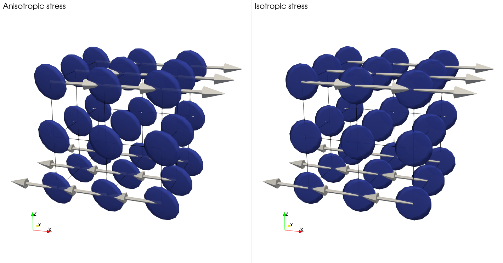

```{tags}
category:cookbook
feature:3d
feature:cartesian
feature:modular-equations
feature:compositional-fields
feature:particles
```

(sec:cookbooks:CPO_induced_anisotropic_viscosity)=
# CPO induced anisotropic viscosity

*This section was contributed by Yijun Wang, Ágnes Király and Theo Häußler*

This cookbook explains how to use the CPO-induced anisotropic viscosity material model to set up a shear box model.

## Introduction

Individual crystals of the mineral olivine reorganize their orientations into crystal-preferred orientations (CPO) under deformation. The viscous properties of olivine crystals are direction-dependent (anisotropic), which suggests that the effective viscosity for olivine rocks/aggregates is different when deformations occur in different directions relative to the CPO. This cookbook model computes an anisotropic viscosity based on the CPO evolution predicted by D-Rex ({cite}`fraters_billen_2021_cpo`; {cite}`kaminski2004`) and includes this information in the subsequent modeling process.

### Forward Rheology

Our constitutive equation for the relationship between the strain rate and stress using the anisotropic viscosity tensor is adapted from {cite:t}`signorelli:etal:2021`. In Kelvin notation we can write:

```{math}
:label: eqn:anisotropic_general_stress
\dot{\varepsilon}_{i} = \gamma J(\sigma_{pq})^{(n-1)/2} A_{ij} \sigma_{j} \text{ ,}
```

where $\gamma$ is the part of fluidity (the inverse of viscosity) which is temperature- and grain-size dependent:

```{math}
:label: eqn:fluidity
\gamma=\gamma_0 exp \left(\frac{-Q}{RT} \right) /d^m \text{ .}
```

$\gamma_0=1.1\times 10^{5}$ is the isotropic fluidity, $Q=530$ $kJ/mol$ is the activation energy, $R=8.314 m^3 \cdot Pa \cdot K^{−1} \cdot$ $mol^{−1}$ is the gas constant, $d=0.001$ $m$ is the grain size, and $m=0.73$ is the grain size exponent. These values for olivine are taken from rock experiments performed by {cite:t}`hansen:etal:2016` and {cite:t}`HK04`. $J(\sigma_{ij})$ is the yield potential, where $\sigma_{ij}$ is the (anisotropic) stress computed using the tensorial and scalar component of the anisotropic viscosity:

```{math}
:label: eqn:yield_potential
J(\sigma_{ij})=\frac{2}{3}\left[F(\sigma_{22}-\sigma_{33})^2 + G(\sigma_{33}-\sigma_{11})^2 + H(\sigma_{11} - \sigma_{22})^2 + 2L\sigma_{23}^2 + 2M\sigma_{13}^2 + 2N\sigma_{12}^2\right]
```

and $A_{ij}$ is the anisotropic tensor of fluidity in Kelvin notation:

```{math}
:label: eqn:anisotropic_fluidity
A_{ij}=\frac{2}{3} \left[
\begin{matrix}
G+H & -H & -G & 0 & 0 & 0 \\
-H & H+F & -F & 0 & 0 & 0 \\
-G & -F & F+G & 0 & 0 & 0 \\
0 & 0 & 0 & L & 0 & 0 \\
0 & 0 & 0 & 0 & M & 0 \\
0 & 0 & 0 & 0 & 0 & N
\end{matrix} \right]
```

In the isotropic case $F,G,H = 0.5$ and $L,M,N = 1.5$, which corresponds to the flow law:

```{math}
:label: eqn:isotropic_flow_law
\dot{\varepsilon}_{ij} = \gamma \left(\tau_{lmj}\tau_{lm}\right)^{(n-1)/2}\tau_{ij} \text{ ,}
```
where $\tau_{ij}$ is the deviatoric stress tensor.

### CPO2Hill model

$J(\sigma_{ij})$ and $A_{ij}$ are computed using Hill coefficients $F,G,H, L, M$ and $N$ {cite}`hill:1948`, which describe the anisotropic viscous properties of an olivine aggregate and depend on its CPO. The relationship between the 9 eigenvalues (3 for each axis) and Hill coefficients is derived using regression analysis on a texture database constructed with olivine textures from laboratory experiments, shear box models, and subduction models {cite}`kiraly:etal:2026`. The 9 coefficients and 1 constant for each of the Hill coefficients are given as input in the parameter file. The default values and the equation to compute the Hill coefficients from the eigenvalues (e.g. $a_1, a_2, a_3$ are the eigenvalues of the orientation tensor for a-axis, where $a_1$ is the largest eigen value) are shown below:
```{math}
:label: eqn:hill_coefficients
F = 0.592 a_1^2 - 0.832 a_1 - 0.001 a_2 - \frac{0.000}{a_3} + 0.380 b_1^2 - 0.533 b_1 + 0.468 b_2 - \frac{0.001}{b_3} - 1.249 c_1^2 + 1.075 c_1 - 0.168 c_2 + \frac{0.003}{c_3} + 0.52 \\
G = -1.695 a_1^2 + 1.336 a_1 - 0.184 a_2 + \frac{0.000}{a_3} + 0.750 b_1^2 + 0.691 b_1 + 0.377 b_2 - \frac{0.002}{b_3} - 0.670 c_1^2 - 0.552 c_1 - 0.428 c_2 + \frac{0.003}{c_3} + 0.26 \\
H = -1.140 a_1^2 + 1.353 a_1 + 0.751 a_2 - \frac{0.002}{a_3} - 0.256 b_1^2 - 1.006 b_1 - 0.116 b_2 + \frac{0.003}{b_3} + 0.648 c_1^2 - 0.031 c_1 - 0.080 c_2 + \frac{0.006}{c_3} + 0.75 \\
L = -3.511 a_1^2 + 2.686 a_1 + 0.360 a_2 - \frac{0.001}{a_3} + 3.948 b_1^2 - 3.816 b_1 - 0.779 b_2 + \frac{0.004}{b_3} + 4.122 c_1^2 - 2.483 c_1 - 1.320 c_2 + \frac{0.002}{c_3} + 2.00 \\
M = 4.537 a_1^2 - 3.228 a_1 + 0.276 a_2 + \frac{0.007}{a_3} - 7.447 b_1^2 + 5.764 b_1 - 1.403 b_2 - \frac{0.032}{b_3} + 2.968 c_1^2 - 3.435 c_1 - 2.266 c_2 + \frac{0.122}{c_3} + 2.44 \\
N = 7.873 a_1^2 - 7.934 a_1 - 2.588 a_2 + \frac{0.030}{a_3} + 7.606 b_1^2 - 5.469 b_1 - 0.348 b_2 + \frac{0.064}{b_3} - 1.788 c_1^2 + 2.255 c_1 + 3.023 c_2 - \frac{0.103}{c_3} + 3.70
```

### CPO Reference Frame

Since the Hill coefficients are defined in the microscopic CPO reference frame, and parameters computed in ASPECT are in the macroscopic model reference frame, several reference frame conversions are needed. We determine the mean CPO orientation from the eigenvectors associated with the largest eigenvalues of the second-order orientation tensor (or covariance matrix) for all three symmetry axes. The corresponding eigenvalues quantify the dispersion of orientations around these mean orientation {cite}`bingham:1974`.

First, we need to rotate $\sigma_{ij}$ in {math:numref}`eqn:yield_potential` from the model reference frame to the CPO reference frame so that $J(\sigma_{ij})$ is in the CPO reference frame. This is achieved by constructing a matrix from the eigenvectors corresponding with the largest eigenvalues of the covariance matrix for the a-, b-, and c-axis of olivine textures and then we assign the rotation matrix R:

```{math}
:label: eqn:rotation_matrix
R = \left[
\begin{matrix}
\texttt{max\_eigenvector}_{a1} & \texttt{max\_eigenvector}_{b1} & \texttt{max\_eigenvector}_{c1} \\
\texttt{max\_eigenvector}_{a2} & \texttt{max\_eigenvector}_{b2} & \texttt{max\_eigenvector}_{c2} \\
\texttt{max\_eigenvector}_{a3} & \texttt{max\_eigenvector}_{b3} & \texttt{max\_eigenvector}_{c3}
\end{matrix} \right]
```
As sometimes the 3 primary eigenvectors do not compose an othrogonal frame, therefore a singular value decomposition is used to orthogonalize the rotationn matrix $R$. We compute the rotation matrix $R$ on the particles and further convert it to Euler angles for computation and memory efficiency. These properties need to be interpolated from particles to fields to be used in the material model. As a result, the anisotropic viscosity material model requires at least one particle in each cell so that all cells can have the texture parameters (Euler angles and eigenvalues) for constructing the rotation matrix R and compute the Hill coefficients. In the material model, the interpolated Euler angles are converted to the rotation matrix again. We use the same notation R to describe the rotation matrix used in the material model in the following paragraphs.

At the current stage averages between angles are computed using scalar arithmetic average tools implemented in ASPECT. For more exact treatment we plan to implement a circular average or quaternion average based on {cite}`markley:etal:2007`.

The inverse of the A tensor then needs to be rotated to the model reference frame. Since $A_{ij}^{-1}$ is the Kelvin notation of the rank-4 tensor, we apply the Kelvin notation representation of the R rotation matrix, $R_K$, on $A_{ij}^{-1}$:

```{math}
:label: eqn:rotation_matrix_kelvin
R_K = \left[
\begin{matrix}
R_{11}^2 & R_{12}^2 & R_{13}^2 & \sqrt2* R_{12}* R_{13} & \sqrt2* R_{11}* R_{13} & \sqrt2* R_{11}* R_{12} \\
R_{21}^2 & R_{22}^2 & R_{23}^2 & \sqrt2* R_{22}* R_{23} & \sqrt2* R_{21}* R_{23} & \sqrt2* R_{21}* R_{22} \\
R_{31}^2 & R_{32}^2 & R_{33}^2 & \sqrt2* R_{32}* R_{33} & \sqrt2* R_{31}* R_{33} & \sqrt2* R_{31}* R_{32} \\
\sqrt2* R_{21}* R_{31} & \sqrt2* R_{23}* R_{32} & \sqrt2* R_{23}* R_{33} & R_{22}* R_{33}+R_{23}* R_{32} & R_{21}* R_{33}+R_{23}* R_{31} & R_{21}* R_{32}+R_{22}* R_{31} \\
\sqrt2* R_{11}* R_{31} & \sqrt2* R_{12}* R_{32} & \sqrt2* R_{13}* R_{33} & R_{12}* R_{33}+R_{13}* R_{32} & R_{11}* R_{33}+R_{13}* R_{31} & R_{11}* R_{32}+R_{12}* R_{31} \\
\sqrt2* R_{11}* R_{21} & \sqrt2* R_{12}* R_{22} & \sqrt2* R_{13}* R_{23} & R_{12}* R_{23}+R_{13}* R_{22} & R_{11}* R_{23}+R_{13}* R_{32} & R_{11}* R_{22}+R_{12}* R_{21}
\end{matrix} \right]
```

### Iterative Inversion

In this material model plugin, strain rate, density, temperature, and other parameters are taken as input to compute the anisotropic viscosity, which is passed into the Stokes system to compute the stress. As a result, we write the inversion of the forward rheology in the CPO reference frame {math:numref}`eqn:anisotropic_general_stress` to be:

```{math}
:label: eqn:anisotropic_stress
\sigma_{i} = \frac{1}{\gamma J(\sigma_{pq})^{(n-1)/2}} A_{ik}^{-1}\dot\varepsilon_{k} \text{ .}
```

To move from CPO frame to model frame we can write:

```{math}
:label: eqn:anisotropic_stress_final
\sigma_{i} = \frac{1}{\gamma J(R'_{pk}\sigma_{kl}R_{lq})^{(n-1)/2}}([R_K]_{im}A_{ml}^{-1}[R_K']_{lk}) \varepsilon_{k} \text{ .}
```

$R'$ and $R_K'$ is the transpose of matrix $R$ and $R_K$ respectively. We save $\frac{1}{\gamma J(R'_{ik}\sigma_{kl}R_{lj})^{(n-1)/2}}$ as the material model viscosity output, which we call the scalar viscosity. The scalar viscosity of the current step is also stored into the prescribed field, so that at the beginning of the next step, the anisotropic stress is computed with the scalar viscosity of the previous step using {math:numref}`eqn:anisotropic_stress`. The tensorial part of anisotropic viscosity, $[R_K]_{ik}A_{kl}^{-1}[R_K']_{lj}$ is called the stress-strain director and is stored in the additional outputs. Because the scalar viscosity depends on stress and the stress is determined by the scalar viscosity from the previous time step, the computation of the scalar viscosity is potentially unstable and its value can oscillate across nonlinear iterations. This oscillation can ultimately cause a numerical instability associated with the prediction of the anisotropic viscosity. Therefore, we damp the scalar viscosity computation using a fixed-point iteration, by applying only half of the change in each iteration until the result converges.

### Analytical inversion

The inverse rheology of an orthotropic non-linear rheology can be derived from the symmetry of the strain-rate tensor {cite}`rathmann:lilien:2022`. Writing the orthotropic rheology and its inversion in the CPO reference frame we can compare the Hill coefficients to the fluidity coefficients or enhancement factors of {cite}`rathmann:lilien:2022`. The reformulated inverse rheology in terms of Hill coefficients  in Kelvin notation then becomes:

```{math}
:label: eqn:analytical_inversion_orthotropic_rheology
\begin{aligned}
    \tau_i &= \eta(\dot{\varepsilon}_I)[R_K]_{ik}V_{kl}[R_K']_{lm}
    \dot{\varepsilon}_m  \\
    V &= \frac{2}{3\Gamma}\begin{pmatrix}
    4H_1+H_2+H_3&
    -2H_1-2H_2 +H_3  &
    -2H_1-2H_3 +H_2 & 0 & 0 & 0 \\
    & 4H_2+H_1+H_3 &
        -2H_2-2H_3 +H_1  & 0 & 0 & 0 \\
    & & 4H_3+H_1+H_2 & 0 & 0 & 0 \\
        &       &       & \frac{9\Gamma}{4H_4} & 0 & 0 \\
        &       &       &   & \frac{9\Gamma}{4H_5} & 0 \\
 \text{sym} & & & & & \frac{9\Gamma}{4H_6}
    \end{pmatrix} \text{ ,}
\end{aligned}
```
with the anisotropic tensor for viscosity in Kelivin notation $V_{ij}$ and the non-linear viscosity $\eta(\dot{\varepsilon}_I)$, which is based on an anisotropic strain-rate invariant $\dot{\varepsilon}_I$:
```{math}
:label: eqn:anisotropic_viscosity
\begin{aligned}
    \eta(\dot{\varepsilon}_I) &= \gamma^{-1/n}\dot{\varepsilon}_I^{(1-n)/n} \\
    \dot{\varepsilon}_I &= \left[\sum_i\frac{2}{3\Gamma}(\dot{\varepsilon}_{ii}^2(4H_{i}+H_{j_i}+H_{k_i}) + 2\dot{\varepsilon}_{j_ij_i}\dot{\varepsilon}_{k_ik_i}(H_i-2H_{j_i}-2H_{k_i}))+ 3/H_{i+3}\dot{\varepsilon}_{j_ik_i}^2\right]^{1/2} \text{ .}
\end{aligned}
```
Here we use the convention $H_1=F,H_2=G,H_3=H$, $H_4=L,H_5=M,H_6=N$ and the shifted indicies $j=\{1,2,0\}$ and $k=\{2,0,1\}$. $\Gamma$ ($\gamma$ in {cite}`rathmann:lilien:2022`) is a short script for:
```{math}
:label: eqn:factor_of_coefficients
\Gamma =  4\sum_i H_{j_i}H_{k_i} \text{ .}
```

In the isotropic case ($H_i=0.5$, $H_{i+3}=1.5$) we then have a flowlaw of the form,
```{math}
:label: eqn:isotropic_inverse_flow_law
\begin{aligned}
\tau_{ij} &= \eta(\dot{\varepsilon}_I) \dot{\varepsilon}^d_{ij} \text{ ,}
\eta(\dot{\varepsilon}_I) &= \gamma^{-1/n}\dot{\epsilon}_I^{(1-n)/n} 
\left.\dot{\varepsilon}_I\right|_{\text{iso}} = \sqrt{\dot{\varepsilon}^d_{lm}\dot{\varepsilon}^d_{lm}}
\end{aligned}
```
where ${\varepsilon}^d_{ij}$ is the deviatoric strain-rate.

## Model setup

The usage of the AV material model is demonstrated with a 2d and 3d simple shear box model, where its dimension is $1 \times 1 (\times 1)$ (non-dimensionalized). The shear strain rate is set to
$0.5$. The origin is the center of the box, and one particle representing 1000 olivine grains sits at the origin to track CPO developments for computation of anisotropic viscosity parameters.

Since the AV material model computes viscosity based on the evolving CPO stored on particles, several setup requirements must be met:

- **Particles per cell**: Each computational cell must contain at least one particle, to allow interpolation of the CPO particle property. This is achieved by setting (in the Particles subsection):

```{literalinclude} min_particles_per_cell.part.prm
```

- **CPO particle property**: The CPO particle property must be stored for use by the AV model. This requires enabling the particle and crystal preferred orientation postprocessors and the relevant subsections for them, including the CPO Bingham Average plugin, which calculates the Hill coefficients:

```{literalinclude} cpo_particle_property.part.prm
```

Note: These settings are similar to those used for simulations involving CPO alone. However, for the AV model, it is essential to set `Use rotation matrix = false` in the CPO Bingham Average subsection, so that the CPO is represented using Euler angles, as required.

- **Compositional fields**: The eigenvalues and Euler angles of the CPO tensor are stored in compositional fields. This requires the following input file section:

```{literalinclude} compositional_field.part.prm
```

In the `CPO induced Anisotropic Viscosity` material model subsection, all parameters have reasonable default values and do not need to be manually specified unless customization is needed. For non-dimensional cases it is possible to define the Grain size $d$, the Grain size exponent $m$, the Fluidity constant $\gamma_0$, the Activation energy $Q$, the non-linear stress exponent $n$ and if the analytical inversion or the iterative inversion should be used.

This shear box model uses an additional postprocessor, anisotropic stress, which is also implemented in this cookbook. It outputs a 3-by-3 matrix that can be visualized as a tensor, similar to the standard stress postprocessor. With the anisotropic viscosity material model, applying simple shear produces deformation in multiple directions. As a result, the anisotropic stress tensor appears as elongated and slightly tilted glyphs (indicating the principal stress directions), in contrast to the isotropic stress tensor (see figure below).

```{figure-md} fig:anisotropic_stress_shearbox


Expected output of the shear box model using anisotropic viscosity material model, showing the anisotropic stress and stress postprocessor as tensor glyphs (blue disks) in Paraview. The arrows indicate the direction and magnitude of velocity.
```

### 2d shear box 

For 2d applications a pseudo 3d strain-rate for texture development is constructed as, 
```{math}

\varepsilon_{ij}^{\text{3D}} = \begin{cases} 
    &\varepsilon_{ij}^{\text{2D}} \qquad & i,j < 3 \\
    &0 \qquad & i,j = 3
\end{cases}  \text{ .}
```
Then texture development, CPO frame and an inversion are computed as before. The out of plane components of the anisotropic viscosity tensor are discarded. 

```{figure-md} fig:anisotropic_stress_shearbox_2d


Expected output of the shear box model using anisotropic viscosity material model, showing the anisotropic stress and stress postprocessor as tensor glyphs (blue disks) in Paraview. The arrows indicate the direction and magnitude of velocity.
```