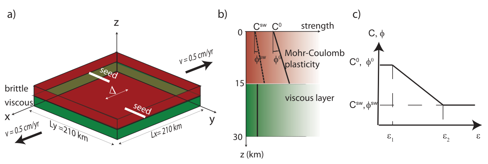
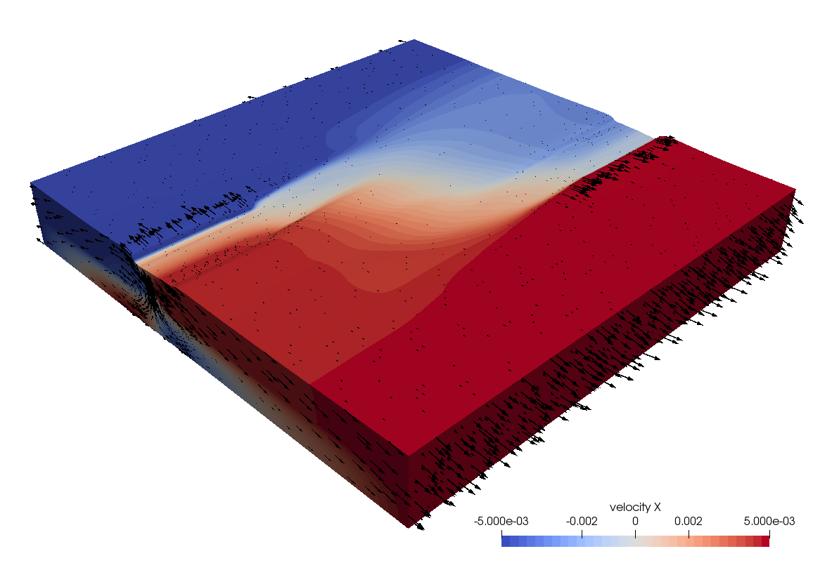
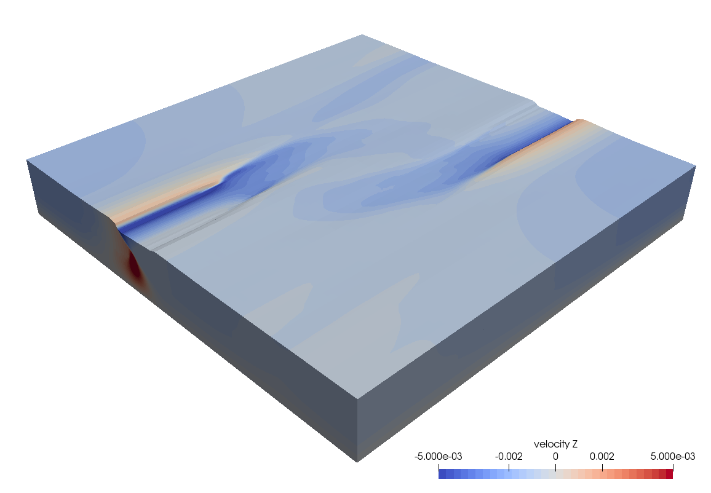
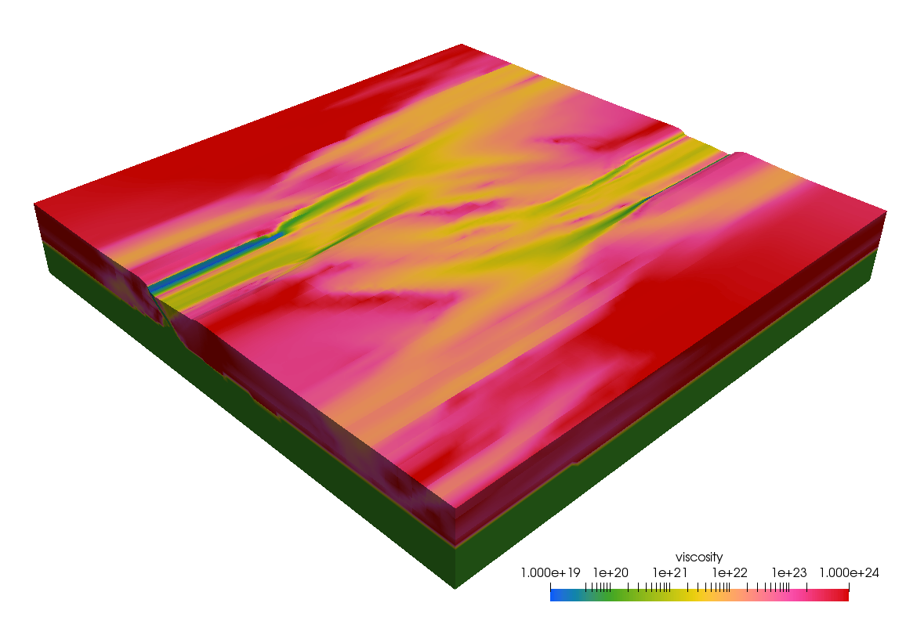
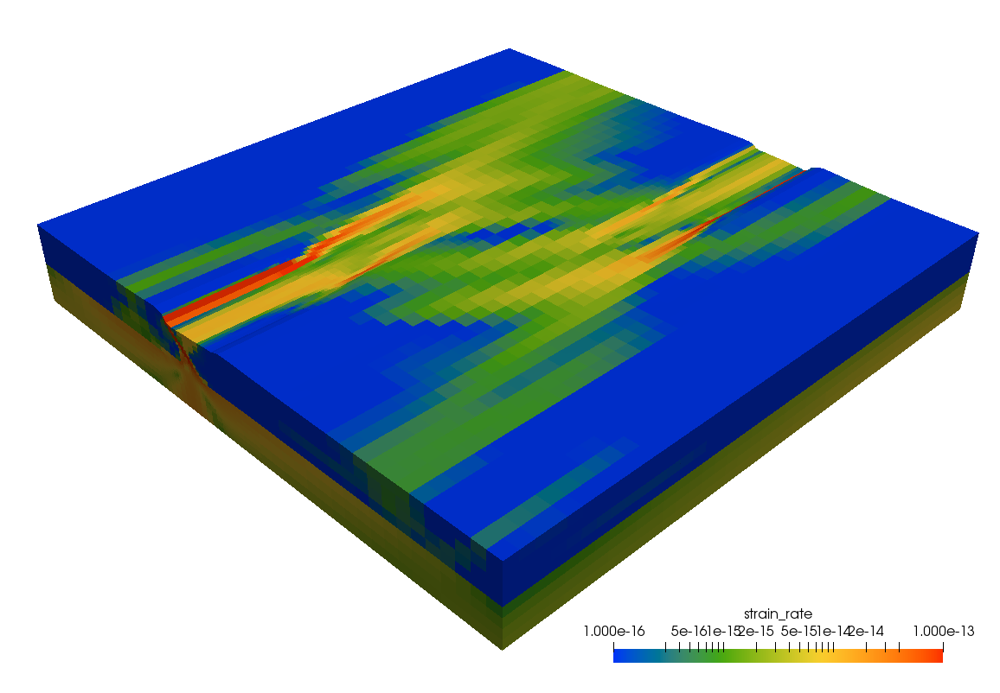

(sec:cookbooks:allken)=
# Rift interaction in brittle-ductile coupled systems

*This section was contributed by Cedric Thieulot.*

The setup for this experiment is based of {cite:t}`allken:etal:2011,allken:etal:2012,allken:etal:2013`.
The Cartesian domain is $L_x\times L_y\times L_z=210\text{ km}\times 210\text{ km}\times 30\text{ km}$
in size (see {numref}`fig:allken-setup`).
It is a simple 2-layer crustal model consisting of $h_{uc}=15~\text{ km}$ of upper crust (characterized by a Mohr-Coulomb rheology with cohesion
$C_0=20\text{ MPa}$ and angle of friction $\phi_0=16^o$) and $h_{lc}=15~\text{ km}$ of lower crust
(characterized by a Newtonian viscous rheology with a viscosity $\eta_{lc}=10^{20}~\text{ Pa.s}$).
The flow is assumed to be incompressible and isothermal.
Both materials have the same density $\rho=2800\text{ kg}/\text{m}^3$ and the gravity is vertical with magnitude $9.81\text{ m}/\text{s}^2$.

```{figure-md} fig:allken-setup


(a) Model setup showing the computational domain, the boundary conditions and the weak zones.
(b) Rheological profile implemented: Mohr-Coulomb plasticity in the upper crust and a fixed viscosity.
(c) Frictional plastic strain weakening behavior of the upper crust. Figure taken from {cite}`allken:etal:2012`.
```

The boundary conditions are free slip on the bottom and on the $y=0$ and $y=L_y$ faces,
free surface at the top, and an outward velocity $(\pm v_{ext},0,0)$ is prescribed on the
$x=0$ and $x=L_x$ sides, with $v_{ext}=0.5\text{ cm}/\text{yr}$, so as to generate extension in the domain.

Strain weakening is an essential part of this experiment: both cohesion and angle of friction see their values linearly decrease
between strains $\varepsilon_1=0.25$ and $\varepsilon_2=1.25$ to reach a maximum weakening factor of $R=C_0/C_{sw}=\phi_0/\phi_{sw}=4$
(i.e. $C_{sw}=5\text{ MPa}$ and $\phi_{sw}=4^o$).

Two weak zones are placed at the base of the upper crust and are characterized by a prescribed strain value of $\varepsilon_2$. As shown
in {numref}`fig:allken-setup` they are offset by a distance $\Delta$ which is a multiple (between 2 and 6) of $h_{uc}$.
The cross section of the two weak zones is $4\text{ km}\times 2\text{ km}$ and they are $50\text{ km}$ long.
Results after $1\text{ Myr}$ of extension are shown in {numref}`fig:allken-result1`, {numref}`fig:allken-result2`, {numref}`fig:allken-result3` and {numref}`fig:allken-result4`.
They show that the rift basins are starting to interact with each other in the middle of the domain. This rift interaction (or lack thereof)
is at the center of the 2012 publication.

In {cite}`allken:etal:2012` the authors focus on the effect of viscosity of the lower layer, the
offset between the rift basins and the amount of strain weakening on the efficiency of rift linkage and rift
propagation and the style of extension. Their models predict three main modes of rift interaction: 1) oblique
to transform linking graben systems for small to moderate rift offset and low lower layer viscosity, 2)
propagating but non linking and overlapping primary grabens for larger offset and intermediate lower layer
viscosity, and 3) formation of multiple graben systems with inefficient rift propagation for high lower
layer viscosity.

```{figure-md} fig:allken-result1


Velocity ($x$-component) field after 1 Myr.
```

```{figure-md} fig:allken-result2


Velocity ($z$-component) field after 1 Myr.
```

```{figure-md} fig:allken-result3


Effective viscosity field after 1 Myr.
```

```{figure-md} fig:allken-result4


Effective strain rate field after 1 Myr.
```
