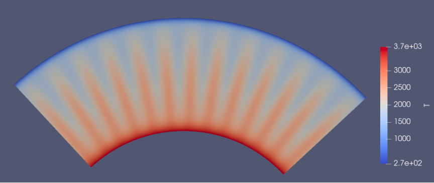
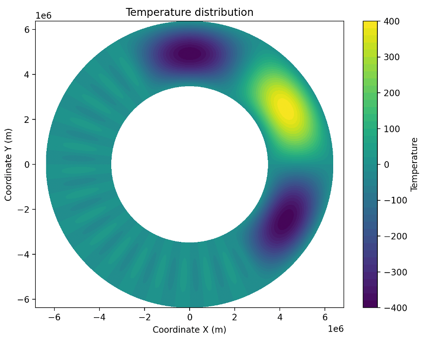
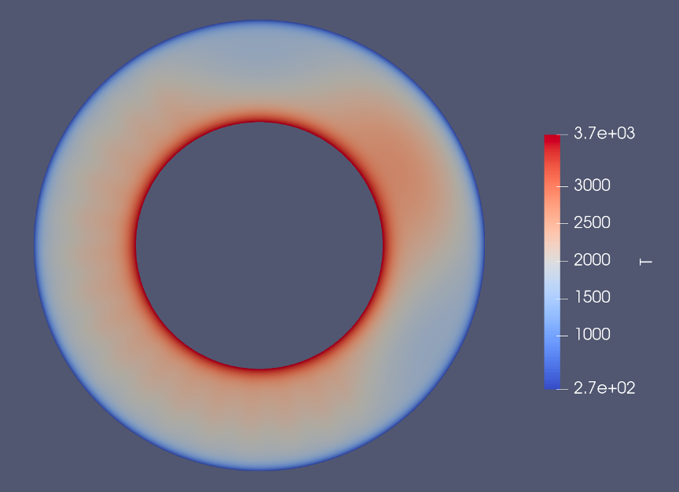

# Using ASCII file to compute a personalized temperature distribution

*This section was contributed by Francesco Radica.*

In this cookbook, we will explore how to implement complex temperature perturbations in a simulation using Steinberger's material model. Specifically, we'll modify a temperature function originally developed for the CITCOM simulation program, designed to initiate mantle convection through an ASCII file. Additionally, we will implement a stagnant lid type subduction, aiming for a viscosity profile that is as realistic as possible.

ASPECT employs the muparser language for writing mathematical functions, which are useful for describing various features such as temperature perturbation functions. For the simulation program CITCOM, a particular mathematical function is well-known for generating perturbations. We will thus apply this function to our adiabatic temperature profile, to which temperature will be added and subtracted according to the mathematical function:

```
subsection Initial temperature model
  set List of model names = adiabatic, function
  subsection Adiabatic
    set Age bottom boundary layer = 5e8
    set Age top boundary layer    = 5e8

    subsection Function
      set Function expression       = 0
    end
    end
    
subsection Function
    set Coordinate system = spherical
    set Variable names = r,theta

    set Function constants  = r_inner=3481000, r_outer=6371000, tcmb=3700, tsurf=300, w=2*pi, p=300.0, frequency=100
    set Function expression = if(r<r_inner, tcmb + (p*sin(pi*(r-r_inner)/(r_outer-r_inner))*sin(frequency*w*theta)), if(r>r_outer, tsurf + (p*sin(pi*(r-r_inner)/(r_outer-r_inner))*sin(frequency*w*theta)), (p*sin(pi*(r-r_inner)/(r_outer-r_inner))*sin(frequency*w*theta))))
end
```

The given function is defined in a spherical coordinate system and calculates values based on the radial position r and angular position theta. The function behaves differently inside, outside, and between two specified radii, r_inner and r_outer.
The function is defined using conditional statements (if) to determine the value based on r:
Inside the Inner Radius (r<r_inner): The function calculates a value by adding the constant tcmb to a sinusoidal perturbation term. This perturbation term depends on the radial position r, the angular position theta, and the constants p and frequency.
Formula:

```{math}
t_\text{cmb} + \left( p \cdot \sin \left( \frac{\pi \cdot (r - r_\text{inner})}{r_\text{outer} - r_\text{inner}} \right) \cdot \sin \left( \text{frequency} \cdot 2\pi \cdot \theta \right) \right)   ,

```

Outside the Outer Radius (r>r_outer): Like the inner radius case, but here the constant tsurf is added to the sinusoidal perturbation term.
Formula:

```{math}
t_\text{surf} + \left( p \cdot \sin \left( \frac{\pi \cdot (r - r_\text{inner})}{r_\text{outer} - r_\text{inner}} \right) \cdot \sin \left( \text{frequency} \cdot 2\pi \cdot \theta \right) \right)  ,
```

Otherwise (For r Values Between r_inner and r_outer): Only the sinusoidal perturbation term is calculated.
Formula:

```{math} 
p \cdot \sin \left( \frac{\pi \cdot (r - r_\text{inner})}{r_\text{outer} - r_\text{inner}} \right) \cdot \sin \left( \text{frequency} \cdot 2\pi \cdot \theta \right)  ,
```

This is the result for a quarter of shell:

```{figure-md} fig:temperature


Temperature for the above muparser function.
```

However, there may be a need to implement more complex temperature functions in our simulation that are difficult to reproduce with muparser language but can be easily crafted using the Python programming language. In such cases, it would be convenient to implement our perturbation using an ASCII file rather than a muparser function.
For instance, we can modify the previous function to include numerous small perturbations along with three large perturbations (two cool and one warm, with a broader perturbation value), to induce a mega convection within our planet, while leaving the remainder undisturbed.
Therefore, we may use the following mathematical function:

```{math}
temp = p_\text{large} \cdot \sin \left( \frac{\pi \cdot (r - r_\text{inner})}{r_\text{outer} - r_\text{inner}} \right) \cdot \sin \left( \text{frequency}_\text{large} \cdot \theta_\text{radians} \right) ,
```

And


```{math}
temp = p_\text{small} \cdot \sin \left( \frac{\pi \cdot (r - r_\text{inner})}{r_\text{outer} - r_\text{inner}} \right) \cdot \sin \left( \text{frequency}_\text{small} \cdot \theta_\text{radians} \right) ,
```

In the model, large temperature perturbations are designated to specific angular sections of a planetary ring to simulate intense convective movements. Conversely, the remaining sections are subjected to smaller perturbations.
The final result will be as following:

```


Temperature distribution in ASCII format.
```

Along with this imput file, it's provided a complete python script full of comments and details of how it build our ASCII file.
After importing the libraries and defining our function, the script will plot how our temperature profile will look. The next step is to write the temperature perturbation in an ASCII format that ASPECT can read.
The script includes a function, write_ascii_data, which is responsible for writing temperature data into an ASCII file that can be read by the ASPECT. The function takes arrays representing radial distances (radius), angular degrees (theta_degrees), temperature values (temperatures), and a filename (filename) where the data will be saved.
The function opens a file with the given filename in write mode. All the data that follows will be written to this file.
The line with the keyword "POINTS:" in the header of the ASCII file is crucial because it defines the dimensions of the data grid for the ASPECT simulation program. The numbers following "POINTS:" represent the size of the grid in each dimension:
100 represents the number of points along the radial dimension (nx). In this case, it means there are 100 radial divisions or layers from the inner radius r_inner to the outer radius r_outer.
360 represents the number of points along the angular dimension (ny). This indicates that the angular data is divided into 360 segments, corresponding to the degrees in a full circle.
1 represents the number of points along the third dimension (nz). In this context, it implies that the data is essentially two-dimensional, with no depth or third dimension to vary over. This would be applicable for a surface or a shell where only the radius and the angle change.
The structure indicated by "POINTS: 100 360 1" tells ASPECT how to read the subsequent data lines. Each line of data will correspond to a point in this grid, and ASPECT will expect to read 100 x 360 x 1 lines of data following the headers. The arrangement of data points in the file must match this grid layout for ASPECT to interpret the file correctly.
In the write_ascii_data function, the nested for loops iterate over the angular positions (theta_degrees) and radial positions (radius), writing out the temperature (temp) at each point. The formatting ensures that each value occupies a specific width in the file, aligning the data into neat columns. This formatting is not just for aesthetics; it is essential for ensuring that ASPECT can correctly parse each value, especially when the data is read by automated scripts or tools that expect a consistent column width. Without such structured formatting, there could be parsing errors, leading to incorrect simulation results or program failures.
The function iterates through the provided arrays of angles and radii to write the temperature data for each grid point.
For each point, it formats the radius (r), angle (phi), and temperature (temp) with improved formatting to ensure numerical precision and readability. The formatting specifies that radius should have one decimal place, angle should have four decimal places (or be an integer if it is a whole number), and temperature should have one decimal place (or be an integer if it is a whole number).
The data is written with aligned columns, ensuring that each row lines up correctly for the radius, angle, and temperature values. This is crucial for ASPECT to correctly parse the file. Each value is given a specific column width with left alignment.
At the end, we convert degrees to radians, since ASPECT only works with radians. Then it creates the file perturbation.txt


If everything has been done correctly, the ASCII file should appear as follows:


```

# Test data for ascii data initial conditions.
# Only next line is parsed in format: [nx] [ny] [nz] because of keyword "POINTS:"
# POINTS: 100 360 1
# Columns: r phi      temperature [K]
3481000.0  0.00000000  0
3510191.9  0.00000000  0
3539383.8  0.00000000  0
3568575.8  0.00000000  0
3597767.7  0.00000000  0
3626959.6  0.00000000  0
3656151.5  0.00000000  0

And many other lines...


```

For each radius value and for each angular value, a certain temperature will be established.
Once executed, the script will generate a file named `perturbation_ascii.txt`. Before running our simulation, we should move our file to the following directory: 

```
`$ASPECT_SOURCE_DIR/data/initial-temperature/ascii-data/test/`
```


To implement it in our simulation (.prm file), we initialize the temperature model as follows:

```

# Here we initialize the temperature model, an adiabatic profile which we will add and subtract temperature according to the ASCII profile.
subsection Initial temperature model
  set List of model names = adiabatic, ascii data
  subsection Adiabatic
    set Age bottom boundary layer = 1e9
    set Age top boundary layer    = 1e9
    
        subsection Function
      set Function expression       = 0
    end

    end

#Here we add the ascii file produced from the python script. Please, be sure to add the file in the path below.
      subsection Ascii data model
    set Data directory       = $ASPECT_SOURCE_DIR/data/initial-temperature/ascii-data/test/
    set Data file name       = perturbation_ ascii.txt
  end
end

```


Let's modify some lines in our Steinberger material model within our script. Specifically, let's limit the lateral viscosity variation to 100. For higher values, we won't achieve a stagnant lid convection regime.    

```

subsection Material model
  set Model name = Steinberger
  set Material averaging = harmonic average
  
  subsection Steinberger model

    set Data directory                                = $ASPECT_SOURCE_DIR/data/material-model/steinberger/
    set Lateral viscosity file name                   = temp-viscosity-prefactor.txt
    set Material file names                           = pyr-ringwood88.txt    
    set Radial viscosity file name                    = radial-visc-simple.txt
    set Latent heat                                   = false
    
    # We decrease the Maximum lateral viscosity variation to facilitate stagnant lid subduction. This term has a relation with the "thermal viscosity prefactor".
    set Maximum lateral viscosity variation           = 1e2 
    set Maximum viscosity                             = 5e23
    set Minimum viscosity                             = 1e19
    set Use lateral average temperature for viscosity = false
    set Thermal conductivity formulation              = p-T-dependent
    #set Thermal conductivity = 4.17
    
    set Composition viscosity prefactors = 1
    
  end
end
```

The simulation will take some time to run, but this will be the final result:

```



Temperature distribution with aspect ratio adjustment.
```


You can see the complete video in the following link:

https://www.youtube.com/watch?v=6KVsunMhpj0

