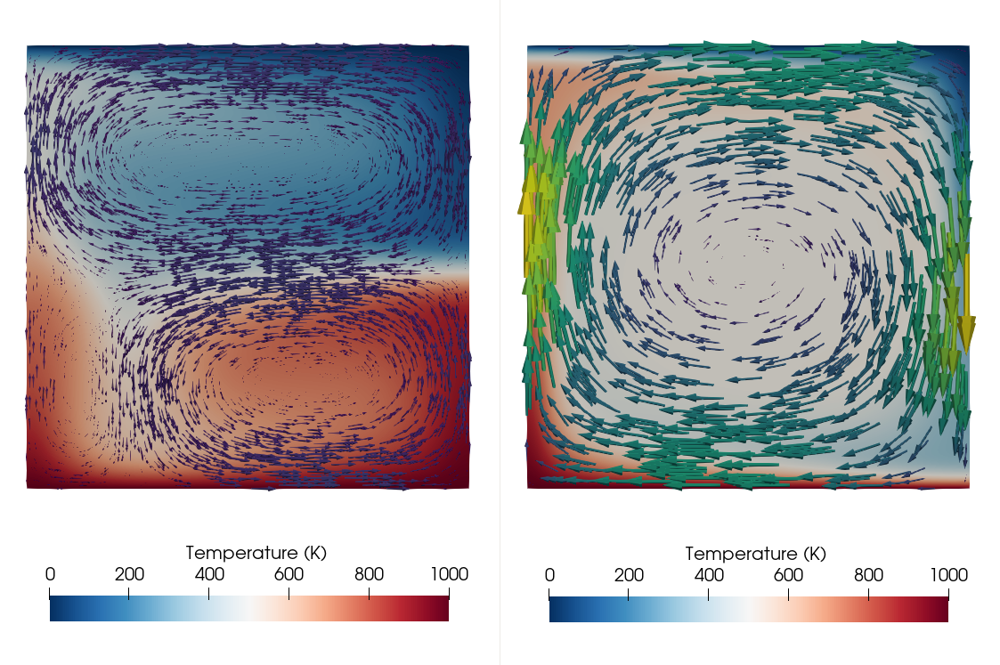

#### Convection in a 2d box with a phase transition

*This section was contributed by Juliane Dannberg.*

This cookbook shows how to use a phase function formulation to introduce phase
transitions in a model, using the setup of (Christensen and Yuen 1985) (which
was the paper that originally introduced phase functions). The paper includes
several different setups; here we only reproduce the incompressible cases
using the Boussinesq Approximation.

The model setup is a 2d quadratic box with prescribed temperatures at the top
and bottom, insulating side walls, and free slip conditions on all boundaries.
All material properties are constant, except for the density, which depends on
temperature and on the stable phase. There is one phase transition in the
center of the model domain (at a depth of 675 km), and the stable phase is
represented by the phase function
$$\Gamma = 0.5 \left(1 + \tanh \frac{p_h - \gamma T}{d \rho_0 g} \right),$$
which defines the fraction of the material that has already undergone the
transition to the denser phase and takes the shape of a hyperbolic tangent.
The phase function is 0 above the transition, and 1 below the transition.
Here, $p_h$ is the hydrostatic pressure,
$\gamma = -2.7~\si{\mega\pascal\per\kelvin}$ is the Clapeyron slope of the
phase transition, $\rho_0 = 1000~\si{\kg\per\cubic\meter}$ is the reference
density, $g = 10~\si{\metre\per\square\second}$ is the magnitude of the
gravitational acceleration, and $d = 67.5~\si{\km}$ is the half-thickness of
the phase transition (corresponding to 5% of the height of the box).

In the model series presented in (Christensen and Yuen 1985), two important
parameters are varied: the Rayleigh number (see for example
Section&nbsp;[\[sec:cookbooks-simple-box\]][1]), which takes the values
$Ra = 10^4$, $10^5$, $4 \times 10^5$ and $2 \times 10^6$, and the phase
buoyancy parameter, which is controlled by the Clapeyron slope of the phase
transition (see (Christensen and Yuen 1985)) and takes values between $-0.8$
and $0.4$. For a negative Clapeyron slope/phase buoyancy, the phase transition
impedes flow; for a positive Clapeyron slope/phase buoyancy, the phase
transition accelerates flow.

In order to set up this model in , we use the latent heat material model,
which includes an implementation of the phase function formulation. The model
in (Christensen and Yuen 1985) is nondimensional, but we want to use
Earth-like parameters here. To achieve this, we set most material properties
to multiples of 10, and then control the three important model parameters by
setting

1.  the thermal conductivity to
    $k = 2.460375 \times 10^7 / Ra~\si{\watt\per\metre\per\kelvin}$, to set
    the Rayleigh number,

2.  the Clapeyron slope to
    $\gamma = P (Ra/Rb) (\rho_0 g h/\Delta T) = P/2 \times 1.35 \times 10^7~\si{\pascal\per\kelvin}$
    Pa/K, to set the phase buoyancy parameter $P$ (where $Rb$ is the boundary
    Rayleigh number, defined analogous to the Rayleigh number as
    $Rb = \Delta \rho g h^3 / \kappa \eta$, $h=1350~\si{\km}$ is the height of
    the box, and $\Delta T = 1000~\si{\kelvin}$ is the temperature difference
    between the top and bottom of the box), and

3.  the density change across the phase transition to
    $\Delta \rho = 2 \alpha \rho_0 \Delta T = 200~\si{\kg\per\cubic\meter}$,
    to achieve $Rb$ = 2$Ra$ (where $\alpha = 10^{-4}~\si{\per\kelvin}$ is the
    thermal expansivity).

Our input file is for a Rayleigh number of $Ra = 10^5$ and a phase buoyancy
parameter of $P=-0.4$. The material properties are therefore set as follows:

``` prmfile
```

We run the model until a steady state heat flow is reached, or, in case the
model does not reach steady state, until a time of 200 Myr. Depending on the
Rayleigh number and the phase buoyancy parameter, the flow pattern in steady
state can be very different: For positive or low negative Clapeyron slopes,
one large convection cell develops. The more negative the Clapeyron slope of
the phase transition, the more it impedes the flow, leading to episodic, or
completely layered convection (see Figure&nbsp;[1][]).

```{figure-md}


Phase function model: Flow field in steady state for two models with a Rayleigh number of <span class="math inline"><em>R</em><em>a</em>&#x2004;=&#x2004;10<sup>5</sup></span>, but different phase buoyancy. The model on the left has a Clapeyron slope of <span class="math inline">&#x2005;&#x2212;&#x2005;2.7&#xA0;MPa/K</span> (corresponding to <span class="math inline"><em>P</em>&#x2004;=&#x2004;&#x2005;&#x2212;&#x2005;0.4</span>) as in the original input file, leading to layered convection. The model on the right has a Clapeyron slope of <span class="math inline">&#x2005;+&#x2005;2.7&#xA0;MPa/K</span> (corresponding to <span class="math inline"><em>P</em>&#x2004;=&#x2004;0.4</span>), leading to one large convection cell.</em></figcaption>
```

The shell script `run_all_models.sh` in the same folder can be used to run the
whole model series of Boussinesq cases presented in (Christensen and Yuen
1985).

<div id="refs" class="references csl-bib-body hanging-indent">

<div id="ref-CY85" class="csl-entry">

Christensen, U. R., and D. A. Yuen. 1985. &ldquo;Layered Convection Induced by
Phase Transitions.&rdquo; *J. Geoph. Res.* 90: 10291&ndash;300.

</div>

</div>

  [1]: #sec:cookbooks-simple-box
  [1]: #fig:christensen_yuen
