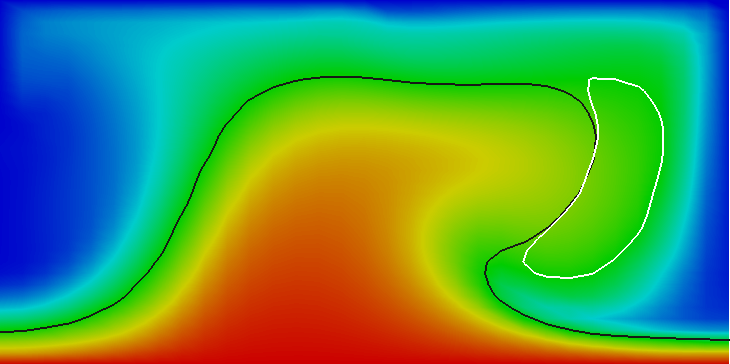
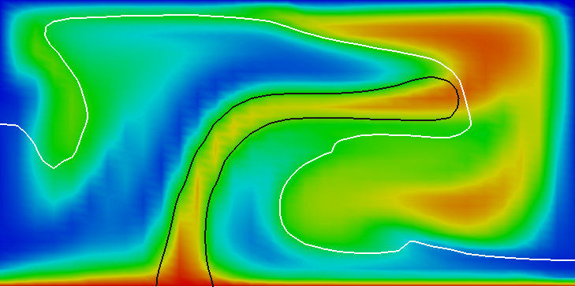
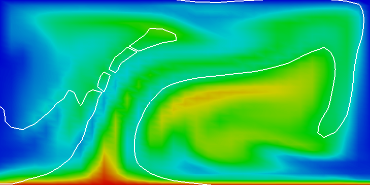

# The active case with reactions.

*This section was contributed by Juliane Dannberg and Ren&eacute;
Ga&szlig;m&ouml;ller*.

In addition, there are setups where one wants the compositional fields to
interact with each other. One example would be material upwelling at a
mid-ocean ridge and changing the composition to that of oceanic crust when it
reaches a certain depth. In this cookbook, we will describe how this kind of
behavior can be achieved by using the `composition reaction` function of the
material model.

We will consider the exact same setup as in the previous paragraphs, except
for the initial conditions and properties of the two compositional fields.
There is one material that initially fills the bottom half of the domain and
is less dense than the material above. In addition, there is another material
that only gets created when the first material reaches the uppermost 20% of
the domain, and that has a higher density. This should cause the first
material to move upwards, get partially converted to the second material,
which then sinks down again. This means we want to change the initial
conditions for the compositional fields:

```{literalinclude} initial.part.prm
```

Moreover, instead of the `simple` material model, we will use the
`composition reaction` material model, which basically behaves in the same
way, but can handle two active compositional field and a reaction between
those two fields. In the input file, the user defines a depth and above this
`reaction depth` the first compositional fields is converted to the second
field. This can be done by changing the following section (the complete input
file can be found in
[cookbooks/composition-reaction/composition-reaction.prm](https://www.github.com/geodynamics/aspect/blob/main/cookbooks/composition-reaction/composition-reaction.prm)).

```{literalinclude} material.part.prm
```

```{figure-md} fig:composition-reaction-0


Reaction between compositional fields: Temperature fields at t=0. The black line is the isocontour line c_1(\mathbf x,t)=0.5 delineating the position of the material starting at the bottom and the white line is the isocontour line c_2(\mathbf x,t)=0.5 delineating the position of the material that is created by the reaction
```

```{figure-md} fig:composition-reaction-2


  Reaction between compositional fields: Temperature fields at t=2. The black line is the isocontour line c_1(\mathbf x,t)=0.5 delineating the position of the material starting at the bottom and the white line is the isocontour line c_2(\mathbf x,t)=0.5 delineating the position of the material that is created by the reaction.
```

```{figure-md} fig:composition-reaction-4


Reaction between compositional fields: Temperature fields at t=4. The black line is the isocontour line c_1(\mathbf x,t)=0.5 delineating the position of the material starting at the bottom and the white line is the isocontour line c_2(\mathbf x,t)=0.5 delineating the position of the material that is created by the reaction.
```

```{figure-md} fig:composition-reaction-8


Reaction between compositional fields: Temperature fields at t=8. The black line is the isocontour line c_1(\mathbf x,t)=0.5 delineating the position of the material starting at the bottom and the white line is the isocontour line c_2(\mathbf x,t)=0.5 delineating the position of the material that is created by the reaction.
```

```{figure-md} fig:composition-reaction-12


Reaction between compositional fields: Temperature fields at t=12. The black line is the isocontour line c_1(\mathbf x,t)=0.5 delineating the position of the material starting at the bottom and the white line is the isocontour line c_2(\mathbf x,t)=0.5 delineating the position of the material that is created by the reaction.
```

```{figure-md} fig:composition-reaction-20


Reaction between compositional fields: Temperature fields at t=20. The black line is the isocontour line c_1(\mathbf x,t)=0.5 delineating the position of the material starting at the bottom and the white line is the isocontour line c_2(\mathbf x,t)=0.5 delineating the position of the material that is created by the reaction.
```

Results of this model are visualized in {numref}`fig:composition-reaction-0` -- {numref}`fig:composition-reaction-20`.
What is visible is
that over the course of the simulation, the material that starts at the bottom
of the domain ascends, reaches the reaction depth and gets converted to the
second material, which starts to sink down.
