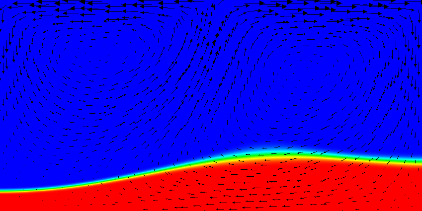

# The active case.

The next step, of course, is to make the flow actually depend on the
composition. After all, compositional fields are not only intended to indicate
where material come from, but also to indicate the properties of this
material. In general, the way to achieve this is to write material models
where the density, viscosity, and other parameters depend on the composition,
taking into account what the compositional fields actually denote (e.g., if
they simply indicate the origin of material, or the concentration of things
like olivine, perovskite, ...). The construction of material models is
discussed in much greater detail in Section {ref}`sec:extending:plugin-types:material-models`;
we do not want to revisit this issue here and instead choose -- once
again -- the simplest material model that is implemented in the
{ref}`parameters:Material_20model/Simple_20model`.

The place where we are going to hook in a compositional dependence is the
density. In the `simple` model, the density is fundamentally described by a
material that expands linearly with the temperature; for small density
variations, this corresponds to a density model of the form
$\rho(T)=\rho_0(1-\alpha(T-T_0))$. This is, by virtue of its simplicity, the
most often considered density model. But the `simple` model also has a hook to
make the density depend on the first compositional field $c_1(\mathbf
x,t)$, yielding a dependence of the form
$\rho(T)=\rho_0(1-\alpha(T-T_0))+\gamma c_1$. Here, let us choose $\rho_0=1,
\alpha=0.01, T_0=0, \gamma=100$. The rest of our model setup will be as in the
passive case above. Because the temperature will be between zero and one, the
temperature induced density variations will be restricted to 0.01, whereas the
density variation by origin of the material is 100. This should make sure that
dense material remains at the bottom despite the fact that it is hotter than
the surrounding material.[^footnote1]

This setup of the problem can be described using an input file that is almost
completely unchanged from the passive case. The only difference is the use of
the following section (the complete input file can be found in
[cookbooks/composition_active/composition_active.prm](https://www.github.com/geodynamics/aspect/blob/main/cookbooks/composition_active/composition_active.prm):

```{literalinclude} active.part.prm
```

To debug the model, we will also want to visualize the density in our
graphical output files. This is done using the following addition to the
postprocessing section, using the `density` visualization plugin:

```{literalinclude} postprocess.part.prm
```

```{figure-md} fig:composition-active-composition-7


 Active compositional fields: Compositional field 1 at the time t=0. Compared to the results shown in {numref}`fig:compositional-passive-14` it is clear that the heavy material stays at the bottom of the domain now. The effect of the density on the velocity field is also clearly visible by noting that at all three times the spreading center at the top boundary is in exactly the same position; this would result in exactly the same velocity field if the density and temperature were constant.
```

```{figure-md} fig:composition-active-composition-8


 Active compositional fields: Compositional field 1 at the time t=10. Compared to the results shown in {numref}`fig:compositional-passive-14` it is clear that the heavy material stays at the bottom of the domain now. The effect of the density on the velocity field is also clearly visible by noting that at all three times the spreading center at the top boundary is in exactly the same position; this would result in exactly the same velocity field if the density and temperature were constant.
```

```{figure-md} fig:composition-active-composition-9


 Active compositional fields: Compositional field 1 at the time t=20. Compared to the results shown in {numref}`fig:compositional-passive-14` it is clear that the heavy material stays at the bottom of the domain now. The effect of the density on the velocity field is also clearly visible by noting that at all three times the spreading center at the top boundary is in exactly the same position; this would result in exactly the same velocity field if the density and temperature were constant.
```


```{figure-md} fig:composition-active-temperature-0


Active compositional fields: Temperature fields at t=0.
The black line is the isocontour line c_1(\mathbf x,t)=0.5 delineating the position of the dense material at the bottom.
```

```{figure-md} fig:composition-active-temperature-1


Active compositional fields: Temperature fields at t=2.
The black line is the isocontour line c_1(\mathbf x,t)=0.5 delineating the position of the dense material at the bottom.
```

```{figure-md} fig:composition-active-temperature-2


Active compositional fields: Temperature fields at t=4.
The black line is the isocontour line c_1(\mathbf x,t)=0.5 delineating the position of the dense material at the bottom.
```

```{figure-md} fig:composition-active-temperature-3


Active compositional fields: Temperature fields at t=8.
The black line is the isocontour line c_1(\mathbf x,t)=0.5 delineating the position of the dense material at the bottom.
```

```{figure-md} fig:composition-active-temperature-4


Active compositional fields: Temperature fields at t=12.
The black line is the isocontour line c_1(\mathbf x,t)=0.5 delineating the position of the dense material at the bottom.
```

```{figure-md} fig:composition-active-temperature-6


Active compositional fields: Temperature fields at t=20.
The black line is the isocontour line c_1(\mathbf x,t)=0.5 delineating the position of the dense material at the bottom.
```

Results of this model are visualized in {numref}`fig:composition-active-composition-7` --
{numref}`fig:composition-active-temperature-6` . What is
visible is that over the course of the simulation, the material that starts at
the bottom of the domain remains there. This can only happen if the
circulation is significantly affected by the high density material once the
interface starts to become non-horizontal, and this is indeed visible in the
velocity vectors. As a second consequence, if the material at the bottom does
not move away, then there needs to be a different way for the heat provided at
the bottom to get through the bottom layer: either there must be a secondary
convection system in the bottom layer, or heat is simply conducted. The
pictures in the figure seem to suggest that the latter is the case.

It is easy, using the outline above, to play with the various factors that
drive this system, namely:

-   The magnitude of the velocity prescribed at the top.

-   The magnitude of the velocities induced by thermal buoyancy, as resulting
    from the magnitude of gravity and the thermal expansion coefficient.

-   The magnitude of the velocities induced by compositional variability, as
    described by the coefficient $\gamma$ and the magnitude of gravity.

Using the coefficients involved in these considerations, it is trivially
possible to map out the parameter space to find which of these effects is
dominant. As mentioned in discussing the values in the input file, what is
important is the *relative* size of these parameters, not the fact that
currently the density in the material at the bottom is 100 times larger than
in the rest of the domain, an effect that from a physical perspective clearly
makes no sense at all.

[^footnote1]: The actual values do not matter as much here. They are chosen in such a
way that the system -- previously driven primarily by the velocity
boundary conditions at the top -- now also feels the impact of the
density variations. To have an effect, the buoyancy induced by the density
difference between materials must be strong enough to balance or at least
approach the forces exerted by whatever is driving the velocity at the top.
