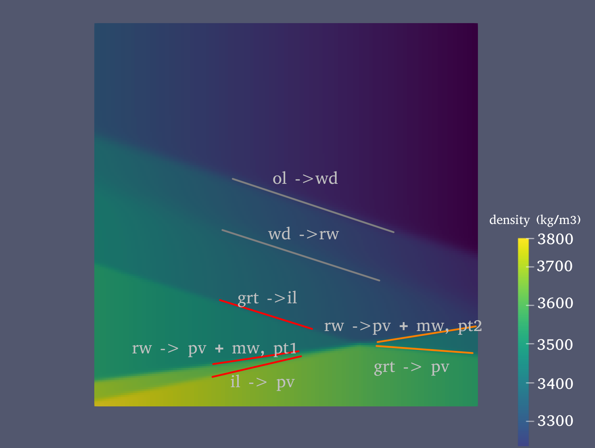
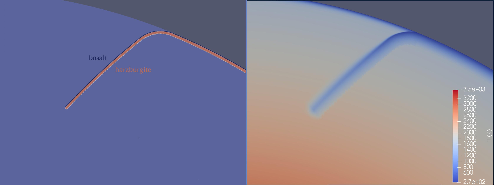
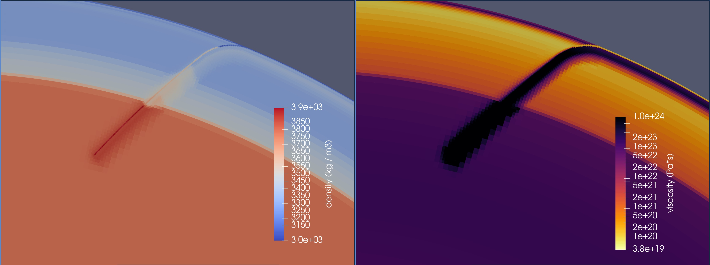

# Composition-dependent phase transition

*This section was contributed by Haoyuan Li, Magali Billen, Rene 
Gassmoeller and Rebecca Fildes*

The Mantle transition zone (MTZ) spans 400 - 700 km in the earth's lower upper mantle.
It contains multiple transitions, each applying hindering or assisting effects on convecting materials.
Composition-dependent phase transitions (CDPT) describe the phase transitions (PT) of Earth's characteristic mantle compositions.
It has the advantage of simplifying numerous phases in the earth's mantle, while capturing the main dynamic effects such as the hindering effects of the 660-km PT on the ascending and descending mantle materials.


In ASPECT, the CDPT model is parameterized by the phase-transition interfaces in select material models.
In this cookbook, we will show an example of the CDPT implementation in ASPECT following the model design of {cite:t}`arredondo:2016`.


## Setup of {cite:t}`arredondo:2016`

The model design includes several dynamically critical phase transitions of olivine and garnet:
olivine (ol), wadsleyite (wd), ringwoodite (rw), garnet (grt), calcium-perovskite (CaPv), ilmenite (il), perovskite or bridgmanite (pv), magnesiowustite or ferropericlase (mw).
The PT variables are included in the following lists:

```{table} Arredondo et al., 2016: Mantle olivine phase transitions
:name: tab:olivine_phases

|Phase Transition |Depth (km)|Depth Range (km)|Clapeyron Slope (MPa / K)|Density Change (%)|
|:---------|:---------:|:---------:|:---------:|:---------:|
|ol -> wd|410 | 13 | 4.0 | 5.2 |
|wd -> rw|520 | 25 | 4.1 | 2.5 |
|rw -> pv + mw|660 | 5 | -2.0 | 8.4|
```

```{table} Arredondo et al., 2016: Mantle garnet phase transitions
:name: tab:garnet_phases

|Phase Transition |Depth (km)|Depth Range (km)|Clapeyron Slope (MPa / K)|Density Change (%)|Temperature Range|
| --------- | --------- | --------- | --------- | --------- | --------- |
|grt -> CaPv + grt | 560 | 60 | 4.0 | 6.7 | - |
|grt -> il| 660 | 5 | 4.0 | 5.6 | $T < 1662 K$ |
|il -> pv| 660 | 5 | -3.1 | 5.97 | $T < 1662 K$ |
|grt -> pv | 660 | 5 | 1.3 | 11.7| $T > 1662 K$ |
```

The three compositions are then compiled as a mixture of olivine and garnet.
The details of this approach are discussed in {cite:t}`arredondo:2016`


## The input file

First, we illustrate the setup with pyrolite composition.
The related entries in the prm file are listed below.
A visualization of the result is generated following the setup in Section&nbsp;{ref}`sec:cookbooks:visualizing_phase_diagram` (  {numref}`fig:pyrolite_density`).

```{literalinclude} pyrolite_material_model.prm
```

Each of the phase transitions is parameterized by their respective depth, temperature, clapeyron slope, and width.
Two additional parameters titled "Phase transition temperature lower limits" and the "Phase transition temperature upper limits" limit a PT to a range of temperatures, which is necessary for garnet phase transitions in the MTZ  ({numref}`fig:pyrolite_density`, the 1st, 3rd red lines and the 2nd orange line).

In order to ensure that the phase transitions don't intersect across P-T space, the rw -> pv + mw phase transition is separated into two parts (the 2nd red line and the 1st orange line).
This can be seen by dividing the deeper PTs into a cooler group (red lines) and a warmer group (orange lines).

Last, in each of the temperature groups, we need to prescribe the PTs in a top-down manner: from shallower to deeper depths.

In order to ensure the correct and non-intersecting phase transitions are implemented within a given model, we recommended generating gone phase diagram for every composition following the instructions in {ref}`sec:cookbooks:visualizing_phase_diagram` before running any dynamic models.

The parameter file for this phase diagram is located in
[cookbooks/layered_phase_transition/pyrolite_phase_diagram.prm](https://www.github.com/geodynamics/aspect/blob/main/cookbooks/layered_phase_transition/pyrolite_phase_diagram.prm)

```{figure-md} fig:pyrolite_density


An example of the pyrolite composition. 
The y-axis captures a range of 0 (top) - 800 (bottom) km depth of the earth's interior, while the x-axis has an increase in temperature from 273 (left) to 2273 K (right). 
Red and orange marks on phase transitions demonstrate the usage of the "temperature limits": Red - low-T PTs, Orange - high-T PTs.
```

## Results

A complex setup is illustrated with a 60-degree dipping slab penetrating into the lower mantle.
In this example, oceanic crust is located in the upper 7.5 km of the slab overlying a 37.5 km thick harzburgite layer, with a pyrolite composition assigned to the rest of the mantle ({numref}`fig:layered_initial`).
The resulting density structure is shown in figure ({numref}`fig:layered_result` a).

In addition to densities, a set of rheology parameters are assigned with the same interfaces.
In this example, we generate a viscosity structure with a stronger lower mantle ({numref}`fig:layered_result` b) as well as a weak oceanic crust.

The parameter file of this model setup is included in:
[cookbooks/layered_phase_transition/layered_phase_transition.prm](https://www.github.com/geodynamics/aspect/blob/main/cookbooks/layered_phase_transition/layered_phase_transition.prm)


```{figure-md} fig:layered_initial


The initial condition of a 60-degree dipping slab. 
(a) The initial composition of a slab with a 7.5 km oceanic crust on top and a 37.5 km harzburgite layer below it. 
(b) The initial temperature, following a 1573 K mantle potential temperature.
```

```{figure-md} fig:layered_result


Density and the viscosity variations in a model with CDPT phase transitions. (a): Density structure. The 410-km and 520-km PTs occur at shallower depths in the slab with respect to the surrounding mantle, while and the 660-km PT occurs at deeper depths in the slab. (b) The viscosity structure in log scale.
```
