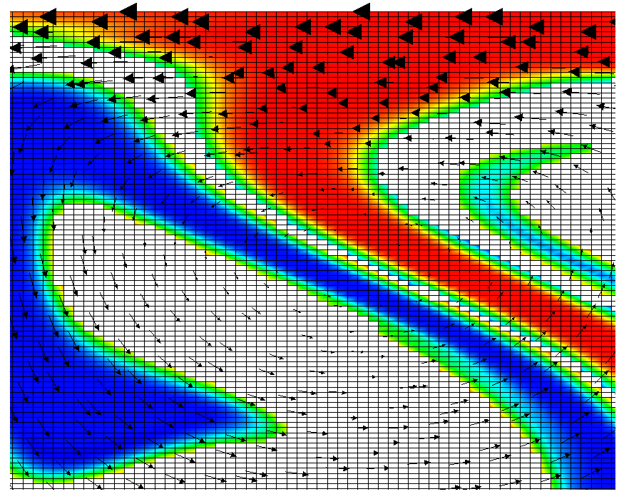

##### The passive case.

We will consider the exact same situation as in the previous section but we
will ask where the material that started in the bottom 20% of the domain ends
up, as well as the material that started in the top 20%. For the moment, let
us assume that there is no material between the materials at the bottom, the
top, and the middle. The way to describe this situation is to simply add the
following block of definitions to the parameter file (you can find the full
parameter file in [cookbooks/composition_passive/composition_passive.prm][]:

``` prmfile
```

Running this simulation yields results such as the ones shown in
Fig.&nbsp;[6][] where we show the values of the functions $c_1(\mathbf x,t)$
and $c_2(\mathbf x,t)$ at various times in the simulation. Because these
fields were one only inside the lowermost and uppermost parts of the domain,
zero everywhere else, and because they have simply been advected along with
the flow field, the places where they are larger than one half indicate where
material has been transported to so far.[1]




Fig.&nbsp;[6][] shows one aspect of compositional fields that occasionally
makes them difficult to use for very long time computations. The simulation
shown here runs for 20 time units, where every cycle of the spreading center
at the top moving left and right takes 4 time units, for a total of 5 such
cycles. While this is certainly no short-term simulation, it is obviously
visible in the figure that the interface between the materials has diffused
over time. Fig.&nbsp;[8][] shows a zoom into the center of the domain at the
final time of the simulation. The figure only shows values that are larger
than 0.5, and it looks like the transition from red or blue to the edge of the
shown region is no wider than 3 cells. This means that the computation is not
overly diffusive but it is nevertheless true that this method has difficulty
following long and thin filaments.[2] This is an area in which may see
improvements in the future.

```{figure-md}
<figcaption aria-hidden="true"><em>Passive compositional fields: Minimum and maximum of the first compositional variable over time, as well as the mass <span class="math inline"><em>m</em><sub>1</sub>(<em>t</em>)&#x2004;=&#x2004;&#x222B;<sub><em>&#x3A9;</em></sub><em>c</em><sub>1</sub>(<strong>x</strong>,<em>t</em>)</span> stored in this variable.</em></figcaption>
</figure>

A different way of looking at the quality of compositional fields as opposed
to particles is to ask whether they conserve mass. In the current context, the
mass contained in the $i$th compositional field is
$m_i(t)=\int_\Omega c_i(\mathbf x,t)$. This can easily be achieve in the
following way, by adding the `composition statistics` postprocessor:

``` prmfile
```

While the scheme we use to advect the compositional fields is not strictly
conservative, it is almost perfectly so in practice. For example, in the
computations shown in this section (using two additional global mesh
refinements over the settings in the parameter file
[cookbooks/composition_passive/composition_passive.prm][]), Fig.&nbsp;[9][]
shows the maximal and minimal values of the first compositional fields over
time, along with the mass $m_1(t)$ (these are all tabulated in columns of the
statistics file, see Sections&nbsp;[\[sec:running-overview\]][1] and
[\[sec:viz-stat\]][2]). While the maximum and minimum fluctuate slightly due
to the instability of the finite element method in resolving discontinuous
functions, the mass appears stable at a value of 0.403646 (the exact value,
namely the area that was initially filled by each material, is 0.4; the
difference is a result of the fact that we can&rsquo;t exactly represent the
step function on our mesh with the finite element space). In fact, the maximal
difference in this value between time steps 1 and 500 is only $\num{1.1e-6}$.
In other words, these numbers show that the compositional field approach is
almost exactly mass conservative.

[1] Of course, this interpretation suggests that we could have achieved the
same goal by encoding everything into a single function &ndash; that would,
for example, have had initial values one, zero and minus one in the three
parts of the domain we are interested in.

[2] We note that this is no different for particles where the position of
particles has to be integrated over time and is subject to numerical error. In
simulations, their location is therefore not the exact one but also subject to
a diffusive process resulting from numerical inaccuracies. Furthermore, in
long thin filaments, the number of particles per cell often becomes too small
and new particles have to be inserted; their properties are then interpolated
from the surrounding particles, a process that also incurs a smoothing
penalty.

  [cookbooks/composition_passive/composition_passive.prm]: cookbooks/composition_passive/composition_passive.prm
  [6]: #fig:compositional-passive
  [8]: #fig:compositional-passive-zoom
  [9]: #fig:compositional-passive-mass
  [1]: #sec:running-overview
  [2]: #sec:viz-stat
