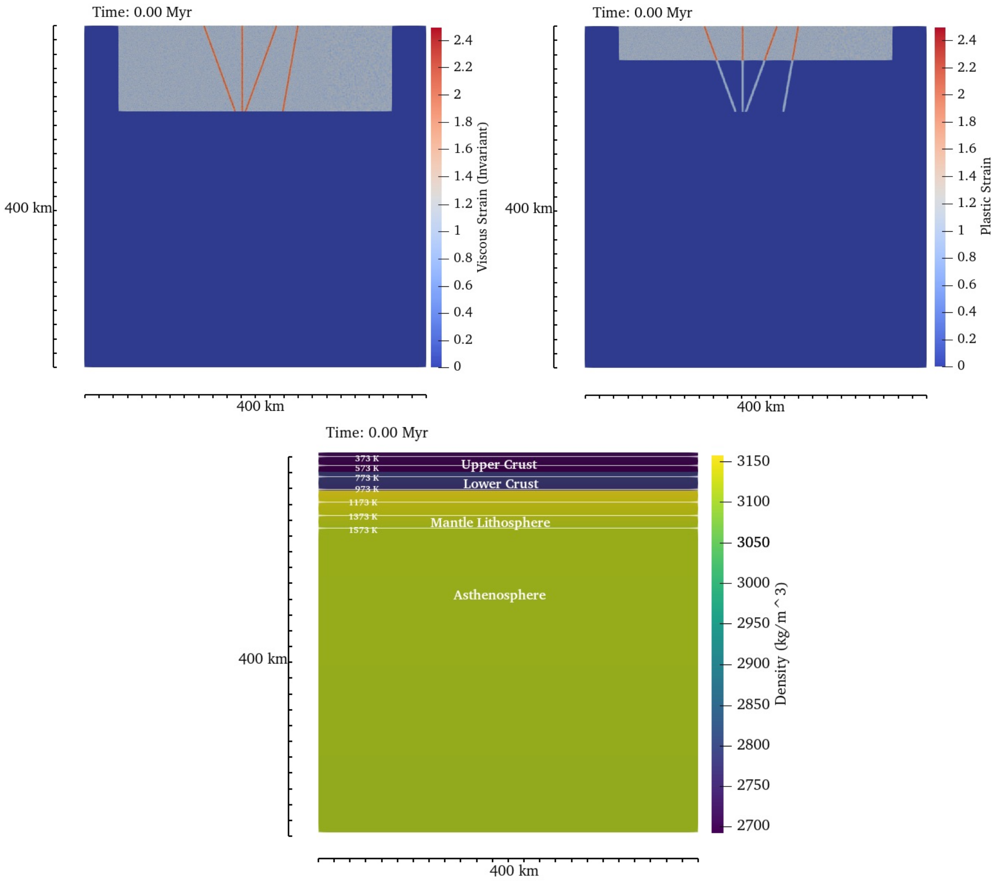
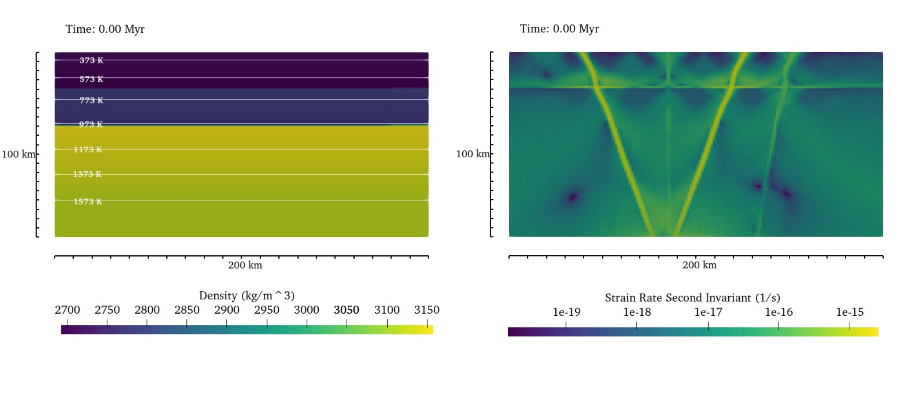
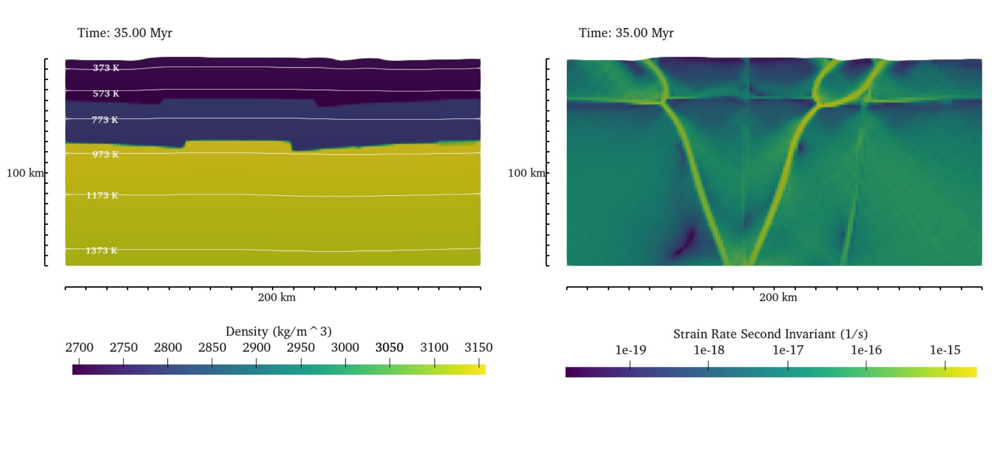

(sec:cookbooks:Continental-Compression-with-imposed-faults)=
# Continental Compression with Pre-Existing Fault inheritance

*This section was contributed by Prajakta Mohite and John Naliboff.*

Recent numerical modeling investigations have demonstrated the influence of extensional phases of deformation on the subsequent evolution of continental collision zones (eg., {cite}`Vasey:etal:2024`,{cite}`Zwaan:etal:2025`). Motivated by these studies and a wide range of observations that highlight fault reactivation processes during the Wilson cycle, this cookbook implements a 2D visco-plastic model of continental compression that incorporates pre-existing fault zones into the initial conditions.

The cookbook builds directly on components of the {ref}`sec:cookbooks:continental-extension` cookbook, and the primary goal here is to:
1. Highlight techniques for imposing fault zones in the initial conditions of a lithospheric deformation simulation and
2. Demonstrate their effect on the evolution of deformation patterns.

# Model Design
The model domain spans 400 km x 400 km and uses adaptive refinement to resolve deformation patterns in the regions where faults are imposed at the onset of deformation. The initial thermal structure follows a conductive, continental-style geotherm through the lithosphere and an initial adiabatic profile in the asthenosphere. The governing equations follow the extended Boussinesq approximation, which includes both adiabatic and shear heating.

Deformation is driven by horizontal velocity applied at the model sides (0.1 cm/yr), which are balanced by outflow at the model base (0.2 cm/yr). A free surface allows topography to develop through time, which is diffused at each time step to approximate landscape evolution processes and stabilize both linear and nonlinear solver behavior.

The initial lithological structure includes distinct layers representing the upper crust (20 km), lower crust (20 km), mantle lithosphere (40 km), and asthenosphere (320 km). Each layer is represented by a nonlinear viscoplastic rheology combining dislocation creep and pressure-dependent plasticity. Respectively, the pre-yield viscosity and brittle material parameters (cohesion, friction) weaken by a factor of 10 and 4 as a function of accumulated viscous and brittle strain over strain intervals of 0.5-1.5.

```{literalinclude} strain_weakening_mechanism.part.prm
```

Faults are integrated into the model initial conditions as zones of initial strain defined in the Geodynamic World Builder. Four faults extending to the base of the lithosphere with constant dip angles are included, two of which dip at 60 degrees toward each other in a style representing pre-existing normal faults. A third vertical fault (i.e., approximating a strike-slip fault) is centrally located between the two dipping faults, while the fourth fault is located to the right of two normal faults and dips at a higher angle. The faults maintain a constant width of 5 km and extend to a depth of 100 km. In addition to defined fault locations with constant strain values, randomized zones of plastic (0-40 km depth) and viscous strain (0-100 km depth) are imposed across a 300 km wide zone in the upper to approximate pervasive off-fault damage observed in many regions that have undergone significant tectonic deformation. The faults are prescribed in the middle of the randomized strain zones, fault1 in wb file is located at x = 250km. The plastic and viscous strain composition values within the faults is the sum of the value defined in the world builder and the randomized values defined in these zones.

Following Howard et al. (2003), the configuration of these faults is motivated by the inferred tectonic history of the Dzereg basin in the Mongolia Altai, which has been undergoing relatively slow compression since the onset of the India-Asia collision following a period of extensional deformation.

```{figure-md} fig:initial_plastic_and_viscous_strain_and_density


  Initial plastic strain (top left), viscous strain (top right) and density (bottom) highlighting the location of defined fault zones and randomized strain across a broader region in the upper 100 km.
 The density plot contains temperature contours at intervals of 200 K, beginning at 373 K and ending at 1573 K (LAB temperature).
```

The position, dip angle and direction, thickness (5 km), and composition (plastic and viscous strain) of each fault are defined with the [Geodynamic World Builder fault feature](https://geodynamicworldbuilder.github.io), which is illustrated below for a single fault.

```{literalinclude} single_fault_imposed.part.wb
```

# Model Evolution and Potential Expansion.

```{figure-md} fig:strain_rate_and_density_0_myr


  Strain rate (left) and density distribution (right) at 0 Myr in the upper 100 km from x = 100 to 300 km. Strain localizes in the upper crust along pre-defined fault zones, while density increases with depth, reflecting the compositional and thermal stratification of the lithosphere.
```

```{figure-md} fig:strain_rate_and_density_35_myr


 Strain rate (left) and density (right) distributions with temperature contours after 35 Myr of deformation.
```

Deformation preferentially localizes along the two pre-existing shear zones forming a graben-like geometry ({numref}`fig:strain_rate_and_density_0_myr`), which reflects their optimal orientation and position within the model domain to accommodate the imposed convergence. After 35 Myr of convergence ({numref}`fig:strain_rate_and_density_35_myr`) deformation remains strongly localized along these faults, with crustal shortening and thickening occurring between them forming an approximately symmetric orogenic wedge. Some degree of asymmetry develops on the right side of the wedge, where the fault farthest to the right remains active in the upper crust and connects to the fault bounding the wedge near the brittle-ductile transition zone.

Given the nonlinearity of the rheology and governing equations, minor variations in fault strength, geometry, lithospheric structure, and boundary velocities may lead to significant variations in the spatiotemporal evolution of deformation. This cookbook provides a flexible framework for exploring the effects of these parameters, and application to hypothesis-driven questions such as fault reactivation, inversion of rift basins, or the partitioning of strain in complex orogens.

Similarly, changing the numerical resolution is likely to also affect the results, as the brittle shear band width introduced by the plastic damper (1e21 Pa s) is still likely not fully resolved at the maximum resolution of 2.5 km. Furthermore, minor variations in the model results will likely occur if a stricter nonlinear solver tolerance is selected. This cookbook provides a flexible framework for exploring the effects of these parameters, and application to questions such as fault reactivation, inversion of rift basins, or the partitioning of strain in complex orogens.
