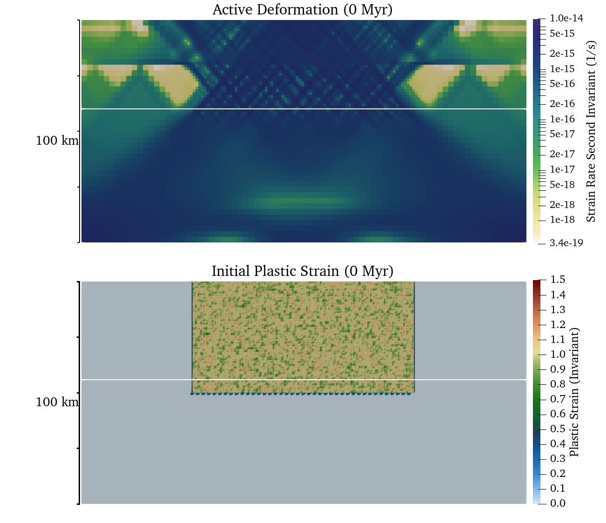
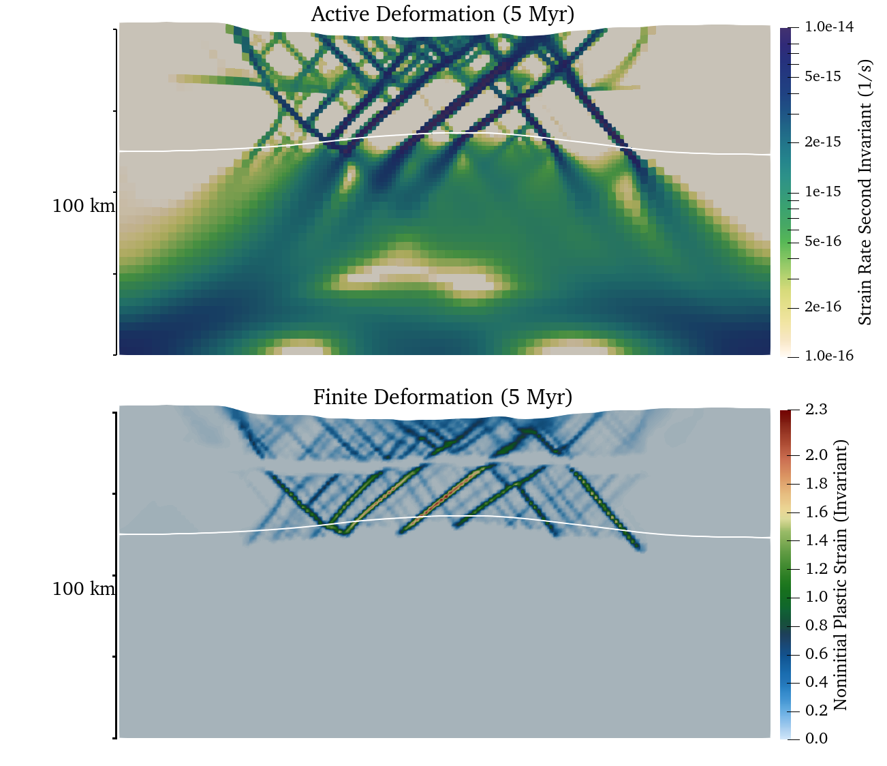

# Continental extension

*This section was contributed by John Naliboff, Anne Glerum, and Valentina
Magni*

In the crustal deformation examples above, the viscosity depends solely on the
Drucker Prager yield criterion defined by the cohesion and internal friction
angle. While this approximation works reasonably well for the uppermost crust,
deeper portions of the lithosphere may undergo either brittle or viscous
deformation, with the latter depending on a combination of composition,
temperature, pressure and strain-rate. In effect, a combination of the
Drucker-Prager and Diffusion dislocation material models is required. The
visco-plastic material model is designed to take into account both brittle
(plastic) and non-linear viscous deformation, thus providing a template for
modeling complex lithospheric processes. Such a material model can be used in
using the following set of input parameters:

```{literalinclude} continental_extension_material_model.prm
```

This cookbook provides one such example where the continental lithosphere
undergoes extension. Notably, the model design follows that of numerous
previously published continental extension studies ({cite}`Hui11,Bru14,Nal15` and references therein)

## Continental Extension

The 2D Cartesian model spans 200 ($x$) by 100 ($y$) km and has a finite
element grid with 1.25 and 2.5 km grid spacing, respectively, above and below
50 km depth. This variation in grid spacing is achieved with a single initial
adaptive refinement step using the minimum refinement function strategy.
Unlike the crustal deformation cookbook (see {ref}`sec:cookbooks:crustal-deformation`),
the mesh is not refined with time.

```{literalinclude} continental_extension_geometry_mesh.prm
```

Similar to the crustal deformation examples above, this model contains a free
surface. However, in this example the free surface is advected using the full
velocity (e.g., normal projection) rather than only the vertical component. As
this projection can lead to significant surface mesh deformation and associated
solver convergence issues, diffusion is applied to the free surface at each
time step. Deformation is driven by constant horizontal ($x$-component)
velocities (0.25 cm/yr) on the side boundaries ($y$-velocity component
unconstrained), while the bottom boundary has vertical inflow to balance the
lateral outflow. The top, and bottom boundaries have fixed temperatures, while
the sides are insulating. The bottom boundary is also assigned a fixed
composition, while the top and sides are unconstrained.

```{literalinclude} continental_extension_boundary_conditions.prm
```

Sections of the lithosphere with distinct properties are represented by
compositional fields for the upper crust (20 km thick), lower crust (20 km
thick) and mantle lithosphere (60 km thick). Material (viscous flow law
parameters, cohesion, internal friction angle) and thermodynamic properties
for each compositional field are based largely on previous numerical studies.
Dislocation creep viscous flow parameters are taken from published deformation
experiments for wet quartzite ({cite}`RB04`), wet anorthite ({cite}`RGWD06`) and dry olivine ({cite}`HK04`). Additional
compositional fields are used to track plastic strain and the non-initial
plastic strain, with the latter value tracking the same quantity as the
plastic strain absent the initial plastic strain values. As discussed further
on, the plastic strain is used to soften (e.g., reduce) the friction and
cohesion through time based on user-specified bounds and magnitudes. The
initial randomized values of plastic strain in the model center localize
distributed deformation in this region.

```{literalinclude} continental_extension_composition.prm
```

The initial thermal structure, radiogenic heating model and associated thermal
properties are consistent with the prescribed thermal boundary conditions and
produce a geotherm characteristic of the continental lithosphere. The
equations defining the initial geotherm ({cite}`Cha86`) follow the form
```{math}
\begin{aligned}
  \label{eq:continental-geotherm-1}
  T(z) = T_T + \frac{q_T}{k}z - \frac{Az^2}{2k}
\end{aligned}
```
where $T$ is temperature, $z$ is depth, $T_T$ is the temperature at the layer surface
(top), $q_T$ is surface heat flux, $k$ is thermal conductivity, and $A$ is
radiogenic heat production.

For a layer thickness $\Delta z$, the basal temperature ($T_B$) and heat flux
($q_B$)
```{math}
 \begin{aligned}
   T_B = T_T + \frac{q_T}{k} \Delta z - \frac{A \Delta z^2}{2k}
   q_B = q_T - A \Delta z.
 \end{aligned}
```

In this example, specifying the top (273 $K$) temperature, surface heat
flow (55 $mW / m^2$), thermal conductivity, and radiogenic heat production
of each layer provides enough constraints to successively solve for the
temperature and heat flux at the top of the lower crust and mantle.

As noted above, the initial zone of randomized plastic strain within the model
center and strain softening of the friction and cohesion produces an initial
pattern of distributed and unlocalized deformation across the zone of initial
plastic strain ({numref}`fig:continental_extension_cookbook_0myr`).
After 5 million years of extension, distributed faulting is clearly evident
in both the active and finite deformation fields and surface topography over
an approximately 100 km wide region ({numref}`fig:continental_extension_cookbook_5myr`).
While deformation is distributed within this region, the fault system is clearly
asymmetric as the rate of deformation and accumulated brittle strain varies between faults.
Localization onto the two conjugate rift-bounding border faults is evident
from the active deformation field. Notably, deformation of the free surface
near the fixed left and right walls is evident at 5 Myr. Continued distortion
of the surface mesh near the lateral boundaries may lead to solver issues,
which can be overcome by either widening the model or allowing the mesh to
deform along these boundaries.

With further extension for millions of years, significant crustal thinning and
surface topography development should occur in response to displacement along
the rift-bounding faults. However, given that the model only extends to 100 km
depth, the simulation will not produce a realistic representation of
continental breakup due to the lack of an upwelling asthenosphere layer.
Indeed, numerical studies that examine continental breakup, rather than just
the initial stages of continental extension, include an asthenospheric layer
or modified basal boundary conditions (e.g. Winkler boundary condition in {cite}`Bru14` for example) as temperature variations associated with
lithospheric thinning exert a first-order influence on the deformation
patterns. As noted below, numerous additional parameters may also affect the
temporal evolution of deformation patterns.

```{figure-md} fig:continental_extension_cookbook_0myr


Initial active deformation field (strain rate second invariant in units of $s^{-1}$)
and distribution of plastic strain. The white line marks the (893 $K$) isotherm
(initial Moho temperature).
```

```{figure-md} fig:continental_extension_cookbook_5myr


Active (strain rate second invariant in units of $s^{-1}$) and finite (plastic)
deformation after 50 million years of extension. The white line marks the (893 $K$)
isotherm (initial Moho temperature).
```
