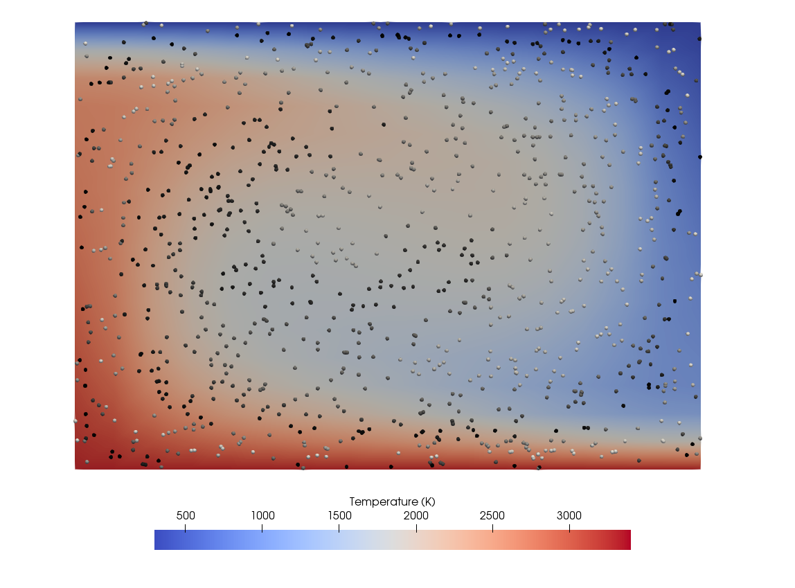

(sec:cookbooks:convection-box-particles)=
# Running a geodynamic model

*This section was contributed by Juliane Dannberg.*

The input file for this model can be found at
[cookbooks/convection-box-particles/convection-box-particles.prm](https://www.github.com/geodynamics/aspect/blob/main/cookbooks/convection-box-particles/convection-box-particles.prm).

This model is a modification of the Convection in a 2d box cookbook described
in {ref}`sec:cookbooks:convection-box`. It is changed to a lower
resolution, uses physical units, and outputs particles, which can be used to
visualize the flow of the material. This makes it a good setup to run as a
very first simple geodynamic model to test if is running on everyone's
computer, and to demonstrate how to visualize models results.

.

```{figure-md} fig:convection-box-iterations-particles


 Setup of the tutorial model. Background colors show temperature, gray spheres illustrate particle positions.
```
.

Slides that demonstrate how to run the model from inside a virtual machine,
and how to use ParaView to look at the model output can be found [here](https://www.dropbox.com/s/dmlcf4tx62ts6d1/02_geophysics_tutorial_01_08.pdf?dl=0). The
model can also be used to show how the thermal conductivity (or other physical
parameters that change the Rayleigh number) control the vigor of convection.
An example for this is given in [this presentation (last slide)](https://www.dropbox.com/s/nqkxe54poe1op7d/03_geophysics_lecture_01_10.pdf?dl=0).
