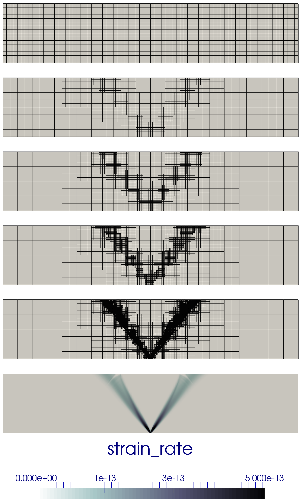

(sec:cookbooks:crustal-deformation)=
# Crustal deformation

*This section was contributed by Cedric Thieulot, and makes use of the
Drucker-Prager material model written by Anne Glerum and the free surface
plugin by Ian Rose.*

This is a simple example of an upper-crust undergoing compression or
extension. It is characterized by a single layer of visco-plastic material
subjected to basal kinematic boundary conditions. In compression, this setup
is somewhat analogous to (Willett 1999), and in extension to (Allken,
Huismans, and Thieulot 2011).

Brittle failure is approximated by adapting the viscosity to limit the stress
that is generated during deformation. This &ldquo;cap&rdquo; on the stress
level is parameterized in this experiment by the pressure-dependent Drucker
Prager yield criterion and we therefore make use of the Drucker-Prager
material model (see Section [\[parameters:Material_20model\]][1]) in the
`cookbooks/crustal_deformation/crustal_model_2D.prm`.

The layer is assumed to have dimensions of $\SI{80}{km} \times \SI{16}{km}$
and to have a density $\rho=\SI{2800}{kg/m^3}$. The plasticity parameters are
specified as follows:

``` prmfile
```

The yield strength $\sigma_y$ is a function of pressure, cohesion and angle of
friction (see Drucker-Prager material model in Section
[\[parameters:Material_20model\]][1]), and the effective viscosity is then
computed as follows:
$$\mu_{\text{eff}} = \left( \frac{1}{ \frac{\sigma_y}{2 \dot{\epsilon}}+
\mu_{\text{min}}} + \frac{1}{\mu_{\text{max}}}  \right)^{-1}$$ where
$\dot{\epsilon}$ is the square root of the second invariant of the deviatoric
strain rate. The viscosity cutoffs ensure that the viscosity remains within
computationally acceptable values.

During the first iteration of the first timestep, the strain rate is zero, so
we avoid dividing by zero by setting the strain rate to
`Reference strain rate`.

The top boundary is a free surface while the left, right and bottom boundaries
are subjected to the following boundary conditions:

``` prmfile
```

Note that compressive boundary conditions are simply achieved by reversing the
sign of the imposed velocity.

The free surface will be advected up and down according to the solution of the
Stokes solve. We have a choice whether to advect the free surface in the
direction of the surface normal or in the direction of the local vertical
(i.e., in the direction of gravity). For small deformations, these directions
are almost the same, but in this example the deformations are quite large. We
have found that when the deformation is large, advecting the surface
vertically results in a better behaved mesh, so we set the following in the
free surface subsection:

``` prmfile
```

We also make use of the strain rate-based mesh refinement plugin:

``` prmfile
```

Setting `set Initial adaptive refinement = 4` yields a series of meshes as
shown in Fig. ([1][]), all produced during the first timestep. As expected, we
see that the location of the highest mesh refinement corresponds to the
location of a set of conjugated shear bands.

If we now set this parameter to 1 and allow the simulation to evolve for
500kyr, a central graben or plateau (depending on the nature of the boundary
conditions) develops and deepens/thickens over time, nicely showcasing the
unique capabilities of the code to handle free surface large deformation,
localised strain rates through visco-plasticity and adaptive mesh refinement
as shown in Fig. ([2][]).

```{figure-md} fig:meshes


Mesh evolution during the first timestep (refinement is based on strain rate).
```

Deformation localizes at the basal velocity discontinuity and plastic shear
bands form at an angle of approximately $53\degree$ to the bottom in extension
and $35\degree$ in compression, both of which correspond to the reported
Arthur angle (Kaus 2010; Buiter 2012).

```{figure-md} fig:extcompr


Finite element mesh, velocity, viscosity and strain rate fields in the case of extensional boundary conditions (top) and compressive boundary conditions (bottom) at t=500kyr.
```

##### Extension to 3D.

We can easily modify the previous input file to produce `crustal_model_3D.prm`
which implements a similar setup, with the additional constraint that the
position of the velocity discontinuity varies with the $y$-coordinate, as
shown in Fig. ([3][]). The domain is now $128\times96\times16$km and the
boundary conditions are implemented as follows:

``` prmfile
```

The presence of an offset between the two velocity discontinuity zones leads
to a transform fault which connects them.

```{figure-md} fig:bottombc


Basal velocity boundary conditions and corresponding strain rate field for the 3D model.
```

The Finite Element mesh, the velocity, viscosity and strain rate fields are
shown in Fig. ([4][]) at the end of the first time steps. The reader is
encouraged to run this setup in time to look at how the two grabens interact
as a function of their initial offset (Allken, Huismans, and Thieulot 2011,
2012; Allken et al. 2013).

```{figure-md} fig:ext3D


Finite element mesh, velocity, viscosity and strain rate fields at the end of the first time step after one level of strain rate-based adaptive mesh refinement.
```

<div id="refs" class="references csl-bib-body hanging-indent">

<div id="ref-alhf13" class="csl-entry">

Allken, V., R. S. Huismans, H. Fossen, and C. Thieulot. 2013. &ldquo;<span
class="nocase">3D numerical modelling of graben interaction and linkage: a
case study of the Canyonlands grabens, Utah</span>.&rdquo; *Basin Research*
25: 1&ndash;14.

</div>

<div id="ref-alht11" class="csl-entry">

Allken, V., R. Huismans, and C. Thieulot. 2011. &ldquo;Three Dimensional
Numerical Modelling of Upper Crustal Extensional Systems.&rdquo;
*J.&nbsp;Geophys.&nbsp;Res.* 116: B10409.

</div>

<div id="ref-alht12" class="csl-entry">

&mdash;&mdash;&mdash;. 2012. &ldquo;Factors Controlling the Mode of Rift
Interaction in Brittle-Ductile Coupled Systems: A 3d Numerical Study.&rdquo;
*Geochem.&nbsp;Geophys.&nbsp;Geosyst.* 13 (5): Q05010.

</div>

<div id="ref-buit12" class="csl-entry">

Buiter, S. J. H. 2012. &ldquo;<span class="nocase">A review of brittle
compressional wedge models</span>.&rdquo; *Tectonophysics* 530: 1&ndash;17.

</div>

<div id="ref-kaus10" class="csl-entry">

Kaus, B. J. P. 2010. &ldquo;Factors That Control the Angle of Shear Bands in
Geodynamic Numerical Models of Brittle Deformation.&rdquo; *Tectonophysics*
484: 36&ndash;47.

</div>

<div id="ref-will99" class="csl-entry">

Willett, S. D. 1999. &ldquo;Rheological Dependence of Extension in Wedge
Models of Convergent Orogens.&rdquo; *Tectonophysics* 305: 419&ndash;35.

</div>

</div>

  [1]: #parameters:Material_20model
  [1]: #fig:meshes
  [2]: #fig:extcompr
  [3]: #fig:bottombc
  [4]: #fig:ext3D
