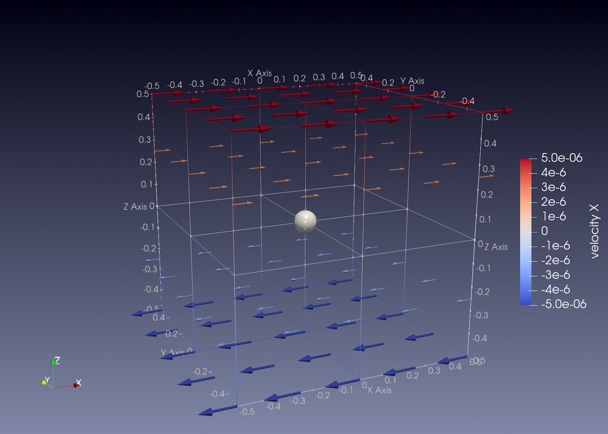
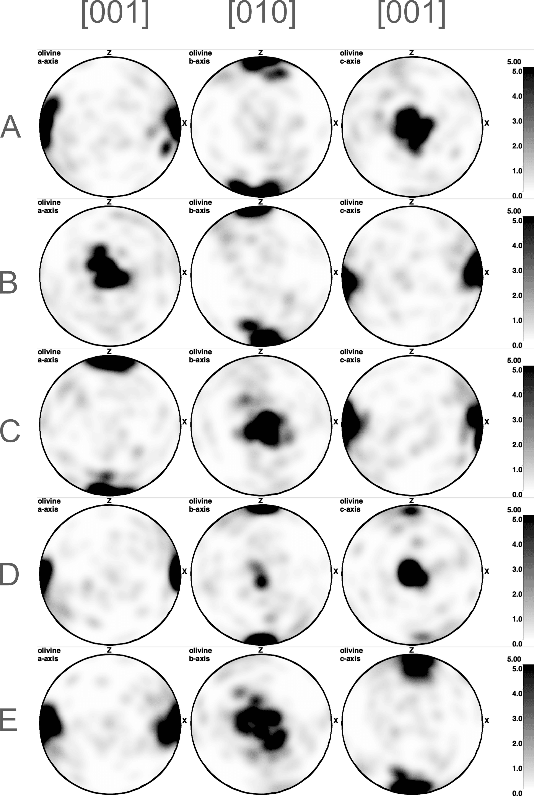

# Olivine Fabric Developments Under Simple Shear

*This section was contributed by Xiaochuan Tian, with help from Yijun Wang and Menno Fraters. It is
based on a section in {cite:t}`fraters_billen_2021_cpo`
by Menno Fraters and Magali Billen published in 2021.*

This cookbook explains how to set up a numerical experiment for fabric
developments of a single olivine particle under simple shear macroscopic strain.
It uses ASPECT
crystal preferred orientation (CPO) implementation, which is described in detail in
{cite:t}`fraters_billen_2021_cpo`.
The fabric calculation is based on DRex {cite:t}`kaminski2004`.
This cookbook describes how to use ASPECT's CPO implementation to calculate the major
olivine fabrics observed in the lab experiments. It focuses on reproducing Fig. 3
of {cite}`fraters_billen_2021_cpo`.

## Motivation
The Earth's plates can move relative to each other because the underlying mantle
can be deformed to accommodate such motions.
This motion reflects dynamics inside the planet, which cannot be observed directly, as the depth of interest is beyond human drilling capability. However, indirect observations from seismic anisotropy provide information about the directionality of seismic wave speeds propagating inside the Earth. If such directionality is controlled by the mantle’s motion or deformation, we can use seismic anisotropy observations to infer mantle deformation.

It is important to note that this cookbook does not directly compare model outputs with seismic anisotropy observations. Instead, it provides the full elastic tensor, including its symmetry axes and fast directions, at the locations of particles in the model. To make direct comparisons with seismic observations, you would still need to process these results through a separate code that simulates seismic wave propagation through the modeled medium.

Olivine is a major mineral of the Earth's upper mantle where continuous deformation
takes place. People care about olivine fabric developments under simple shear as it may
provide a bridge that links seismic anisotropy observations to flow in the upper mantle that accommodates plate motions. Indeed, high temperature and pressure lab experiments using [Griggs apparatus](https://en.wikipedia.org/wiki/Griggs_apparatus) to investigate olivine fabrics developments under simple shear do find systematic types of fabrics based on the stress and water content conditions (see {cite:t}`karato2008` for details). Note that the effects of secondary phases, such as enstatite  {cite:t}`kaminski2004` can also be included in the method, we here only focus on olivine for simplicity. Meanwhile, following the example input file from {cite:t}`fraters_billen_2021_cpo`,the input file provided here also includes an example of enstatite calculation with a volume fraction of 0.3.

## Model setup

Following {cite:t}`fraters_billen_2021_cpo`, we prescribe simple shear in a 3d Cartesian box/cube
with dimensions of $1 \times 1 \times 1 $ $[m^3]$. The shear strain rate is set to
$\dot{\epsilon}_{xz} = -5\times 10^{-6} [s^{-1}]$. The particle with olivine/enstatite volume fraction of 0.7/0.3 is placed
right at the center of the cubic box so it stays stationary. The DRex implementation
keep tracks of rotations of crystal grains within the particle under macroscopic deformation.

```{figure-md} fig:model_setup_3D_box


3D shear box with velocity vectors. The grey ball is the central olivine particle.
```

The model computes how crystal grains rotate and align under simple shear and the pole figures visualize this rotation.

## The input file

Rather than solving the Stokes equation with boundary conditions, we instead prescribe
a constant simple shear strain rate field by setting "Nonlinear solver scheme" to
"single Advection, no Stokes" and
prescribing the Stokes solution with a function. In this case, the only model property that we care about is the prescribed strain rate that is exerted onto the olivine particle. Parameters useful for the Stokes equation is not important in this case.

```{literalinclude} prescribe_stokes.part.prm
```

The second part of the input file specifies what to output and for what minerals to keep track of
CPO development. It also specifies the parameters for the DRex algorithm.

```{literalinclude} cpo.part.prm
```

The complete input file is located at
[/cookbooks/crystal_preferred_orientation_olivine_fraters_billen_2021/olivineA.prm](../olivineA.prm).

## Plotting pole figures
To plot pole figures from the output in `out_drex_olivineA/particles_cpo`, you could use [MTEX](https://mtex-toolbox.github.io/) or [cpo_analyzer](https://github.com/MFraters/cpo_analyzer.git). For example, inside the `cpo_analyzer` folder, run:
```{code-block} console
$ cargo run --release path/to/cpo_pole_figure_config.toml
```
A folder named 'CPO_figures' will be generated in the folder 'out_drex_olivineA' that contains the pole figure results.  An example config file can be found here: [/cookbooks/crystal_preferred_orientation_olivine_fraters_billen_2021/cpo_pole_figure_config.toml](./cpo_pole_figure_config.toml).

## Model results
```{figure-md} fig:initCPO


Initial randomized CPO at time zero.
```
By changing "Olivine: A-fabric" to "Olivine: B-fabric" you can generate olivine fabric results for B-type and other types as well shown below.

```{figure-md} fig:olivinefabrics


Olivine A-E type fabrics under simple shear with a shear strain of 1.5
at 3e5 seconds of model time under constant shear strain rate:
 $\dot{\epsilon}_{xz} = -5\times 10^{-6} [s^{-1}]$.
Note that the color scales range from 0 to 5 but actual results may be larger.
```

When we look at the visualization output of this model (see also
{numref}`fig:olivinefabrics`), we can see the results reproduce the pole figures in Figure 3 of {cite:t}`fraters_billen_2021_cpo`. There is a minor difference in the type D fabric (the girdle is less pronounced) when compared to Fig. 3 of (Karato et al., 2008), which could be investigated in more details in the future.

## Extending the model

This model of a unit cube under simple shear can be extended in various ways.
Some ideas for adapting the model setup are:

-   Setup high pressure and temperature lab experiments for olivine CPO.
    After benchmarking against the lab experiment results, it could then be
    extended beyond the parameter space limited by the lab experiment.

-   Add CPO calculations in large scale geodynamic models like mantle plumes,
    lower crust delamination and mid-ocean ridges.

-   Include anisotropic viscosity to feed this CPO back to influence the stokes solution.

## References:
- Fraters, M. R. T., & Billen, M. I. (2021).
On the implementation and usability of crystal preferred orientation evolution in geodynamic modeling. Geochemistry, Geophysics, Geosystems, 22(10), e2021GC009846.

- Kaminski, E., Ribe, N. M., & Browaeys, J. T. (2004).
D-Rex, a program for calculation of seismic anisotropy due to crystal lattice preferred orientation in the convective upper mantle. Geophysical Journal International, 158(2), 744–752.

- Karato, S., Jung, H., Katayama, I., & Skemer, P. (2008).
Geodynamic significance of seismic anisotropy of the upper mantle: New insights from laboratory studies. Annu. Rev. Earth Planet. Sci., 36, 59–95.
