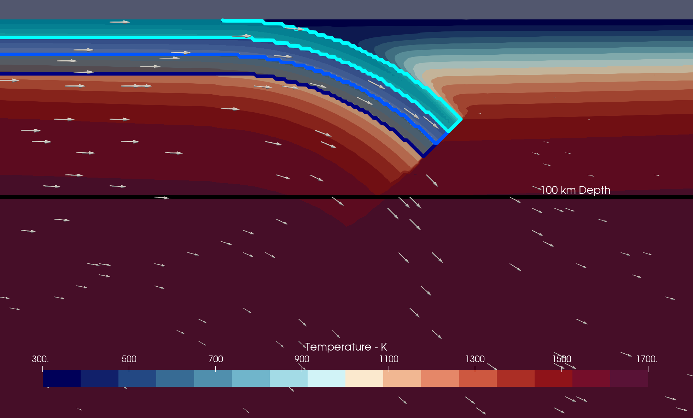

(sec:cookbooks:dynamic_subduction_with_two_phases)=
# Dynamic 2D Subduction Model with Reactive Two Phase Fluid Flow

*This section was contributed by Daniel Douglas.*

In this cookbook we extend the simplified kinematic subduction model built in INSERT_LINK_HERE to a more dynamic model of subduction in a 2D Cartesian box. The model begins with a slab that has just started to subduct with a leading slab dip of 45 degrees, and a weak plate interface to facilitate subduction. The initial conditions for this model were constructed using the Geodynamic World Builder, see this [tutorial](https://gwb.readthedocs.io/en/latest/user_manual/cookbooks/simple_subduction_2d_cartesian/doc/README.html) for an in depth explanation on how to setup your own World Builder file, and the file used to generate this model can be found [here](https://www.github.com/geodynamics/aspect/blob/main/cookbooks/dynamic_subduction_with_two_phases/WORLDBUILDER_FILE.WB). While we still kinematically impose a convergence velocity of 5cm/yr, this is only prescribed on the upper left boundary. We use the 'box with lithosphere boundary indicators' geometry model to only impose this velocity on the shallowest 100 km of the left boundary, and for depths larger than 100 km the boundary in left open to allow inflow/outflow. On the right boundary, we impose a free slip boundary condition on the shallowest 100 km, and an open boundary for depths greater than 100 km. For the top and bottom boundaries, a free slip boundary condition is imposed. With the exception of the entire left boundary, the composition is not held fixed. We fix the temperature on the boundaries for the top, bottom, and the shallowest 100 km on both the left and right boundaires, and allow it to dynamically evolve for depths greater than 100 km on the left and right boundaries. The subducting plate (slab and unsubducted oceanic lithosphere) has a layered composition comprised of (from shallowest to deepest): 10 km of sediment containing 2 wt% water, 10 km of mid-ocean ridge basalt (MORB) hydrated to 1 wt% water, and 10 km of gabbro hydrated to 0.5 wt% water. The rest of the model is composed of peridotite, and there is no free fluid at the beginning of the model.

```{figure-md} fig:initial-temperature-hydration


Schematic diagram showing the model region of a subduction zone, and the actual schematic diagram of the model.
```
