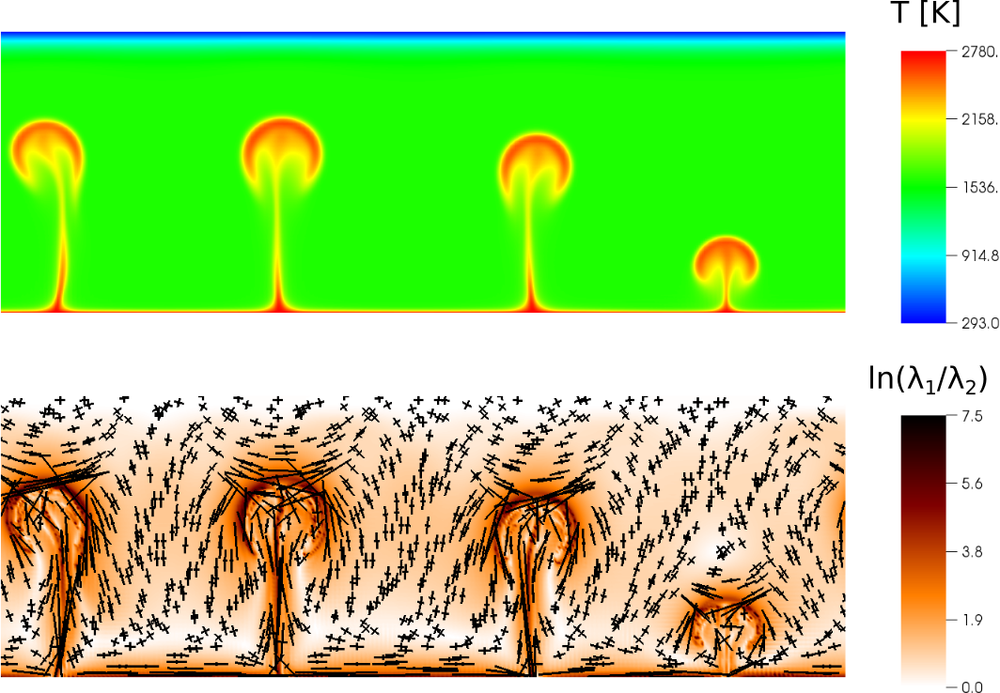

(sec:cookbooks:finite_strain)=
# Tracking finite strain

*This section was contributed by Juliane Dannberg and Rene Gassm&ouml;ller.*

:::{note}
In this section, following {cite:t}`becker:etal:2003,dahlen:tromp:1998`, we denote the velocity gradient tensor as $\mathbf G$, where $\mathbf G = \nabla \mathbf u^T$,
and $\mathbf u$ is the velocity. Note that this is different from the definition of the strain rate $\epsilon(\mathbf u)$, which only contains the symmetric part of $\mathbf G$. We then denote the deformation gradient (or deformation) tensor by $\mathbf F$, where $\mathbf F$ is the tensor that
deforms an initial state $\mathbf x$ into an deformed state $\mathbf r = \mathbf F \mathbf x$.
:::

In many geophysical settings, material properties, and in particular the
rheology, do not only depend on the current temperature, pressure and strain
rate, but also on the history of the system. This can be incorporated in ASPECT
models by tracking history variables through compositional fields. In this
cookbook, we will show how to do this by tracking the strain that idealized
little grains of finite size accumulate over time at every (Lagrangian) point
in the model.

Here, we use a material model plugin that defines the compositional fields as
the components of the deformation gradient tensor $\mathbf F_{ij}$, and
modifies the right-hand side of the corresponding advection equations to
accumulate strain over time. This is done by adjusting the
`out.reaction_terms` variable:

```{literalinclude} finite_strain.cc
```

Let us denote the accumulated deformation at time step $n$ as $\mathbf F^n$.
We can calculate its time derivative as the product of two tensors, namely the
current velocity gradient $\mathbf G_{ij} = \frac{\partial u_i}{\partial x_j}$
and the deformation gradient $\mathbf F^{n-1}$ accumulated up to the previous
time step, in other words
$\frac{\partial \mathbf F}{\partial t} = \mathbf G \mathbf F$, and
$\mathbf F^0 = \mathbf I$, with $\mathbf I$ being the identity tensor. While
we refer to other studies {cite}`mckenzie:jackson:1983,dahlen:tromp:1998,becker:etal:2003`
for a derivation of this relationship, we can give an
intuitive example for the necessity to apply the velocity gradient to the
already accumulated deformation, instead of simply integrating the velocity
gradient over time. Consider a simple one-dimensional "grain" of
length $1.0$, in which case the deformation tensor only has one component, the
compression in $x$-direction. If one embeds this grain into a convergent flow
field for a compressible medium where the dimensionless velocity gradient is
$-0.5$ (e.g. a velocity of zero at its left end at $x=0.0$, and a velocity of
$-0.5$ at its right end at $x=1.0$), simply integrating the velocity gradient
would suggest that the grain reaches a length of zero after two units of time,
and would then "flip" its orientation, which is clearly
non-physical. What happens instead can be seen by solving the equation of
motion for the right end of the grain $\frac{dx}{dt} = v = -0.5 x$. Solving
this equation for $x$ leads to $x(t) = e^{-0.5t}$. This is therefore also the
solution for $\mathbf F$ since $\mathbf F x$ transforms the initial position
of $x(t=0)=1.0$ into the deformed position of $x(t=1) = e^{-0.5}$, which is
the definition of $\mathbf F$.

In more general cases a visualization of $\mathbf F$ is not intuitive, because
it contains rotational components that represent a rigid body rotation without
deformation. Following {cite:t}`becker:etal:2003` we can polar-decompose the tensor
into a positive-definite and symmetric left stretching tensor $\mathbf L$, and
an orthogonal rotation tensor $\mathbf Q$, as
$\mathbf F = \mathbf L \mathbf Q$, therefore
$\mathbf L^2 = \mathbf L \mathbf L^T = \mathbf F \mathbf F^T$. The left
stretching tensor $\mathbf L$ (or finite strain tensor) then describes the
deformation we are interested in, and its eigenvalues $\lambda_i$ and
eigenvectors $\mathbf e_i$ describe the length and orientation of the
half-axes of the finite strain ellipsoid. Moreover, we will represent the
amount of relative stretching at every point by the ratio
$\ln(\lambda_1/\lambda_2)$, called the *natural strain* {cite}`ribe:1992`.

The full plugin implementing the integration of $\mathbf F$ can be found in
[cookbooks/finite_strain/finite_strain.cc](https://www.github.com/geodynamics/aspect/blob/main/cookbooks/finite_strain/finite_strain.cc) and can be compiled with
`cmake . && make` in the [cookbooks/finite_strain](https://www.github.com/geodynamics/aspect/blob/main/cookbooks/finite_strain) directory. It can be
loaded in a parameter file as an "Additional shared library," and
selected as material model. As it is derived from the "simple"
material model, all input parameters for the material properties are read in
from the subsection `Simple model`.

```{literalinclude} finite_strain.part.prm
```

```{figure-md} fig:finite_strain


Accumulated finite strain in an example convection model, as described in {ref}`sec:cookbooks:finite_strain` at a time of 67.6 Ma. Top panel: Temperature distribution. Bottom panel: Natural strain distribution. Additional black crosses are the scaled eigenvectors of the stretching tensor <span class="math inline"><strong>L</strong></span>, showing the direction of stretching and compression.
```

The plugin was tested against analytical solutions for the deformation
gradient tensor in simple and pure shear as described in
[benchmarks/finite_strain/pure_shear.prm](https://www.github.com/geodynamics/aspect/blob/main/benchmarks/finite_strain/pure_shear.prm) and
[benchmarks/finite_strain/simple_shear.prm](https://www.github.com/geodynamics/aspect/blob/main/benchmarks/finite_strain/simple_shear.prm).

We will demonstrate its use at the example of a 2D Cartesian convection model
({numref}`fig:finite_strain`): Heating from the bottom leads to the ascent of plumes
from the boundary layer (top panel), and the amount of stretching is visible
in the distribution of natural strain (color in lower panel). Additionally,
the black crosses show the direction of stretching and compression (the
eigenvectors of $\mathbf L$). Material moves to the sides at the top of the
plume head, so that it is shortened in vertical direction (short vertical
lines) and stretched in horizontal direction (long horizontal lines). The
sides of the plume head show the opposite effect. Shear occurs mostly at the
edges of the plume head, in the plume tail, and in the bottom boundary layer
(black areas in the natural strain distribution).

The example used here shows how history variables can be integrated up over
the model evolution. While we do not use these variables actively in the
computation (in our example, there is no influence of the accumulated strain
on the rheology or any other material property), it would be trivial to extend
this material model in a way that material properties depend on the integrated
strain: Because the values of the compositional fields are part of what the
material model gets as inputs, they can easily be used for computing material
model outputs such as the viscosity.

:::{note}
In this model we present the use of multiple compositional fields for other purposes than chemical composition.
It would have been feasible to run the same model with particles that track the deformation gradient, as
additionally implemented and tested in the simple shear and pure shear benchmarks mentioned in this section.
Both approaches have specific advantages, and for scientific computations one needs to evaluate the more suitable
strategy. Compositional fields cover the whole domain, but are affected by numerical diffusion, effectively reducing the
maximum accumulated strain. Particles only provide finite strain values at discrete positions, but can, if this is desired, be used in
fewer numbers and only a part of the model domain (and are much faster in this case). If however
there needs to be a large number of particles (possibly because they are used for other purposes as well), then they
can be much more expensive. Both approaches can be used to actively influence the rheology in the material model.
:::
