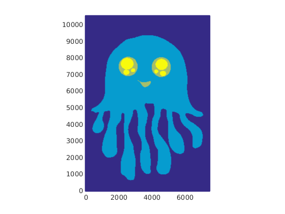

(sec:cookbooks:geomio)=
# Reading in compositional initial composition files generated with geomIO

*This section was contributed by Juliane Dannberg.*

:::{note}
This cookbook is based on a developer version of geomIO from July 2016. In the
meantime, the development of geomIO continued, and there is now a publication
{cite}`bauville:baumann:2019` that describes its features and how they can be
used in more detail.
:::

Many geophysical setups require initial conditions with several different
materials and complex geometries. Hence, sometimes it would be easier to
generate the initial geometries of the materials as a drawing instead of by
writing code. The MATLAB-based library geomIO
(<https://bitbucket.org/geomio/geomio>, {cite}`bauville:baumann:2019` provides
a convenient tool to convert a drawing generated with the vector graphics
editor Inkscape (<https://inkscape.org>) to a data file that can be read
into ASPECT. Here, we will demonstrate how this can be done for a 2D setup for a
model with one compositional field, but geomIO also has the capability to
create 3D volumes based on a series of 2D vector drawings using any number of
different materials. Similarly, initial conditions defined in this way can
also be used with particles instead of compositional fields.

To obtain the developer version of geomIO, you can clone the bitbucket
repository by executing the command

     git clone https://bitbucket.org/geomio/geomio.git

or you can download geomIO [here](https://bitbucket.org/geomio/geomio/downloads/).
You will then need to add the geomIO
source folders to your MATLAB path by running the file located in
`/path/to/geomio/installation/InstallGeomIO.m`. An extensive documentation for
how to use geomIO can be found [here](http://geomio-doc.bitbucket.org/). Among other things, it explains [how
to generate drawings in Inkscape](http://geomio-doc.bitbucket.org/tuto2D.html#drawing) that can be read in by geomIO, which
involves assigning new attributes to paths in Inkscape's XML editor. In
particular, a new property 'phase' has to be added to each path,
and set to a value corresponding to the index of the material that should be
present in this region in the initial condition of the geodynamic model.

:::{note}
geomIO currently only supports the latest stable version of Inkscape (0.91), and
other versions might not work with geomIO or cause errors. Moreover, geomIO
currently does not support grouping paths (paths can still be combined using `Path`$\rightarrow$`Union`,`Path`$\rightarrow$`Difference` or similar commands),
and only the outermost closed contour of a path will be considered. This means
that, for example, for modeling a spherical annulus, you would have to draw two
circles, and assign the inner one the same phase as the background of your
drawing.
:::

We will here use a drawing of a jellyfish located in
[cookbooks/geomio/doc/jellyfish.svg](https://www.github.com/geodynamics/aspect/blob/main/cookbooks/geomio/doc/jellyfish.svg), where different phases have already
been assigned to each path ({numref}`fig:jelly-picture`).

```{figure-md} fig:jelly-picture


Vector drawing of a jellyfish.
```

:::{note}
The page of your drawing in Inkscape should already have the extents (in px)
that you later want to use in your model (in m).
:::

After geomIO is initialized in MATLAB, we [run geomIO as described in the
documentation](https://bitbucket.org/geomio/geomio/wiki/Basic2Dtutorial#markdown-header-assigning-phase-information-to-markers), loading the
default options and then specifying all the
option we want to change, such as the path to the input file, or the
resolution:

```{literalinclude} run_geomio.part1.m
```

You can view all of the options available by typing `opt` in MATLAB.

In the next step we create the grid that is used for the coordinates in the
`ascii data` initial conditions file and assign a phase to each grid point:

```{literalinclude} run_geomio.part2.m
```

You can plot the `Phase` variable in MATLAB to see if the drawing was read in
and all phases are assigned correctly ({numref}`fig:jelly-plot`).

```{figure-md} fig:jelly-plot


 Plot of the Phase variable in MATLAB.
```

Finally, we want to write output in a format that can be read in by ASPECT's
`ascii data` compositional initial conditions plugin. We write the data into
the file `jelly.txt`:

```{literalinclude} save_file_as_txt.m
```

To read in the file we just created (a copy is located in ASPECT's data
directory), we set up a model with a box geometry with the same extents we
specified for the drawing in px and one compositional field. We choose the
`ascii data` compositional initial conditions and specify that we want to read
in our jellyfish. The relevant parts of the input file are listed below:

```{literalinclude} geomIO.prm
```

If we look at the output in `ParaView`, we can see our jellyfish, with the
mesh refined at the boundaries between the different phases
({numref}`fig:jelly-paraview`).

```{figure-md} fig:jelly-paraview


ASPECT model output of the jellyfish and corresponding mesh in ParaView.
```

For a geophysical setup, the MATLAB code could be extended to write out the
phases into several different columns of the ASCII data file (corresponding to
different compositional fields). This initial conditions file could then be
used in ASPECT with a material model such as the `multicomponent` model, assigning
each phase different material properties.

An animation of a model using the jellyfish as initial condition and assigning
it a higher viscosity can be found here:
<https://www.youtube.com/watch?v=YzNTubNG83Q>.
