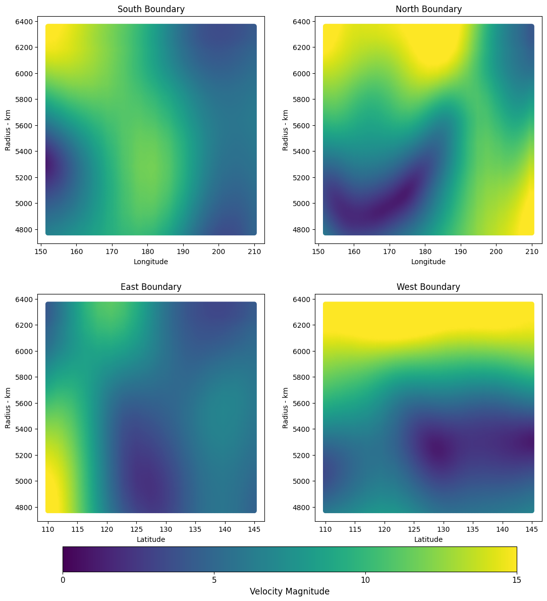
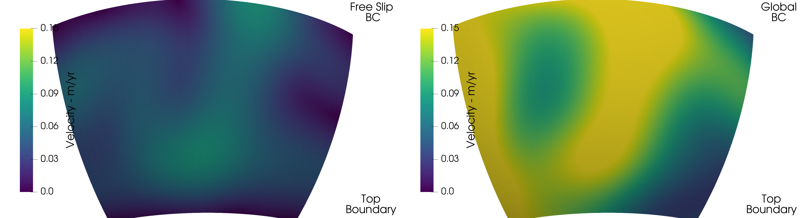
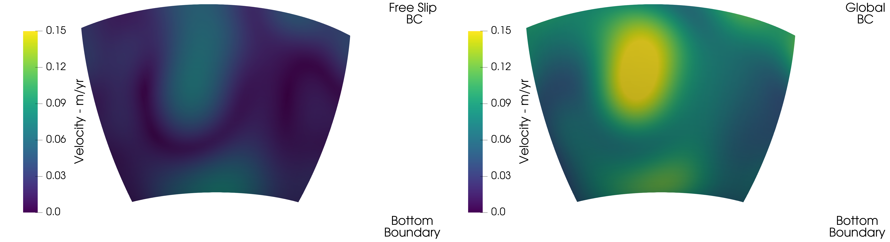
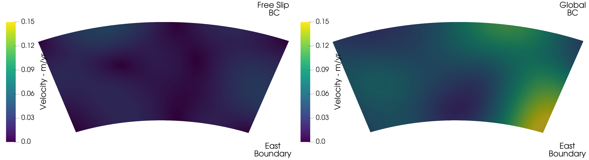
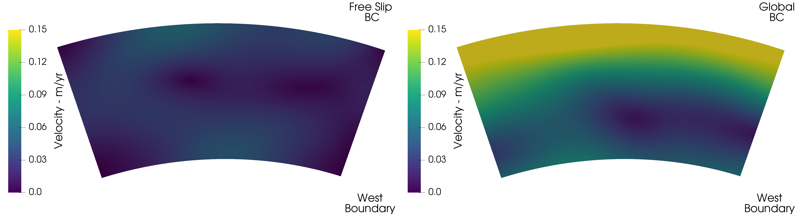
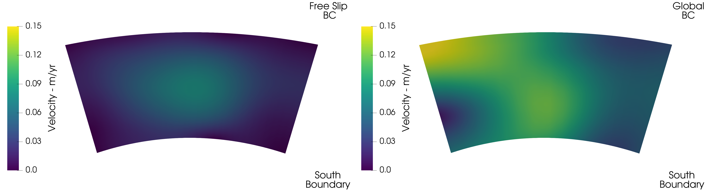
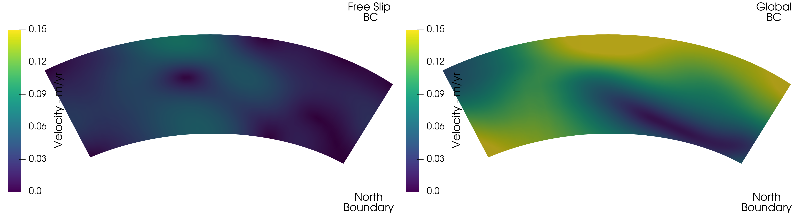

(sec:cookbooks:global_regional_coupling)=
# Prescribing Velocities from Global Convection Models as Boundary Conditions in Regional Models

*This section was contributed by Daniel Douglas.*

In this cookbook we showcase how to use the python script `extract_local_velocity.py` (located in the [contrib/python/scripts](https://www.github.com/geodynamics/aspect/blob/main/contrib/python/scripts) directory) to prescribe velocity boundary conditions on a regional spherical chunk using the velocity solution from a global convection model. For the `extract_local_velocity.py` script to work, `pvpython` must be installed locally on your machine. The `pvpython` package is bundled with Paraview, and if you have Paraview on your machine the `pvpython` executable is located within the `bin` directory of your Paraview installation. The broad concept motivating this cookbook is the influence of far-field boundary conditions on processes occurring at regional scales, such as at a specific plate tectonics boundary. While regional geodynamic simulations commonly expand the size of a model domain to reduce the effects of free-slip or no-slip boundaries on the key system dynamics, this approach still does not take into account the effects far-field on regional dynamics. This cookbook demonstrates how to address this issue by extracting velocity constraints from a global mantle flow simulations and imposing the the extracted velocities along the boundaries of a regional 3D chunk simulation. In detail, we compare two regional instantaneous models in a chunk geometry, one applying velocity boundary conditions from a global convection model, the other applying free slip boundary conditions. Both cases use the S20RTS model as the initial temperature distribution, and the simple material model. The spherical chunk domain spans from -55&deg; < latitude < -20&deg;, 152&deg; < longitude < 210&deg;, and 4770 km < radius < 6370 km.


To start, run the global `initial-condition-S20RTS` cookbook for this demonstration, which has a relatively low resolution and run time. Assuming ASPECT has already been compiled, run this cookbook with the following terminal commands:

```
cd $ASPECT_SOURCE_DIR/cookbooks/initial-condition-S20RTS/
../../build/aspect-release ./S20RTS.prm
```

Where `$ASPECT_SOURCE_DIR` is the path to your local ASPECT directory, and the `build` directory is assumed to be located in your `ASPECT_SOURCE_DIR`. This will generate a `solution.pvd` file required for the next step. Next, run the `extract_local_velocity.py` script after navigating to the correct directory using the following commands:

```
cd ../../contrib/python/scripts
pvpython extract_local_velocity.py
```

Note: the script `extract_local_velocity.py` by default points to the `solution.pvd` file for the `initial-conditions-S20RTS`, but this script can be used on any global model by specifying a different pathway. Also note that the maximum radius in the script `extract_local_velocity.py` is 6360 km as opposed to 6370 km in the parameter file `global_regional_coupling.prm`. This is because extracting the surface velocity along the cross section can lead to numerical artifacts in the velocity. The script will write four ASCII files, one for each of the lateral boundaries (North, East, South, and West) into a directory called `regional_velocity_files`. The files are formatted so that they can be directly used in an ASPECT model. The `extract_local_velocity.py` script can be modified to output along different slices by changing the `latitude_bounds`, `longitude_bounds`, and `radius_bounds` parameters. For this case, plotting the ASCII files quickly in python shows that the global velocity along each boundary looks like this:

```{figure-md} fig:pvpython-output


The velocities extracted from the output of the `initial-conditions-S20RTS` global convection model.
```

 Now that the velocity boundary conditions are ready to be used in ASPECT, we can compare how a regional model with free-slip boundary conditions is impacted by the inclusion of the far-field flow patterns imposed along the vertical boundaries. The input files for the remainder of this cookbook can be found in `cookbooks/global_regional_coupling`. The parameter file `free_slip_boundaries.prm` assumes all six boundaries are closed, which is achieved by defining them as free slip boundaries:

```{literalinclude} free_slip_boundaries.part.prm
```

In contrast, the input file `global_regional_coupling.prm` applies the ASCII files written by `extract_local_velcoity.py` on the North, East, South and West boundary, while applying an open bottom boundary and a free slip top boundary.

```{literalinclude} global_regional_coupling.part.prm
```

Significantly, specifying an open bottom boundary ensures mass conservation, which is not guaranteed when imposing a flow field derived from arbitrary vertical boundaries within a global simulation. The inflow and/or outflow through the open boundary compensates for the net mass flux imposed along the vertical boundaries. We compare the velocities along each of the 6 boundaries in the series of figures below.

```{figure-md} fig:top-boundary


Comparison of the velocity on the top boundary of the regional model with free slip boundary conditions (left) and with global velocity boundary conditions (right).
```

```{figure-md} fig:bottom-boundary


Comparison of the velocity on the bottom boundary of the regional model with free slip boundary conditions (left) and with global velocity boundary conditions (right).
```

```{figure-md} fig:east-boundary


Comparison of the velocity on the East boundary of the regional model with free slip boundary conditions (left) and with global velocity boundary conditions (right).
```

```{figure-md} fig:west-boundary


Comparison of the velocity on the West boundary of the regional model with free slip boundary conditions (left) and with global velocity boundary conditions (right).
```

```{figure-md} fig:south-boundary


Comparison of the velocity on the South boundary of the regional model with free slip boundary conditions (left) and with global velocity boundary conditions (right).
```

```{figure-md} fig:north-boundary


Comparison of the velocity on the North boundary of the regional model with free slip boundary conditions (left) and with global velocity boundary conditions (right).
```

The figures above clearly illustrate that applying velocity boundary conditions from the global simulation significantly impacts the regional model dynamics. Significantly, it is important to note that the lateral boundaries of the globally-coupled regional simulations recover the expected velocity which we plotted in Figure {numref}`fig:pvpython-output`.
