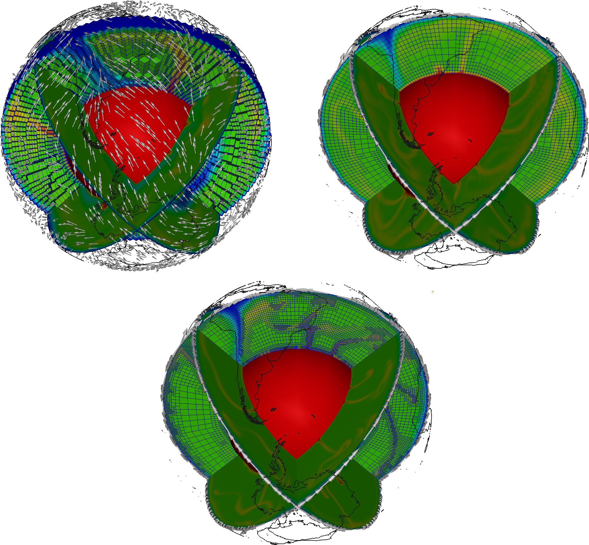

(sec:cookbooks:gplates)=
# Using reconstructed surface velocities by GPlates

*This section was contributed by Ren&eacute; Ga&szlig;m&ouml;ller.*

In a number of model setups one may want to include a surface velocity
boundary condition that prescribes the velocity according to a specific
geologic reconstruction. The purpose of this kind of models is often to test a
proposed geologic model and compare characteristic convection results to
present-day observables in order to gain information about the initially
assumed geologic input. In this cookbook we present ASPECT's interface to the
widely used plate reconstruction software GPlates, and the steps to go from a
geologic plate reconstruction to a geodynamic model incorporating these
velocities as boundary condition.

## Acquiring a plate reconstruction.

The plate reconstruction that is used in this cookbook is included in the
`data/boundary-velocity/gplates/` directory of your ASPECT installation. For a new
model setup however, a user eventually needs to create her own data files, and
so we will briefly discuss the process of acquiring a usable plate
reconstruction and transferring it into a format usable by ASPECT. Both the
necessary software and data are provided by the GPlates project. GPlates is an
open-source software for interactive visualization of plate tectonics. It is
developed by the EarthByte Project in the School of Geosciences at the
University of Sydney, the Division of Geological and Planetary Sciences (GPS)
at CalTech and the Center for Geodynamics at the Norwegian Geological Survey
(NGU). For extensive documentation and support we refer to the GPlates website
(<http://www.gplates.org>). Apart from the software one needs the actual plate
reconstruction that consists of closed polygons covering the complete model
domain. For our case we will use the data provided by (Gurnis et al. 2012)
that is available from the GPlates website under "Download $\rightarrow$
Download GPlates-compatible data $\rightarrow$ Global reconstructions with
continuously closing plates from 140 Ma to the present." The data is
provided under a Creative Commons Attribution 3.0 Unported License
(<http://creativecommons.org/licenses/by/3.0/>).

## Converting GPlates data to ASPECT input.

After loading the data files into GPlates (\*.gpml for plate polygons, \*.rot
for plate rotations over time) the user needs to convert the GPlates data to
velocity information usable in ASPECT. The purpose of this step is to convert from
the description GPlates uses internally (namely a representation of plates as
polygons that rotate with a particular velocity around a pole) to one that can
be used by ASPECT (which needs velocity vectors defined at individual points at the
surface).

With loaded plate polygon and rotation information the conversion from GPlates
data to ASPECT-readable velocity files is rather straightforward. First the user
needs to generate (or import) so-called "velocity domain points,"
which are discrete sets of points at which GPlates will evaluate velocity
information. This is done using the "Features $\rightarrow$ Generate
Velocity Domain Points $\rightarrow$ Latitude Longitude" menu option.
Because ASPECT is using an adaptive mesh it is not possible for GPlates to generate
velocity information at the precise surface node positions like for CitcomS or
Terra (the other currently available interfaces). Instead GPlates will output
the information on a general Latitude/Longitude grid with nodes on all
crossing points. ASPECT then internally interpolates this information to the current
node locations during the model run. This requires the user to choose a
sensible resolution of the GPlates output, which can be adjusted in the
"Generate Latitude/Longitude Velocity Domain Points" dialog of
GPlates. In general a resolution that resolves the important features is
necessary, while a resolution that is higher than the maximal mesh size for
the ASPECT model is unnecessary and only increases the computational cost and memory
consumption of the model.

**Important note:** The Mesh creation routine in GPlates has significantly
changed from version 1.3 to 1.4. In GPlates 1.4 and later the user has to make
sure that the number of longitude intervals is set as twice the number of
latitude intervals, the "Place node points at centre of
latitude/longitude cells" box is **un**checked and the
"Latitude/Longitude extents" are set to "Use Global
Extents." ASPECT does check for most possible combinations that can not be read
and will cancel the calculation in these cases, however some mistakes can not
be checked against from the information provided in the GPlates file.

After creating the Velocity Domain Points the user should see the created
points and their velocities indicated as points and arrows in GPlates. To
export the calculated velocities one would use the "Reconstruction
$\rightarrow$ Export" menu. In this dialog the user may specify the time
instant or range at which the velocities shall be exported. The only necessary
option is to include the "Velocities" data type in the "Add
Export" sub-dialog. The velocities need to be exported in the native
GPlates `*.gpml` format, which is based on XML and can be read by ASPECT. In case of
a time-range the user needs to add a pattern specifier to the name to create a
series of files. The `%u` flag is especially suited for the interaction with ASPECT,
since it can easily be replaced by a calculated file index (see also
[0.0.1.5]).

## Setting up the ASPECT model.

For this cookbook we will use the parameter file provided in
[cookbooks/gplates/gplates_2d.prm](https://www.github.com/geodynamics/aspect/blob/main/cookbooks/gplates/gplates_2d.prm) which uses the 2d shell geometry
previously discussed in {ref}`sec:cookbooks:shell_simple_2d`. ASPECT's
GPlates plugin allows for the use of two- and three-dimensional models
incorporating the GPlates velocities. Since the output by GPlates is
three-dimensional in any case, ASPECT internally handles the 2D model by rotating the
model plane to the orientation specified by the user and projecting the plate
velocities into this plane. The user specifies the orientation of the model
plane by prescribing two points that define a plane together with the
coordinate origin (i.e. in the current formulation only great-circle slices
are allowed). The coordinates need to be in spherical coordinates $\theta$ and
$\phi$ with $\theta$ being the colatitude (0 at north pole) and $\phi$ being
the longitude (0 at Greenwich meridian, positive eastwards) both given in
radians. The approach of identifying two points on the surface of the Earth
along with its center allows to run computations on arbitrary two-dimensional
slices through the Earth with realistic boundary conditions.

The relevant section of the input file is then as follows:

```{literalinclude} gplates.part.prm
```

In the "Boundary velocity model" subsection the user prescribes
the boundary that is supposed to use the GPlates plugin. Although currently
nothing forbids the user to use GPlates plugin for other boundaries than the
surface, its current usage and the provided sample data only make sense for
the surface of a spherical shell (boundary number 1 in the above provided
parameter file). In case you are familiar with this kind of modeling and the
plugin you could however also use it to prescribe mantle movements *below* a
lithosphere model. All plugin specific options may be set in
{ref}`parameters:Boundary_20velocity_20model`. Possible options
include the data directory and file name of the velocity file/files, the time
step (in model units, mostly seconds or years depending on the
`Use years in output instead of seconds` flag) and the points
that define the 2D plane.

## Comparing and visualizing 2D and 3D models.

The implementation of plate velocities in both two- and three-dimensional
model setups allows for an easy comparison and test for common sources of
error in the interpretation of model results. The left top figure in
{numref}`fig:gv-1` shows a modification of the above presented parameter file by
setting `Dimension = 3` and
`Initial global refinement = 3`. The top right plot of
{numref}`fig:gv-1` shows an example of three independent two-dimensional
computations of the same reduced resolution. The models were prescribed to be
orthogonal slices by setting:

```{literalinclude} slice1.part.prm
```

and

```{literalinclude} slice2.part.prm
```

The results of these models are plotted simultaneously in a single
three-dimensional figure in their respective model planes. The necessary
information to rotate the 2D models to their respective planes (rotation axis
and angle) is provided by the GPlates plugin in the beginning of the model
output. The bottom plot of {numref}`fig:gv-1` finally shows the results of the
original [cookbooks/gplates/gplates_2d.prm](https://www.github.com/geodynamics/aspect/blob/main/cookbooks/gplates/gplates_2d.prm) also in the three mentioned
planes.

Now that we have model output for otherwise identical 2D and 3D models with
equal resolution and additional 2D output for a higher resolution an
interesting question to ask would be: What additional information can be
created by either using three-dimensional geometry or higher resolution in
mantle convection models with prescribed boundary velocities. As one can see
in the comparison between the top right and bottom plot in {numref}`fig:gv-1`
additional resolution clearly improves the geometry of small scale features
like the shape of up- and downwellings as well as the maximal temperature
deviation from the background mantle. However, the limitation to two
dimensions leads to inconsistencies, that are especially apparent at the
cutting lines of the individual 2D models. Note for example that the Nacza
slab of the South American subduction zone is only present in the equatorial
model plane and is not captured in the polar model plane west of the South
American coastline. The (coarse) three-dimensional model on the other hand
shows the same location of up- and downwellings but additionally provides a
consistent solution that is different from the two dimensional setups. Note
that the Nazca slab is subducting eastward, while all 2D models (even in high
resolution) predict a westward subduction.

Finally we would like to emphasize that these models (especially the used
material model) are way too simplified to draw any scientific conclusion out
of it. Rather it is thought as a proof-of-concept what is possible with the
dimension independent approach of ASPECT and its plugins.

```{figure-md} fig:gv-1


 Using GPlates for velocity boundary conditions: The top left figure shows the results of a three-dimensional model using the present day plate velocities provided by GPlates as surface boundary condition. The top right figure shows three independent computations on two-dimensional slices through Earth. The boundary conditions for each of these slices (white arrows) are tangential to the slices and are projections of the three-dimensional velocity vectors into the two-dimensional plane occupied by the slice. While the two top models are created with the same mesh resolution the bottom figure shows three independent two-dimensional models using a higher resolution. The view is centered on South America with Antarctica being near the bottom of the figure (coastlines provided by NGU and the GPlates project).
```

## Time-dependent boundary conditions.

The example presented above uses a constant velocity boundary field that
equals the present day plate movements. For a number of purposes one may want
to use a prescribed velocity boundary condition that changes over time, for
example to investigate the effect of trench migration on subduction. Therefore
ASPECT's GPlates plugin is able to read in multiple velocity files and
linearly interpolate between pairs of files to the current model time. To
achieve this, one needs to use the `%d` wildcard in the velocity file name,
which represents the current velocity file index (e.g.
`time_dependent.%d.gpml`). This index is calculated by dividing the current
model time by the user-defined time step between velocity files (see parameter
file above). As the model time progresses the plugin will update the
interpolation accordingly and if necessary read in new velocity files. In case
it can not read the next velocity file, it assumes the last velocity file to
be the constant boundary condition until the end of the model run. One can
test this behavior with the provided data files
`data/boundary-velocity/gplates/time_dependent.%d.gpml` with the index `d`
ranging from 0 to 3 and representing the plate movements of the last 3 million
years corresponding to the same plate reconstruction as used above.
Additionally, the parameter `Velocity file start time` allows for a period of
no-slip boundary conditions before starting the use of the GPlates plugin.
This is a comfort implementation, which could also be achieved by using the
checkpointing possibility described in
{ref}`sec:checkpoint-restart`.
