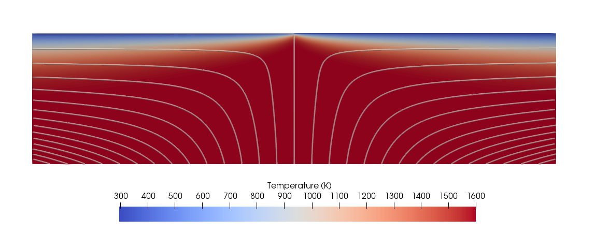

(sec:cookbooks:heat-flow)=
# Convective and conductive heat flow: Cooling of oceanic lithosphere

*This section was contributed by Juliane Dannberg.*

The input file for this model can be found at
[cookbooks/heat_flow/heat-flow.prm](https://www.github.com/geodynamics/aspect/blob/main/cookbooks/heat_flow/heat-flow.prm)

The model is loosely based on the cookbook describing how to model
{ref}`sec:cookbooks:platelike-boundary`.

The model features the spreading of plates at a mid-ocean ridge, with the
ridge being in the center of the model. Its vertical extent is 100 km and
material flows in from the bottom, and then leaves the domain at the sides.
The initial temperature is the adiabatic temperature of the mantle, which
corresponds to a plate age of 0, and temperature is fixed at the top, so that
a cold thermal boundary develops over time at the top model boundary.


```{figure-md} fig:heat-flow


 Setup of the mid-ocean-ridge model that illustrates the cooling of the lithosphere. Background colors show temperature, streamlines illustrate the flow.
```

An example that shows how this model can be used to visualize lithospheric
thickness and how it changes over time and in dependence of the spreading rate
can be found in [this presentation](https://www.dropbox.com/s/tdfj9pi2mdq0fhe/04_geophysics_lecture_01_13.pdf?dl=0).

## Shear heating and radiogenic heating

The model can also be modified to include radiogenic heat production and shear
heating. The corresponding input file is located at
[cookbooks/heat_flow/heat-flow-terms.prm](https://www.github.com/geodynamics/aspect/blob/main/cookbooks/heat_flow/heat-flow-terms.prm), and it switches on postprocessors
that generate graphical output for the different heating terms. An example
exercise is described in [this presentation (last slide)](https://www.dropbox.com/s/jh2v6vgje4cft5n/05_geophysics_lecture_01_27.pdf?dl=0).

## Example assignment: Heat flux

*This section describes an example for a homework assignment based on this
cookbook.*

In order to complete this assignment, you will need to run models with ASPECT
in the virtual machine, analyze these models, and visualize and discuss your
model results in a report. For each of the two settings, discuss the setup of
the model and the model results as detailed below. You can use resources and
data from elsewhere, but you will need to reference these in your report.

### Heat flux close to mid-ocean ridges

Analyze the heat flux close to mid-ocean ridges.

In order to do that, use the mid-ocean ridge model, which is located in the
folder [cookbooks/heat_flow/](https://www.github.com/geodynamics/aspect/blob/main/cookbooks/heat_flow/). Run the model and use ParaView to compute and
visualize the conductive and convective heat flux in vertical direction. Hint:
You can use the Calculator filter in ParaView to compute the convective and
conductive heat flux, using the equations on slides 5 and 6 of [this
presentation]. Be careful to make sure that the units are the same; the
velocity in ParaView is given in m/yr, while all other properties are given in
SI units:

-   density: kg/m$^3$

-   thermal conductivity: W/(m K)

-   specific heat capacity: J/(kg K)

-   temperature: K

Hint: You can compare your result to the output property `vertical_heat_flux`,
which shows the combined effect of conductive and convective heat flux, to
make sure you got the order of magnitude right in your computation.

Use ParaView to generate a plot that shows the temperature of your model as
background colors, and a contour that divides the model in two areas: one
where the conductive heat flux is larger than the convective heat flux, and
one where the conductive heat flux is smaller than the convective heat flux.
On the contour, conductive and convective heat flux should be equal. Label in
what area of the model conductive heat flux is dominant, and where convective
heat flux is dominant.

Hint: You can save screenshots in ParaView under the menu option
`File` &#8594; `Save screenshot`. VirtualBox also has a menu option to take
screenshots under `View` &#8594; `Take Screenshot (Host+E)`. Alternatively,
you can press the Host + E keys (by default, the Host key is Right Ctrl on
Windows machines or Right Cmd on a Mac).

### Describe your model setup and your results.

Start by describing the setup of the model and what kind of predictions it can
make that we can then compare to observations. Specifically, include a
qualitative discussion of the physical processes and the material properties
that affect the temperature distribution and heat flow computed in the model,
based on the equation solved in the model.

Next, describe the model results. Include a plot of convective/conductive heat
flux and discuss it: Respectively, where are convection and conduction
dominant? Qualitatively, describe how the temperature profile compares to the
profiles computed with Wolfram Alpha (as described on slide 7 of [this
presentation]) under the assumption that the temperature follows a
conductive (linear) profile going downwards from the surface, and then remains
constant once it reaches 1600 K (in the region where convection is dominant)?
What causes the similarities/differences?

Explain how the depth of the line where convective equals conductive heat flux
changes with the age of the plate. Is this a linear relationship? Does the
line follow an isotherm (line of constant temperature)? Why/why not?

### Heat flux at hot spots

In the second setup, you will analyze the heat flux of one ocean island.

In order to do that, pick your favorite ocean island from the list below.
Find out on what tectonic plate the island is located on, and how old the
ocean floor is where the hot spot is located.

Use the input file [cookbooks/heat_flow/heat-flow-plume.prm](https://www.github.com/geodynamics/aspect/blob/main/cookbooks/heat_flow/heat-flow-plume.prm). The model is
very similar to the mid-ocean ridge model you analyzed above, but the oceanic
plate does not move (so by default, there is no convective heat flux), and
extension in the vertical direction is larger to allow for older (and,
accordingly, thicker) oceanic lithosphere.

Open this file and change the following model parameters:

### 1. The age of the ocean floor

Take the age of the ocean floor your hot spot erupted on and subtract 10
million years from it (because the model will run for 10 million years, so at
the end of the model run, the age of the model plate will match the age of the
ocean floor you found for your ocean island). Insert this number in the line

        set Age top boundary layer = 1

instead of 1 (which would correspond to 1 year).

### 2. The temperature of the plume

Run several models with different plume temperatures. To change the
temperature of the plume, modify the line

        set Function constants  = DeltaT=0

in the `subsection Adiabatic`. The variable `DeltaT` represents the plume
excess temperature (the temperature difference between the plume and the
average mantle temperature). Change its value from 0 to some other number. Try
different values and find out which value provides the best fit to the heat
flux of the selected ocean island. You can estimate the heat flux of the plume
by multiplying the maximum vertical heat flux density at the bottom of the
model (the `vertical_heat_flux` output variable) with the approximate area of
the inflow, which is $6.3 \cdot 10^9$ m$^2$.

### Describe your model setup and your results.

In your report, describe the model setup: What ocean island is modeled? What
is the plate age? What plume temperatures are tested? What happens to the
mantle temperature profile at the location where plume material flows in?

Make a plot of the results that shows the plume excess temperature on the
horizontal axis and the plume heat flux on the vertical axis. Describe the
results: How does the heat flux depend on the plume temperature? What excess
temperature best fits the observed heat flux? Is that what one would expect
for a mantle plume below the modeled ocean island?

Repeat the computation of convective/conductive heat flux for the mid-ocean
ridge model described above (in paragraph "Heat flux close to mid-ocean
ridges") for the best-fit plume model, and generate the corresponding
plot that shows where conductive/convective heat flux are dominant (as above).
Discuss how the plume influences what is the dominant mechanism for heat
transport. Why does it have this effect?

### Discuss the predictions of your model.

Measurements (given in {cite:t}`harris:mcnutt:2007`) show
that the heat flux anomaly at the ocean floor above many hot spots is on the
order of 1 mW/m$^2$ (Reunion) to 14 mW/m$^2$ (Hawaii/Oahu). Does your model
predict heat flux anomalies of this magnitude? If there are differences, what
could be the reason?

Hint: To find out what the heat flux contribution of the plume is at the
surface, also run one model where `DeltaT=0`. Next, compute the difference in
the maximum heat flux (the `vertical_heat_flux` output variable) plotted at
the surface at the end of the model run between this model without a plume and
the other models that have a plume.

In reality, the mantle would melt at the location of a hot spot, and this melt
would contribute to the transport of heat. This process is not included in the
model. How do you think it would change the temperature profile below the
ocean island?

### Hot spot heat flux

Values are taken from {cite:t}`schubert:etal:2001` and are based on {cite:t}`sleep:1990`.

| Hot spot        | Heat flux ($10^9$ W) |
|:----------------|---------------------:|
| Afar            |                   50 |
| Australia, East |                   38 |
| Azores          |                   46 |
| Baja            |                   12 |
| Bermuda         |                   46 |
| Bouvet          |                   17 |
| Bowie           |                   12 |
| Canary          |                   42 |
| Cape Verde      |                   67 |
| Caroline        |                   67 |
| Crozet          |                   21 |
| Discovery       |                   21 |
| Easter          |                  138 |
| Fernando        |                   21 |
| Galapagos       |                   42 |
| Great Meteor    |                   21 |
| Hawaii          |                  363 |
| Hoggar          |                   38 |
| Iceland         |                   58 |
| Juan de Fuca    |                   12 |
| Juan Fernandez  |                   67 |
| Kerguelen       |                   21 |
| Louisville      |                   38 |
| MacDonald       |                  138 |
| Marquesas       |                  138 |
| Martin          |                   21 |
| Meteor          |                   21 |
| Pitcairn        |                  138 |
| Reunion         |                   79 |
| St. Helena      |                   21 |
| Samoa           |                   67 |
| San Felix       |                   67 |
| Tahiti          |                  138 |
| Tasman, Central |                   38 |
| Tasman, East    |                   38 |
| Tristan         |                   71 |
| Yellowstone     |                   62 |
