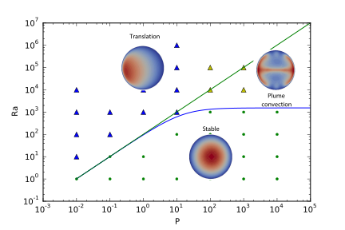

(sec:cookbooks:inner_core_convection)=
# Inner core convection

*This section was contributed by Juliane Dannberg, and the model setup was
inspired by discussions with John Rudge. Additional materials and comments by
Mathilde Kervazo and Marine Lasbleis.*

This is an example of convection in the inner core of the Earth. The model is
based on a spherical geometry, with a single material. Three main
particularities are constitutive of this inner core dynamics modeling: it
consists of a sphere where the gravity decreases linearly (to mimic
self-gravitation) from the boundary to zero at the center of the inner core;
the boundary conditions combine normal stress and normal velocity, and take
into account the rate of phase change (melting/freezing) at the inner-outer
core boundary; the material has a temperature dependent density that makes the
density profile unstably stratified as temperature increases towards the
center of the core. Note that we do not actually compute self-gravitation, but
instead define a linear gravity profile. Since the density variations are very
small, this is a good approximation.

The setup is analogous to the models described in {cite:t}`Deguen2013`,
and all material properties are chosen in a way so that the
equations are non-dimensional.

The required heating model and changes to the material model are implemented
in the shared library [inner_core_convection.cc](https://github.com/geodynamics/aspect/blob/main/cookbooks/inner_core_convection/inner_core_convection.cc).
To compile the file, do

     cmake -DAspect_DIR=/path/to/aspect/build/ .
     make

In the non-dimensional form of the equations derived by {cite:t}`Deguen2013`,
we solve for the potential temperature
$T = \tilde{T}-T_{\text{is}}$ ($\tilde{T}$ is the temperature field,
$T_{\text{is}}$ the isentropic &ndash; also called adiabatic &ndash;
temperature). This allows to solve the temperature field with simple boundary
conditions ($T=0$), even if the temperature of the inner core boundary evolves
with time, defined as the intersection between the isentrope and the liquidus
of the material in the outer core. The equations for inner core convection in
the approximation of no growth (equation 59 for the potential temperature) are
```{math}
  :label: eq:inner-core
  \begin{aligned}
  \nabla \cdot \sigma &= -Ra T \mathbf g,
  \\
  \nabla \cdot \mathbf u &= 0,
  \\
  \left(\frac{\partial T}{\partial t} + \mathbf u\cdot\nabla T\right)
  - \nabla^2 T
  &=
  H,
  \end{aligned}
```
where $Ra$ is the Rayleigh number and $H$ is the
&rsquo;source term&rsquo;, constructed when removing the adiabatic temperature
from the temperature field to obtain the potential temperature $T$. $H$
describes the evolution of the adiabatic temperature over time, due to
secular cooling of the outer core. In spherical geometry, $H=6$.

**Mechanical boundary.** The mechanical boundary conditions for the inner core
are tangential stress-free and continuity of the normal stress at the
inner-outer core boundary. For the non-dimensional equations, that means that
we define a &ldquo;phase change number&rdquo; $\mathcal{P}$ (see {cite:t}`Deguen2013`) so that the normal stress at the
boundary is $-\mathcal{P} u_r$ with the radial velocity $u_r$. This number
characterizes the resistance to phase change at the boundary, with
$\mathcal{P}\rightarrow\infty$ corresponding to infinitely slow
melting/freezing (or a free slip boundary), and $\mathcal{P}\rightarrow0$
corresponding to instantaneous melting/freezing (or a zero normal stress,
corresponding to an open boundary).

In the weak form, this results in boundary conditions of the form of a surface
integral:
```{math}
\int_S \mathcal{P} (\mathbf u \cdot \mathbf n) (\mathbf v \cdot \mathbf n) \text{d}S,
```
with the normal vector $\mathbf n$.

This phase change term is added to the matrix in the
[inner_core_assembly.cc](https://github.com/geodynamics/aspect/blob/main/cookbooks/inner_core_convection/inner_core_assembly.cc) plugin by using a
signal (as described in Section&nbsp;{ref}`sec:extending-signals`). The
signal connects the function `set_assemblers_phase_boundary`, which is only
called once at the beginning of the model run. It creates the new assembler
`PhaseBoundaryAssembler` for the boundary faces of the Stokes system and adds
it to the list of assemblers executed in every time step. The assembler
contains the function `phase_change_boundary_conditions` that loops over all
faces at the model boundary, queries the value of $\mathcal{P}$ from the
material model, and adds the surface integral given above to the matrix:

```{literalinclude} ../inner_core_assembly.cc
   :language: c++
```

Instructions for how to compile and run models with a shared library are given
in Section&nbsp;{ref}`sec:benchmark-run`.

**Governing parameters.** Analyzing
Equations&nbsp;{math:numref}`eq:inner-core`, two
parameters determine the dynamics of convection in the inner core: the
Rayleigh number $Ra$ and the phase change number $\mathcal{P}$. Three main
areas can be distinguished: the stable area, the plume convection area and the
translation mode of convection area ({numref}`fig:regime:diagram`). For low Rayleigh
numbers (below the critical value $Ra_c$), there is no convection and thermal
diffusion dominates the heat transport. However, if the inner core is
convectively unstable ($Ra$\>$Ra_c$), the convection regime depends mostly on
$\mathcal{P}$. For low $\mathcal{P}$ ($<29$), the convective translation mode
dominates, where material freezes at one side of the inner core and melts at
the other side, so that the velocity field is uniform, pointing from the
freezing to the melting side. Otherwise, at high $\mathcal{P}$ ($>29$),
convection takes the usual form of thermal convection with shear free boundary
and no phase change, that is the one-cell axisymmetric mode at the onset, and
chaotic plume convection for larger Rayleigh number. In this case, melting and
solidification at the ICB have only a small dynamic effect. At intermediate
values of $\mathcal{P}$, the first unstable mode is a linear combination of the high-$\mathcal{P}$
convection mode and of the small-$\mathcal{P}$ translation mode.

```{figure-md} fig:regime:diagram


Stability diagram for convection in a sphere with phase change at its outer boundary. The stability curves for the first unstable mode ($l=1$) and the translation are obtained from {cite:t}`Deguen2013`. Each dot (no convection) and triangle (blue: translation, yellow: plume convection) is one model run done with ASPECT. The higher $Ra$ and $\mathcal{P}$ are, the more refinement is required (see text).
```

Changing the values of $Ra$ and $\mathcal{P}$ in the input file allows
switching between the different regimes. The Rayleigh number can be changed by
adjusting the magnitude of the gravity:

```{literalinclude} inner_core_traction.part.2.prm
```

The phase change number is implemented as part of the material model, and as a
function that can depend on the spatial coordinates and/or on time:

```{literalinclude} inner_core_traction.part.1.prm
```

{numref}`fig:inner:core:convection` shows examples of the three regimes with
$Ra=3000, \mathcal{P}=1000$ (plume convection), $Ra=10^5, \mathcal{P}=0.01$
(translation), $Ra=10, \mathcal{P}=30$ (no convection).

```{figure-md} fig:inner:core:convection


Convection regimes in the inner core for different values of $Ra$ and $\mathcal{P}$. From left to right: no convection, translation, plume convection; the 2D slices in the top row use the default temperature scale for all panels, while in the second row an adaptive scale is used. The bottom row features slightly different model parameters (that are still in the same regime as the models in the respective panels above) and also shows the velocity as arrows.
```

**Mesh refinement.** The temperature is set to 0 at the outer boundary and a
large temperature gradient can develop at the boundary layer, especially for
the translation regime. The adaptive mesh refinement allows it to resolve this
layer at the inner core boundary. Another solution is to apply a specific
initial refinement, based on the boundary layer thickness scaling law
$\delta \propto Ra^{-0.236}$, and to refine specifically the uppermost part of
the inner core.

In order to have a mesh that is much finer at the outer boundary than in the
center of the domain, this expression for the mesh refinement subsection can
be used in the input file:

```{literalinclude} inner_core_traction.part.3.prm
```

**Scaling laws.** In addition, {cite:t}`Deguen2013`
give scaling laws for the velocities in each regime derived from linear
stability analysis of perfect translation, and show how numerical results
compare to them. In the regimes of low $\mathcal{P}$, translation will start
at a critical ratio of Rayleigh number and phase change number
$\frac{Ra}{\mathcal{P}}=\frac{175}{2}$ with steady-state translation
velocities being zero below this threshold and tending to
$v_0=\frac{175}{2}\sqrt{\frac{6}{5}\frac{Ra}{\mathcal{P}}}$ going towards
higher values of $\frac{Ra}{\mathcal{P}}$. In the same way, translation
velocities will decrease from $v_0$ with increasing $\mathcal{P}$, with
translation transitioning to plume convection at $\mathcal{P}\sim29$. Both
trends are shown in {numref}`fig:inner:core:trends` and can be compared to Figure&nbsp;8
and 9 in {cite:t}`Deguen2013`.

```{figure-md} fig:inner:core:trends


Translation rate (approximated by the average of the velocity component in the direction of translation),
normalized to the low-$\mathcal{P}$ limit estimate given in {cite:t}`Deguen2013`, as a function of
$\frac{Ra}{\mathcal{P}}$ for $\mathcal{P}=10^{-2}$ (left) and as a function of $\mathcal{P}$ for $Ra=10^5$ (right).
The dashed gray line gives the translation velocity predicted in the limit of low $\mathcal{P}$. Disagreement
for larger values of $\mathcal{P}$ indicates that higher order terms (not included in the low $\mathcal{P}$
approximation) become important. Additionally, differences between the analytical and numerical model might
be the result of limited resolution (only 12 elements in radial direction).
```

Deguen, R., T. Alboussi&egrave;re, and P. Cardin. 2013. &ldquo;Thermal
Convection in Earth&rsquo;s Inner Core with Phase Change at Its
Boundary.&rdquo; *Geophysical Journal International* 194 (3): 1310&ndash;34.
<https://doi.org/10.1093/gji/ggt202>.
