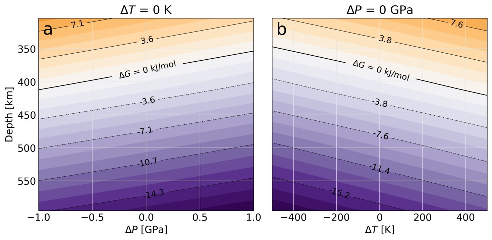
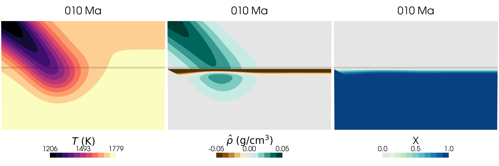
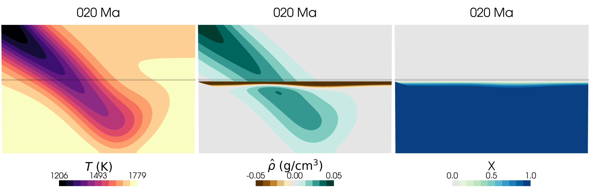
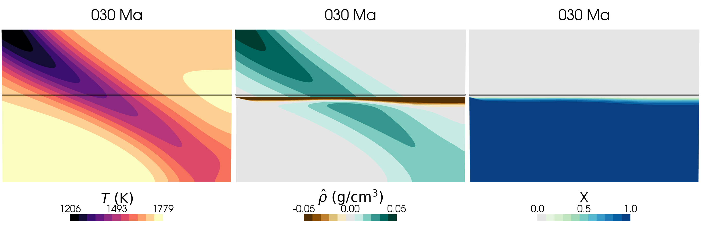

(sec:cookbooks:kinetic-driving-force)=
# Using Non-Equilibrium Thermodynamics to Drive Phase Transformations

*Buchanan Kerswell contributed this cookbook.*

You can find the input file for this model at [cookbooks/kinetic_driving_force/simple-subduction.prm](https://www.github.com/geodynamics/aspect/blob/main/cookbooks/kinetic_driving_force/simple-subduction.prm)

This cookbook describes how to govern a polymorphic phase transition in `ASPECT` using reaction kinetics, rather than existing approaches in `ASPECT` that use depth- or pressure-dependent phase transformations (e.g., the [`PhaseFunction`](https://github.com/geodynamics/aspect/blob/4a0743e738e65c3c8b371b4e8579e304f855ec0d/include/aspect/material_model/utilities.h#L756) and [`PhaseFunctionDiscrete`](https://github.com/geodynamics/aspect/blob/4a0743e738e65c3c8b371b4e8579e304f855ec0d/include/aspect/material_model/utilities.h#L572) classes). While the `PhaseFunction` and `PhaseFunctionDiscrete` classes in `ASPECT` imply some macroscale reaction kinetics govern phase transformations, they assume that reactions proceed with the shape of a hyperbolic tangent without explicitly defining a model describing the kinetic forces driving the phase transformation. An alternative model that calculates reaction rates in terms of a "kinetic driving force" is outlined below.

The model formulates the kinetic driving force as a function of the excess Gibbs free energy:

```{math}
:label: eqn:driving-force
\Delta G = \Delta G_0 + \Delta P \Delta V - \delta T \delta S

```

where $\Delta G$ is the kinetic driving force, $\Delta G_0 = \Delta G_b - \Delta G_a$ is the difference in Gibbs free energy between two polymorphic phases $a$ and $b$ under a hydrostatic adiabatic reference state, $\Delta V$ and $\Delta S$ are the differences in molar volume and entropy of the polymorphic phases, respectively, $\Delta P = p - \bar{p}$ is the nonadiabatic ("dynamic") pressure, and $\Delta T = T - \bar{T}$ is the nonadiabatic temperature. The thermodynamic variables $\Delta G_0$, $\Delta V$, and $\Delta S$ are evaluated along an isentropic adiabat ($\bar{p}$, $\bar{T}$, {numref}`fig:ascii-data-profile`) using the thermodynamic data and equations of state from {cite:t}`stixrude:lithgow-bertelloni:2011`. These thermodynamic data are stored in the table [ol-wad-driving-force-profile.txt](/doc/sphinx/user/cookbooks/cookbooks/kinetic_driving_force/ol-wad-driving-force-profile.txt), which is referenced using the [`AsciiDataProfile`](https://github.com/geodynamics/aspect/blob/a947bac5a92025ed0f12bf4da70757e78a531b25/include/aspect/structured_data.h#L717) class.

```{figure-md} fig:ascii-data-profile


Kinetic driving force for the reaction olivine --> wadsleyite as a function of depth. The pressure- and temperature-dependent terms in Equation {math:numref}`eqn:driving-force` are shown separately in (a) and (b), respectively, with the other term held fixed. The $\Delta G = 0$ contour indicates the chemical equilibrium. Olivine transforms into wadsleyite where the $\Delta G$ is negative (purple contours) and remains stable where $\Delta G$ is positive (orange contours). At a fixed depth, positive dynamic pressure tends to speed up the olivine --> wadsleyite reaction, while excess local heating tends to retard it. $\Delta G_0$, $\Delta V$, and $\Delta S$ for olivine and wadsleyite were computed with the mineral physics toolkit `BurnMan` {cite}`cottaar:etal:2014` using thermodynamic data and equations of state from {cite:tstixrude:lithgow-bertelloni:2011}`.`
```

The reaction rate is then calculated as:

```{math}
:label: eqn:reaction-rate
\frac{dX}{dt} = Q * \Delta G * (1 - X)

```

where $Q$ is a kinetic prefactor constant (units: J/mol/s) and $X$ is the mass fraction of phase $b$ (the product phase).


```{figure-md} fig:simple-subduction-Q-1e-9




Evolution of a simple subduction model with an olivine --> wadsleyite phase transition that is governed by a kinetic reaction rate (Equation {math:numref}`eqn:reaction-rate`). Cold material flows into the top left boundary at a fixed temperature and velocity (left column) and olivine transforms to wadsleyite (center column). A low-density metastable olivine layer forms below the equilibrium reaction depth with a dynamic topography that responds to changes in pressure and temperature (right column).`
```
